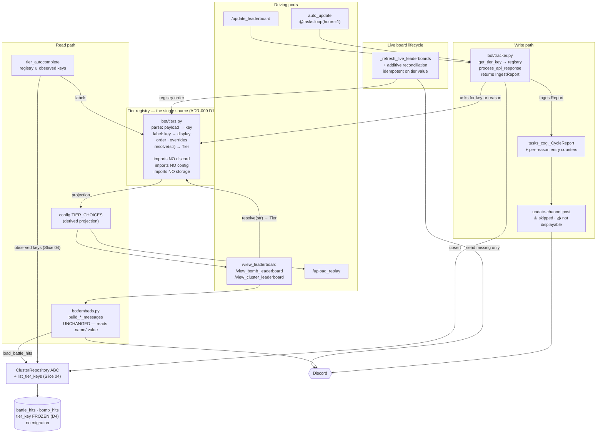

# Feature Delta — `dynamic-tier-registry`

> Single narrative file per the nWave lean-wave-documentation contract.
> Density: `full` + `ask-intelligent` (resolved from `~/.nwave/global-config.json`).
> Tier-1 `[REF]` sections plus all Tier-2 `[WHY]`/`[HOW]` expansions rendered
> inline, per the `mode = "full"` branch.

---

## Wave: DISCUSS / [REF] Incident Origin

Tacticus shipped a **Mythic 3** raid tier. The bot has been silently
discarding every hit against it since the tier went live. This is confirmed,
not hypothetical: the operator reports Mythic 3 hits have already been lost
in production.

The discard happens at ingest, one branch above storage:

```python
# bot/tracker.py:9-18
if rarity == "Mythic":
    try:
        tier = int(entry.get("set"))
        if tier == 0: return "Mythic"
        if tier == 1: return "Mythic_1"
    except (TypeError, ValueError):
        pass
    return None          # <-- set=2 lands here
```

`process_api_response` then drops the entry outright
([tracker.py:109-111](../../../bot/tracker.py#L109-L111)):

```python
tier_key = get_tier_key(entry)
if tier_key is None:
    continue
```

No exception, no log line, no counter. The entry is not stored anywhere.

**The loss is irreversible.** The Tacticus guild-raid endpoint serves a
rolling window of recent hits, not full season history, so the hits dropped
before the fix ships cannot be backfilled from the vendor. Whatever window
has already elapsed is gone.

### Measured blast radius

| Surface | State today with Mythic 3 live |
|---|---|
| Ingest ([tracker.py:9-18](../../../bot/tracker.py#L9-L18)) | Every `set >= 2` Mythic entry discarded, silently |
| Storage (`battle_hits` / `bomb_hits`) | Zero Mythic 3 rows will ever exist for the elapsed window |
| `/view_leaderboard`, `/view_bomb_leaderboard`, `/view_cluster_leaderboard` | No Mythic 3 option in the picker ([config.py:22-30](../../../config.py#L22-L30)) |
| Live leaderboards | Cannot grow a tier mid-season — [tasks_cog.py:663-666](../../../bot/cogs/tasks_cog.py#L663-L666) skips any tier lacking a stored `message_id` |
| Replay index | `/upload_replay` tier picker has no Mythic 3 entry ([replay_cog.py:166](../../../bot/cogs/replay_cog.py#L166)) |
| Observability | `_CycleReport` counts skipped **guilds**, not skipped **entries** — there is no instrument that would have caught this |

### The precedent this repeats

`_CycleReport`'s own docstring
([tasks_cog.py:766-769](../../../bot/cogs/tasks_cog.py#L766-L769)) states the
lesson from the `guild-key-integrity` incident:

> "a skip that leaves no trace is exactly how a whole-server outage stayed
> invisible for three days."

That instrument was built at guild granularity. The same failure recurred one
level down, at entry granularity, where no instrument exists. This feature
extends the identical principle to the ingest filter: **nothing is discarded
without being counted and reported.**

---

## Wave: DISCUSS / [REF] Persona ID

**`cluster-admin`** (primary) — the single operator-developer who owns the
deployment. Adding a raid tier today means editing two Python lists in two
files, correctly, while remembering that the numeric suffix is offset from
the displayed label. They are also the only person who would ever notice the
tier is missing.

**`guild-officer`** (secondary) — holds the officer tier, reads and posts
leaderboards, runs `/update_leaderboard` and `/upload_replay`. Consumes tier
coverage; cannot change it. Feels the gap first, because officers are the
ones members ask "why isn't my Mythic 3 run on the board?".

---

## Wave: DISCUSS / [REF] JTBD One-Liners

- **`see-every-tier-my-guild-clears`** — When my guild clears a raid tier the
  bot has never seen before, I want its hits captured and shown from the
  first hourly cycle, so I can rank members on the content they are actually
  running.
- **`add-a-tier-without-a-release`** — When the game adds a raid tier, I want
  the bot to keep working without me editing a Python list and redeploying,
  so a vendor change does not become an outage I have to notice first.

Opportunity scores (ODI: `importance + max(importance − satisfaction, 0)`,
1–10 scale, scored by the operator against the observed loss):

| Job | Importance | Satisfaction | Opportunity | Rank |
|---|---|---|---|---|
| `see-every-tier-my-guild-clears` | 9 | 0 | **18** | 1 |
| `add-a-tier-without-a-release` | 7 | 2 | **12** | 2 |

Both clear the "worth building" bar (>10). Job 1 scores **18** — higher than
`trust-guild-data-provenance`'s 17, the highest previously recorded in this
repo — because its satisfaction is a true zero. In the guild-key incident
there was no *signal*; here there is no signal **and** the data is actively
destroyed rather than merely wrong. Wrong data can be deleted and re-ingested,
which is exactly what remediation did on 2026-07-31. Discarded data cannot.

Job 2 scores lower and deserves to: hand-editing `config.py` genuinely works,
has worked twice, and costs minutes. It is prevention, not triage.

Full dimensions and four-forces analysis are written to
`docs/product/jobs.yaml`; the Tier-2 `jtbd-narrative` expansion renders them
inline below.

---

## Wave: DISCUSS / [REF] Locked Decisions

### D1 — Generalise the tier parser; keep the rarity allow-list

**Verdict: LOCKED (operator confirmation, 2026-08-15).**

The operator confirmed the observed payload shape: Mythic 3 arrives as
`rarity: "Mythic", set: 2`. It follows the existing pattern, so no SPIKE is
needed and the parser generalises by removing bounds rather than by adding a
case.

| Dimension | Today | After D1 |
|---|---|---|
| Mythic `set` | hardcoded `0`, `1` | any integer `>= 0` |
| Legendary `set` | hardcoded `0..4` | any integer `>= 0` |
| `rarity` | allow-list `{Legendary, Mythic}` | **unchanged** — still an allow-list |

The rarity allow-list stays closed **deliberately**. Removing it would start
ingesting Common/Uncommon/Rare/Epic raid hits, which the bot has never
tracked and which arrive in far greater volume. That is a product decision,
not a parser bug, and it should not be made accidentally by a generalisation
aimed at something else.

The asymmetry — unbounded `set`, bounded `rarity` — is intentional and is why
**D2** exists. A new *tier* within a tracked rarity is now automatic. A new
*rarity* is reported and requires a human decision.

### D2 — Nothing is discarded without being counted and reported

**Verdict: LOCKED.**

Every entry the ingest filter rejects is counted by reason and surfaced in
the hourly update-channel post. Three distinct reasons, never collapsed:

| Reason | Meaning | Operator action |
|---|---|---|
| `untracked_rarity` | rarity outside the allow-list (e.g. `Epic`, or a future `Divine`) | decide whether to start tracking it |
| `malformed_set` | `set` missing or not an integer | vendor schema change — investigate |
| `unparseable` | entry rejected for any other reason | investigate |

Collapsing `untracked_rarity` into `malformed_set` would hide a vendor schema
change behind a number that is normally non-zero. This mirrors the D4
reasoning in `guild-key-integrity`, where collapsing `unreachable` into
`mismatch` would have quarantined the cluster during a vendor outage: **a
count is only actionable if its reasons are separable.**

A newly observed tier within a tracked rarity is reported too, but as news
rather than as a failure: `🆕 New tier observed: Mythic 3 — 14 hits captured`.

### D3 — Stored tier keys are frozen; display labels are derived

**Verdict: LOCKED (operator selection, 2026-08-15).**

Stored keys keep their existing, slightly odd shape. Display labels are
derived from them in exactly one place.

| Stored key (frozen) | Derived label |
|---|---|
| `Legendary_0` … `Legendary_4` | Legendary 1 … Legendary 5 |
| `Mythic` | Mythic 1 |
| `Mythic_1` | Mythic 2 |
| `Mythic_2` | **Mythic 3** |

The derivation rule: `Legendary_{n}` → `Legendary {n+1}`; bare `Mythic` →
`Mythic 1`; `Mythic_{n}` → `Mythic {n+1}`. The registry also accepts explicit
per-key label overrides, so a tier the game names irregularly does not force a
schema change.

Three things fall out of this, and all three are the reason it was chosen:

1. **No Alembic migration.** `battle_hits.tier_key` and `bomb_hits.tier_key`
   are untouched, and both participate in a `UNIQUE` constraint
   ([models.py:192](../../../bot/db/models.py#L192),
   [models.py:222](../../../bot/db/models.py#L222)). Rewriting them means
   rewriting every historical hit row under a uniqueness constraint, for
   cosmetic gain.
2. **Live leaderboard configs survive.** `live_leaderboards.messages` is keyed
   by tier *value* ([data-dictionary.md:179](../../product/architecture/data-dictionary.md#L179)).
   Frozen keys mean every existing message mapping stays valid; the
   reconciliation in D5 only ever *adds*.
3. **Replay rows survive untouched.** `/upload_replay` stores `tier.name` —
   the display *label* — not the value ([replay_cog.py:208](../../../bot/cogs/replay_cog.py#L208)),
   and rendering filters against `[t.name for t in TIER_CHOICES]`
   ([replay_cog.py:54](../../../bot/cogs/replay_cog.py#L54)). Because the
   derivation reproduces today's labels exactly — "Mythic 1" stays
   "Mythic 1" — no historical replay row is orphaned. Any renaming scheme
   would silently drop existing replays from the rendered index while leaving
   them in the database.

Point 3 was not obvious before the code was read and is the strongest
argument for D3. The alternative considered (normalise keys to
`Mythic_0/1/2`) is recorded under the `alternatives-considered` expansion.

**Accepted cost:** the stored key and its label remain off by one, and raw
`sqlite3` inspection still shows `Mythic_1` for a row displayed as
"Mythic 2". The mitigation is that the skew now lives behind one documented
function instead of being a fact humans must remember across two files.

### D4 — One registry module is the single source of tier truth

**Verdict: LOCKED.**

Today tier knowledge is duplicated across two files that must agree:
`config.TIER_CHOICES` (labels, values, order) and `tracker.get_tier_key`
(parse rule). Nothing enforces their agreement, and the off-by-one skew is
the visible residue of that.

After D4 there is one module owning: the parse rule (payload → key), the
label rule (key → label), the ordering rule, and the override table.
`TIER_CHOICES` becomes a derived value. The parse rule and the label rule sit
beside each other, so a future tier cannot be added to one and forgotten in
the other.

### D5 — Live boards reconcile toward the current tier set

**Verdict: LOCKED.**

`_refresh_live_leaderboards` currently skips any tier without a stored
`message_id` ([tasks_cog.py:663-666](../../../bot/cogs/tasks_cog.py#L663-L666)),
so a new tier stays invisible on the always-on board until the next *season
rollover*, whose branch does send a full set
([tasks_cog.py:684](../../../bot/cogs/tasks_cog.py#L684)). The resulting
behaviour — the tier appears weeks later, on its own, with no action taken —
is worse than either consistent alternative.

After D5, the same-season path reconciles: any tier in the registry without a
stored `message_id` gets one sent and persisted, in registry order.

Reconciliation is **additive only**. A tier that disappears from the registry
leaves its message in place, frozen. Deleting boards automatically is a
destructive action driven by a vendor-shaped input, which the persona's
stated anti-goal — *"a key problem should stop and wait for a human, not
resolve itself in a way that might be wrong"*
([cluster-admin.yaml:69-72](../../product/personas/cluster-admin.yaml#L69-L72))
— rules out.

### D6 — The tier picker becomes autocomplete, not a choice list

**Verdict: LOCKED, scheduled last (Slice 04).**

Discord caps `app_commands.Choice` lists at **25 per option**. Seven tiers
today, eight with Mythic 3 — not urgent, but a hard ceiling on the word
"dynamic". More immediately: choice lists are fixed at command-sync time, so
even a registry-derived `TIER_CHOICES` still requires a redeploy and a
re-sync before a new tier appears in the picker.

Autocomplete is evaluated per invocation, so a tier discovered in the data
appears in the picker with no redeploy. The codebase already uses this
pattern — `boss_autocomplete` ([replay_cog.py:74](../../../bot/cogs/replay_cog.py#L74))
and `guild_autocomplete` ([update_cog.py:48](../../../bot/cogs/update_cog.py#L48)) —
so it is an established idiom here, not a new one.

This is scheduled last because it is the only decision with a real signature
cost: handlers currently receive `app_commands.Choice[str]` and read both
`tier.value` and `tier.name`
([embeds.py:83](../../../bot/embeds.py#L83), [embeds.py:90](../../../bot/embeds.py#L90)).
Autocomplete delivers a plain `str`, so every call site needs a resolve step.
That risk is isolated in its own slice rather than being carried by the
urgent one.

---

## Wave: DISCUSS / [REF] Scope Assessment

**Verdict: OVERSIZED → SPLIT PROPOSED AND ADOPTED.**

Run before journey visualisation, per Phase 1.5. Two oversized signals fired:

| Signal | Threshold | This feature | Fired |
|---|---|---|---|
| User stories | >10 | 7 | no |
| Bounded contexts / modules | >3 | **4** — Ingestion, Leaderboard Rendering, Live Board Lifecycle, Replay Index | **yes** |
| Walking skeleton integration points | >5 | 2 (Tacticus payload → repo upsert) | no |
| Estimated effort | >2 weeks | ~3.5 days | no |
| Independent user outcomes shippable separately | any | **4** — capture, on-demand display, live display, dynamic picker | **yes** |

Two signals = oversized. The split is the four-slice decomposition in the
story map below. Each slice ships end-to-end, is independently useful, and
independently revertible. Slice 01 alone stops the data loss and is worth
shipping even if nothing after it is ever built — which is the test that
makes this a real split rather than a phased plan wearing a split's clothes.

---

## Wave: DISCUSS / [REF] Pre-requisites

- **None external.** Every seam already exists and is exercised in production
  hourly. No new dependency, no new table, no new column, no migration.
- **Slice order is a real dependency**, not a preference: Slices 02, 03 and 04
  all consume the registry introduced in Slice 02. Slice 01 depends on
  nothing.
- The tier registry module is `@infrastructure` and, per the slice-composition
  gate, lands as a **precursor commit inside Slice 02** rather than as its own
  slice. See `alternatives-considered`.
- `tier_key` is `String(32)` ([models.py:169](../../../bot/db/models.py#L169));
  `Mythic_2` is 8 characters. No width change needed at any plausible tier
  count.

---

## Wave: DISCUSS / [REF] Driving Ports

| Port | Surface | Slices |
|---|---|---|
| Hourly `auto_update` background task | `tasks_cog.auto_update` → update-channel post | 01, 03 |
| `/update_leaderboard guild_id season` | officer-tier manual ingest trigger | 01 |
| `/view_leaderboard season tier` | on-demand battle board | 02, 04 |
| `/view_bomb_leaderboard season tier` | on-demand bomb board | 02, 04 |
| `/view_cluster_leaderboard season tier` | on-demand cluster board | 02, 04 |
| `/upload_replay … tier` | replay submission picker | 04 |
| Live leaderboard channel messages | always-on rendered boards | 03 |

No new driving port is introduced. Every story lands on a surface that exists
and that the operator already uses.

---

## Wave: DISCUSS / [REF] WS Strategy

**Strategy B — extend an existing driving port; no new port, no environment
switch.**

The walking skeleton is **Slice 01**: a real Tacticus payload containing
`rarity=Mythic, set=2` travels the full existing path — `auto_update` →
`process_api_response` → `get_tier_key` → `upsert_guild_hits` → SQLite — and
the cycle reports what it saw. That is end-to-end through every layer the
feature touches on the write side, using production data, on the hour the
guild already runs.

No walking skeleton is needed for the read side: `build_battle_messages`
already renders any `tier_key` handed to it. The read path's risk is in
*naming and enumeration*, not in plumbing, which is why Slice 02 is a
display slice rather than a second skeleton.

> Note: the A/B/C/D strategy taxonomy referenced by Mandate 5 is not present
> in this repository, so the letter above is a mapping to the conventional
> reading (A = new build, B = extend existing, C = strangler, D =
> configurable/env-switched). The description is authoritative; the letter is
> a convenience.

---

## Wave: DISCUSS / [REF] User Stories

Seven stories. Six carry user-visible value; one (`US-004`) is
`@infrastructure` and rides as a precursor commit inside Slice 02.

---

### US-001 — Capture hits for tiers the bot has never seen

**Job:** `see-every-tier-my-guild-clears` · **Slice 01**

As the cluster admin, I want the ingest filter to accept any tier within a
tracked rarity, so a tier the game adds is stored from the hour it appears
rather than discarded until someone edits Python.

#### Elevator Pitch
Before: every Mythic 3 hit is discarded at ingest and no record of it exists anywhere.
After: run `/update_leaderboard guild_id:word_bearers season:107` → the update channel shows `🆕 New tier observed: Mythic 3 — 14 hits captured`
Decision enabled: whether the cluster's hardest-content hits are being recorded at all, or still being thrown away.

#### Acceptance Criteria

- **AC-001.1** Given an entry `{rarity: "Mythic", set: 2}`, when `get_tier_key`
  parses it, then it returns `"Mythic_2"` and not `None`.
- **AC-001.2** Given entries with `set` values `0, 1, 2, 3, 7`, when parsed,
  then the returned keys are `Mythic`, `Mythic_1`, `Mythic_2`, `Mythic_3`,
  `Mythic_7` — parametrised, asserting the rule holds beyond the observed value.
- **AC-001.3** Given an entry `{rarity: "Legendary", set: 5}`, when parsed,
  then it returns `"Legendary_5"` — the Legendary `0..4` bound is removed
  symmetrically, so the same bug cannot recur one rarity over.
- **AC-001.4** Given entries at every currently-supported tier, when parsed,
  then every returned key is **byte-identical** to the key returned before this
  change. Regression pin: existing rows must remain addressable.
- **AC-001.5** Given a `{rarity: "Mythic", set: 2}` battle entry ingested via
  `process_api_response`, when the cycle completes, then a `battle_hits` row
  exists with `tier_key = "Mythic_2"` for that `(season, discord_server_id,
  guild_id)` partition.
- **AC-001.6** Given the same entry with `damageType: "Bomb"`, then the row
  lands in `bomb_hits`, not `battle_hits` — tier generalisation must not
  disturb damage-type routing.
- **AC-001.7** Given an entry whose `rarity` is `"Epic"`, when parsed, then it
  returns `None` — the rarity allow-list is unchanged (D1).

---

### US-002 — See what ingest threw away

**Job:** `see-every-tier-my-guild-clears` · **Slice 01**

As the cluster admin, I want every discarded entry counted by reason and
reported in the hourly post, so a tier the bot cannot handle announces itself
in the same cycle instead of waiting for a human to notice absent names.

#### Elevator Pitch
Before: discarded entries leave no trace — no log, no counter, no message.
After: wait for the hourly cycle → the update channel post reads `⚠️ 3 entries skipped — untracked_rarity: 3 (Epic)`
Decision enabled: whether the leaderboard is complete, or is quietly missing content the guild actually ran.

#### Acceptance Criteria

- **AC-002.1** Given a cycle in which 3 entries are rejected as
  `untracked_rarity` and 1 as `malformed_set`, when the cycle completes, then
  the structured cycle event carries both counts under **separate** keys.
- **AC-002.2** Given any cycle with ≥1 rejected entry, then the update-channel
  post contains a skip line naming the count **and** the reason. A count with
  no reason fails this AC — matching `_CycleReport`'s existing invariant that
  `skip_reasons` is never empty while `guilds_skipped > 0`.
- **AC-002.3** Given a cycle in which zero entries are rejected, then no skip
  line is posted. Silence means clean; the operator must not learn to scroll
  past a permanent warning.
- **AC-002.4** Given a tier key observed for the first time in this
  `(server, season)`, then the post contains `🆕 New tier observed: {label} —
  {n} hits captured`, distinct from the `⚠️` skip line. News and failure are
  visually separable.
- **AC-002.5** Given the same tier in the following cycle, then no `🆕` line is
  emitted — first observation only. Re-announcing every hour is the alert
  fatigue the persona already calls out.
- **AC-002.6** Given an untracked rarity, then the reported reason names the
  observed rarity string verbatim (e.g. `untracked_rarity: 3 (Epic)`), so a
  brand-new rarity is identifiable without a shell.
- **AC-002.7** Given the skip counts, then no entry field other than `rarity`
  and `set` appears in the emitted record — the report is about shape, not
  about players.

---

### US-003 — Read a Mythic 3 leaderboard on demand

**Job:** `see-every-tier-my-guild-clears` · **Slice 02**

As a guild officer, I want Mythic 3 in the tier picker on every view command,
so I can post the board for the hardest content the guild is clearing.

#### Elevator Pitch
Before: `/view_leaderboard` offers only Mythic 1 and Mythic 2; Mythic 3 is unreachable even once its rows exist.
After: run `/view_leaderboard season:107 tier:"Mythic 3"` → sees `🏆 **Season 107 — Mythic 3 Leaderboard**` followed by the ranked hits
Decision enabled: who to recognise, bench, or coach on the tier the guild is currently pushing.

#### Acceptance Criteria

- **AC-003.1** Given the registry, when `TIER_CHOICES` is built, then it
  contains a choice `name="Mythic 3", value="Mythic_2"`.
- **AC-003.2** Given `TIER_CHOICES` built from the registry, then the first
  seven entries are byte-identical in name, value **and order** to today's
  hand-written list — pinned by an explicit test against the literal list.
- **AC-003.3** Given `/view_leaderboard season:107 tier:"Mythic 3"` and
  `Mythic_2` rows present, then the embed title reads `Season 107 — Mythic 3
  Leaderboard` and the ranked entries are those rows.
- **AC-003.4** Given the same command with no `Mythic_2` rows, then the
  response is the existing no-data message with the Mythic 3 label — an empty
  board, never an error or an absent option.
- **AC-003.5** Given `/view_bomb_leaderboard` and `/view_cluster_leaderboard`,
  then both offer and render Mythic 3 identically. Parametrised across all
  three view commands; a fix on one surface only is the failure mode.
- **AC-003.6** Given a tier key with no explicit override, when its label is
  derived, then `Legendary_0`→`Legendary 1`, `Mythic`→`Mythic 1`,
  `Mythic_1`→`Mythic 2`, `Mythic_2`→`Mythic 3` (parametrised).
- **AC-003.7** Given a tier key present in stored data but absent from the
  registry, then the raw key is rendered as its own label. A row is never
  hidden because its name could not be derived — the D2 principle applied to
  the read path.

---

### US-004 — One place that knows what a tier is `@infrastructure`

**Job:** `add-a-tier-without-a-release` · **Slice 02, precursor commit**

As the cluster admin, I want tier parsing, labelling and ordering to live in a
single module, so adding a tier is one edit in one file rather than two edits
that must silently agree.

> **`@infrastructure`.** No user-visible output of its own. Per the slice
> composition gate it does **not** ship as its own slice; it lands as the
> precursor commit of Slice 02, whose value story is US-003. Slice 02 is
> releasable because US-003 is in it.

**Infrastructure rationale:** this is the abstraction that Slices 02, 03 and
04 all depend on. The carpaccio taste test "if every slice depends on a new
abstraction, ship the abstraction first" is satisfied by ordering it first
*within* Slice 02, rather than by promoting it to a slice that would contain
no user value and be rejected by the composition gate.

#### Acceptance Criteria

- **AC-004.1** Given the registry module, then it exposes the parse rule
  (payload → key), the label rule (key → label), the ordering rule, and the
  override table.
- **AC-004.2** Given `config.TIER_CHOICES`, then it is derived from the
  registry and contains no hand-written tier literals.
- **AC-004.3** Given `tracker.get_tier_key`, then it delegates to the
  registry's parse rule and contains no tier literals of its own.
- **AC-004.4** Given a grep of `bot/` and `config.py` for the literals
  `"Mythic_"` and `"Legendary_"`, then matches occur only inside the registry
  module and its tests. Enforced as an architecture test, in the manner of the
  existing chokepoint test (`OUT-2`).
- **AC-004.5** Given an override entry mapping a key to a custom label, then
  the override wins over derivation — an irregularly named future tier does
  not require a code-shape change.
- **AC-004.6** Given the registry's ordering rule, then Legendary tiers sort
  before Mythic tiers and numeric suffixes sort ascending, so
  `replay_cog.tier_order` and the live-board message order stay stable.

---

### US-005 — A new tier appears on the live board without waiting for a season

**Job:** `see-every-tier-my-guild-clears` · **Slice 03**

As the cluster admin, I want the always-on leaderboard channel to grow a
message for a newly registered tier on the next refresh, so the live board
matches the tiers the guild is actually running.

#### Elevator Pitch
Before: a new tier never appears on the live board mid-season; it materialises weeks later at season rollover, unprompted.
After: wait for the next hourly refresh → the live leaderboard channel gains a new `Mythic 3` message, in tier order, below Mythic 2
Decision enabled: whether the pinned board can be trusted as the complete picture, or still needs cross-checking with a slash command.

#### Acceptance Criteria

- **AC-005.1** Given a live config whose `messages` lacks `Mythic_2` and a
  current season matching `stored_season`, when the refresh runs, then a new
  message is sent for `Mythic_2` and its ID persisted.
- **AC-005.2** Given the refresh has run once, when it runs again, then **no**
  additional message is sent for `Mythic_2` — reconciliation is idempotent,
  keyed on tier value.
- **AC-005.3** Given a registry tier absent from `messages`, when the message
  send raises `discord.Forbidden`, then the existing message IDs are retained
  unchanged and the operation retries next cycle without creating a duplicate.
- **AC-005.4** Given the new message is sent, then it appears in registry
  order relative to the tiers already present.
- **AC-005.5** Given a tier present in `messages` but absent from the
  registry, then its message is left untouched and no delete is issued (D5,
  additive only).
- **AC-005.6** Given a season rollover in the same cycle as a new tier, then
  the rollover branch sends the full set exactly once and reconciliation is a
  no-op afterwards — no tier gets two messages.
- **AC-005.7** Given both a per-guild (`guild:{id}`) and a `cluster` live
  config, then both reconcile — parametrised across both key shapes.

---

### US-006 — The picker discovers tiers instead of being told about them

**Job:** `add-a-tier-without-a-release` · **Slice 04**

As the cluster admin, I want the tier option to autocomplete from the registry
and from tiers observed in stored data, so the next tier the game ships needs
no code edit, no redeploy, and no command re-sync.

#### Elevator Pitch
Before: a new tier requires editing `config.py`, redeploying, and re-syncing commands before anyone can select it.
After: type `/view_leaderboard season:107 tier:` → the dropdown lists `Mythic 4` because rows for it exist, with no deploy having happened
Decision enabled: whether the operator must schedule a release for the next game patch, or can let the bot absorb it.

#### Acceptance Criteria

- **AC-006.1** Given stored rows with `tier_key = "Mythic_3"` and no registry
  entry for it, when the tier option is autocompleted, then `Mythic 4` is
  offered.
- **AC-006.2** Given autocomplete returns a label, when the handler receives
  it, then it resolves to the correct stored key before any query runs.
- **AC-006.3** Given the handler signature change from
  `app_commands.Choice[str]` to `str`, then `build_battle_messages`,
  `build_bomb_messages` and `build_cluster_messages` receive an object
  exposing the same `.name` and `.value` attributes they read today — the
  renderers are not modified by this story.
- **AC-006.4** Given the user types free text matching no tier, then the
  response is an explicit "unknown tier" message naming the valid tiers, not
  an empty board.
- **AC-006.5** Given more than 25 distinct tiers exist, then autocomplete
  returns at most 25 filtered by the typed prefix — Discord's hard cap is
  handled by filtering, not by truncation of an unfiltered list.
- **AC-006.6** Given a tier in the registry with zero stored rows, then it is
  still offered — the picker is registry ∪ observed, not observed alone, so a
  tier can be selected before its first hit lands.

---

### US-007 — A new *rarity* is reported, never silently adopted

**Job:** `add-a-tier-without-a-release` · **Slice 01**

As the cluster admin, I want a rarity outside the allow-list to be counted and
named rather than either dropped silently or auto-tracked, so I decide whether
it belongs on the leaderboard.

#### Elevator Pitch
Before: an unrecognised rarity is discarded exactly like a recognised-rarity parse failure — indistinguishable, invisible.
After: wait for the hourly cycle → the update channel reads `⚠️ 12 entries skipped — untracked_rarity: 12 (Divine)`
Decision enabled: whether to add the new rarity to the allow-list, or confirm it is correctly ignored.

#### Acceptance Criteria

- **AC-007.1** Given entries with `rarity: "Divine"`, then they are counted as
  `untracked_rarity` and **not** stored.
- **AC-007.2** Given the same entries, then the reported reason names `Divine`
  verbatim.
- **AC-007.3** Given entries with `rarity: "Epic"` — routine, high-volume, and
  deliberately untracked — then they are counted but the report is rate-limited
  to once per cycle per rarity, so routine noise cannot bury a novel rarity.
- **AC-007.4** Given a rarity is added to the allow-list, then no other change
  is required for its tiers to be captured and labelled — the D1 generalisation
  covers the tier dimension already.

---

## Wave: DISCUSS / [REF] Story Map and Slices

### Backbone

```
Game ships a tier  →  Bot ingests it  →  Operator learns of it  →  Board shows it  →  Next tier needs no release
                      US-001            US-002 US-007             US-003 US-004      US-006
                                                                  US-005
```

### Slices

| Slice | Stories | Ships | Est. | Brief |
|---|---|---|---|---|
| **01** — Capture and report | US-001, US-002, US-007 | Mythic 3 hits stored; skip counts and new-tier news in the hourly post | ~0.5 d | [slice-01](slices/slice-01-capture-and-report.md) |
| **02** — Registry and display | US-004 (precursor), US-003 | Mythic 3 selectable and renderable on all three view commands | ~1 d | [slice-02](slices/slice-02-registry-and-display.md) |
| **03** — Live board reconciliation | US-005 | New tier gets a live message mid-season | ~0.75 d | [slice-03](slices/slice-03-live-board-reconciliation.md) |
| **04** — Dynamic picker | US-006 | Tiers autocomplete; next tier needs no release | ~2 d | [slice-04](slices/slice-04-dynamic-tier-picker.md) |

> Slice 04 estimate revised from ~1.25 d after the DESIGN-wave SPIKE found 26
> `.name`/`.value` readers across five modules rather than three in one. Scope
> confirmed by the operator on 2026-08-15; see
> [design/upstream-changes.md](design/upstream-changes.md) §3. Feature total
> ~4.25 d.

### Carpaccio taste tests

| Test | Verdict |
|---|---|
| Any slice shipping 4+ new components? | **Pass.** Slice 02 ships one new module; the rest are edits to existing files. |
| Every slice depends on a new abstraction? | **Pass with a documented deviation.** Slices 02–04 depend on the registry. It is not promoted to its own slice, because an abstraction-only slice has no user-visible value story and the composition gate rejects it. It lands as Slice 02's precursor commit — sanctioned option (b). |
| Does any slice disprove a pre-commitment? | **Pass.** Each has a falsifiable hypothesis; Slice 04's is genuinely at risk (see its brief). |
| Synthetic data only? | **Pass.** All four use production cluster data. Slice 01's acceptance requires real Mythic 3 hits from a real season. |
| Two slices identical except for scale? | **Pass.** All four cross different layers. |

### Prioritisation

| Order | Slice | Rationale |
|---|---|---|
| 1 | **01** | **Cost accrues hourly.** Every cycle before this ships permanently destroys that hour's Mythic 3 hits. This overrides the usual "highest-uncertainty first" heuristic, and the override is deliberate: learning-leverage ordering optimises for cheap failure, but here *delay itself* is the expensive failure. Also the lowest-uncertainty slice, so it is the least likely to be blocked. |
| 2 | **02** | First slice with a visible board. Unblocks 03 and 04 by landing the registry. Dogfood: the operator posts a real Mythic 3 board the same day. |
| 3 | **03** | Isolated to one function. Deferred behind 02 only because it consumes the registry; carries no dependency of its own. |
| 4 | **04** | **Highest uncertainty, lowest urgency.** The `Choice[str]` → `str` signature change touches every view call site. Placed last so that if its hypothesis fails, Slices 01–03 have already delivered the full Mythic 3 outcome and 04 can be abandoned without loss. |

The honest summary: **Slice 01 is the feature.** The remaining three are the
difference between "we stopped losing data" and "we stopped needing to think
about this."

---

## Wave: DISCUSS / [REF] Outcome KPIs

Prefixed `TK-` to avoid collision with `KPI-1..6`, already claimed by
`guild-key-integrity` in `docs/product/kpi-contracts.yaml`.

| # | KPI | Baseline | Target | Measurement |
|---|---|---|---|---|
| TK-1 | Entries discarded per cycle for an unrecognised tier within a tracked rarity | **unknown, and unknowable** — no instrument exists; known non-zero since Mythic 3 shipped | **0** | New per-reason entry-skip counters on the structured cycle event |
| TK-2 | Latency from a tier's first hit to its rows existing in the DB | **∞** (never) | **≤1 hourly cycle** | `MIN(completed_on)` for the new `tier_key` vs. the cycle timestamp that first wrote it |
| TK-3 | Latency from a tier's first hit to it being visible on the live board | **∞ mid-season**; next season rollover at best | **≤1 hourly cycle** after Slice 03 | Live config `messages` gains the tier value within one refresh of the first stored row |
| TK-4 | Files that must be edited to support a new tier | **2** (`config.py`, `bot/tracker.py`), with an undocumented off-by-one between them | **1** after Slice 02, **0** after Slice 04 | Diff review at the next real tier addition |
| TK-5 | Discarded entries carrying no stated reason | **100%** — nothing is counted, so nothing has a reason | **0%** | Assertion that every non-zero skip count has a populated reason, mirroring `_CycleReport`'s existing invariant |

TK-1's baseline is recorded as *unknowable* rather than estimated. Producing
the instrument that would measure it is the point of Slice 01, and writing a
fabricated number here would be the same category of error the feature exists
to fix.

---

## Wave: DISCUSS / [REF] Definition of Ready

| # | DoR item | Status | Evidence |
|---|---|---|---|
| 1 | Business value articulated | ✅ | Incident Origin; confirmed production data loss, irreversible because the vendor serves a rolling window |
| 2 | Story format with job traceability | ✅ | 7 stories; 6 trace to a real `job_id`, US-004 is `@infrastructure` with rationale and rides as a precursor commit |
| 3 | Acceptance criteria testable | ✅ | 40 ACs, each with a concrete given/when/then; observed values (`rarity=Mythic, set=2`) used, not invented ones |
| 4 | Dependencies identified | ✅ | Pre-requisites section; registry dependency chain 02→03/04 stated; no external dependency, no migration |
| 5 | Sized appropriately | ✅ | 4 slices at ~0.5 / ~1 / ~0.75 / ~1.25 days; all five taste tests pass, with the abstraction-ordering deviation documented |
| 6 | Technical approach feasible | ✅ | Every seam exists and runs hourly in production. Payload shape confirmed by the operator. `tier_key` is `String(32)`; `Mythic_2` is 8 chars. Autocomplete precedent exists at [replay_cog.py:74](../../../bot/cogs/replay_cog.py#L74) and [update_cog.py:48](../../../bot/cogs/update_cog.py#L48) |
| 7 | Test approach defined | ✅ | `make_tacticus_entry` fixture already parametrises `rarity`/`set_` ([conftest.py:306](../../../tests/acceptance/sqlite-backend/conftest.py#L306)) — the exact seam these ACs need. AC-001.4 pins existing keys byte-identical; AC-004.4 is an architecture test in the manner of `OUT-2` |
| 8 | Non-functional requirements stated | ✅ | AC-002.3 (silence when clean), AC-002.5 + AC-007.3 (alert-fatigue limits), AC-002.7 (no player fields in skip records), AC-005.2 (idempotent reconciliation), AC-006.5 (Discord's 25-choice cap) |
| 9 | Definition of Done agreed | ✅ | See below |

**Requirements completeness: 0.96** — 40 ACs across 7 stories; every journey
step and every error path maps to at least one AC. The residual shortfall is
TK-1's unmeasurable baseline: the volume already lost cannot be quantified,
because the instrument that would have counted it is what this feature builds.
The most that can be specified is that it becomes measurable from Slice 01
onward, which AC-002.1 does.

### Definition of Done

1. All 40 ACs pass as automated tests.
2. A real production entry with `rarity=Mythic, set=2` is ingested end-to-end
   and a `battle_hits` row with `tier_key = "Mythic_2"` is confirmed by direct
   SQL against the live database.
3. AC-001.4 passes: every pre-existing tier key parses byte-identically, so no
   historical row is orphaned.
4. AC-003.2 passes: registry-derived `TIER_CHOICES` matches today's
   hand-written list in name, value and order for the first seven entries.
5. No Alembic revision is added, and no `tier_key` value in `battle_hits` or
   `bomb_hits` is rewritten (D3).
6. Historical replay rows still render: an existing `"Mythic 1"` replay
   remains visible in `/get_replay` after the registry lands.
7. Reconciliation is proven idempotent across two consecutive refreshes
   (AC-005.2), and additive-only across a registry removal (AC-005.5).
8. Every non-zero skip count carries a stated reason (TK-5), verified in a
   cycle containing at least one deliberately untracked-rarity entry.
9. `docs/product/jobs.yaml`, `journeys/raid-tier-coverage.yaml` and
   `personas/guild-officer.yaml` updated; `data-dictionary.md` lines 179 and
   251 amended to describe the tier key set as open rather than as the closed
   enumeration `Legendary_0..4, Mythic, Mythic_1`.

---

## Wave: DISCUSS / [REF] Out of Scope

- **Backfilling the lost Mythic 3 window.** Not possible. The Tacticus
  guild-raid endpoint serves a rolling window, so hits discarded before Slice
  01 ships are unrecoverable. Stated explicitly so nobody later plans against it.
- **Tracking new rarities.** The allow-list stays closed (D1). US-007 makes a
  new rarity *visible*; adopting one remains a deliberate human decision.
- **Renaming stored tier keys.** Explicitly rejected by D3. The off-by-one
  between `Mythic_1` and "Mythic 2" survives, contained behind one function.
- **Deleting live board messages for retired tiers.** Reconciliation is
  additive only (D5).
- **Changing the `TOP_N = 5` limit or the tiebreak contract.** Untouched;
  `bot/tests/test_tracker_tiebreak.py` remains the pin.
- **A tier-management slash command.** No `/add_tier`. The registry is code,
  edited in a commit and reviewed — a runtime-mutable tier list is a larger
  and separately justified feature.
- **Retiring `try_insert`.** Flagged as pending cleanup in
  [tracker.py:46-51](../../../bot/tracker.py#L46-L51). Unrelated; do not
  bundle it.

---

## Wave: DISCUSS / [WHY] jtbd-narrative

### Job 1 — `see-every-tier-my-guild-clears`

**Statement.** When my guild clears a raid tier the bot has never seen before,
I want its hits captured and shown from the first hourly cycle, so I can rank
members on the content they are actually running.

| Dimension | Content |
|---|---|
| **Functional** | Capture and render hits for any tier within a tracked rarity, from first observation, without a code release standing between the game and the database. |
| **Emotional** | Absence of doubt about *completeness*. The `guild-key-integrity` feature bought absence of doubt about *provenance* — the numbers are from the right guild. This is the other half: the numbers are all of them. An operator who has been burned once by silence does not fully trust a board that could be silently partial. |
| **Social** | An officer who posts a leaderboard is publicly asserting who did what. A board missing the hardest tier in the game reads to members as either the officer not caring about top-end content, or the bot being unmaintained. The members most affected are precisely the ones clearing the newest content — the guild's strongest players. |

**Four forces.** Grounded in the confirmed loss, not in speculation.

- **Push.** Mythic 3 shipped, the bot discarded every hit, and nothing said so.
  No error, no log line, no counter. The window that has already elapsed is
  unrecoverable because the vendor serves a rolling window of recent hits, not
  season history. The bot's *only* copy of that data was the one it declined
  to make.
- **Pull.** A bot that stores what it does not fully understand and announces
  the fact, rather than discarding it. Detection in one hourly cycle, by the
  bot, rather than by a member asking why their run is missing.
- **Anxiety.** That generalising the parser starts hoovering up content nobody
  meant to track — the low rarities arrive in far greater volume and would
  swamp the boards. That a derived label renders the wrong tier name against
  real damage numbers, which is worse than no board at all because it looks
  authoritative. Both are addressed: D1 keeps the rarity allow-list closed,
  AC-003.2 pins existing labels byte-identical.
- **Habit.** The operator assumes silence means nothing happened. This is the
  same habit that cost 72 hours in the guild-key incident, and it is not
  irrational — it is what a system with no instruments trains you to believe.
  Breaking it requires the system to speak, which is D2.

**Opportunity: importance 9, satisfaction 0, score 18.**

Satisfaction is a true zero rather than a near-zero. The comparison worth
drawing is with `trust-guild-data-provenance` (importance 9, satisfaction 1,
score 17), whose note reads *"no signal of any kind. Not a weak signal — no
signal."* This job scores one point higher because it has that same absence of
signal **plus** irreversibility. Contaminated rows could be, and were, deleted
and re-ingested on 2026-07-31. Discarded rows have no such remedy.

### Job 2 — `add-a-tier-without-a-release`

**Statement.** When the game adds a raid tier, I want the bot to keep working
without me editing a Python list and redeploying, so a vendor change does not
become an outage I have to notice first.

| Dimension | Content |
|---|---|
| **Functional** | A new tier flows through parse, storage, label and picker with no hand-edited enumeration anywhere in the path. |
| **Emotional** | Not being the single point of failure. Today the bot's correctness is coupled to whether one person reads the game's patch notes. That is a low-grade, permanent obligation. |
| **Social** | An operator whose bot handles the new tier on day one is ahead of the game; one whose board is missing the newest content is visibly behind it, to exactly the audience that cares most. |

**Four forces.**

- **Push.** Two hardcoded lists in two files that must agree, with an
  undocumented off-by-one between them. `Mythic` displays as "Mythic 1";
  `Mythic_1` displays as "Mythic 2". Adding a tier means editing both and
  getting the skew right, and nothing checks that you did.
- **Pull.** One registry, one derivation rule, and a picker that discovers
  tiers from data — so the next tier arrives without ceremony.
- **Anxiety.** Discord caps choice lists at 25, so unbounded growth eventually
  forces autocomplete regardless. A fully automatic picker could surface a
  garbage tier from one malformed API row. AC-006.6 keeps the registry in the
  union so the picker is never purely data-driven, and AC-002.1's
  `malformed_set` reason keeps malformed rows visible rather than absorbed.
- **Habit.** Reaching for `config.py` and editing a list. It has worked twice.
  It is also why the skew exists — each edit was locally reasonable and the
  inconsistency accumulated.

**Opportunity: importance 7, satisfaction 2, score 12.**

Satisfaction is above zero because the manual edit genuinely works and costs
minutes. This job is prevention. It is ranked second and scheduled last, and
both are correct: if only Slice 01 ever ships, Job 1 is substantially served
and Job 2 is not, which is the right way round.

### JTBD-to-story bridge

| Job | Stories | Slices |
|---|---|---|
| `see-every-tier-my-guild-clears` | US-001, US-002, US-003, US-005 | 01, 02, 03 |
| `add-a-tier-without-a-release` | US-004, US-006, US-007 | 01, 02, 04 |

Every story traces to exactly one job. US-004 carries the
`@infrastructure` label and its rationale, and is the only story without an
elevator pitch — by design, per the gate.

---

## Wave: DISCUSS / [WHY] persona-narrative

### `cluster-admin` — extended for this feature

The existing profile at
[personas/cluster-admin.yaml](../../product/personas/cluster-admin.yaml) holds.
Three of its recorded properties are load-bearing here and worth drawing out.

**Cadence.** *"Checks in when something looks wrong rather than on a schedule.
Has no dashboard and no alerting outside the bot's own update-channel posts."*
This is the single most important constraint on this feature. It means the
update-channel post is not one reporting surface among several — it is the
**only** one. A skip count written solely to a structured log is, for this
operator, equivalent to not reporting at all. AC-002.2 puts the reason in the
Discord post for that reason, not for convenience.

**Mental model.** *"If the numbers were wrong, I would see it."* The profile
records this as false when two guilds share an alliance prefix. This feature
demonstrates the same belief failing in a second way: a *missing* tier is
harder to see than a *wrong* value, because absence has no visual weight. You
cannot notice a row that was never drawn. The picker offering only Mythic 1
and Mythic 2 looks exactly like a game that only has two Mythic tiers.

**Anti-goal.** *"Does not want automatic key recovery or retry-until-it-works.
A key problem should stop and wait for a human."* Generalised, this is: the
bot should not make consequential decisions on the operator's behalf just
because it can. It is the direct source of two decisions here — D1's closed
rarity allow-list (a new rarity is reported, not adopted) and D5's
additive-only reconciliation (a vanished tier's board is frozen, not deleted).

**New vocabulary this feature introduces.** Worth adding to the persona's
glossary because the ambiguity is real and internal to the bot:

| Term | Meaning |
|---|---|
| `tier_key` | the **stored** identifier, e.g. `Mythic_1`. Appears in the database and in `live_leaderboards.messages`. |
| tier label | the **displayed** name, e.g. "Mythic 2". Appears in Discord and in replay rows. |
| tier index | the raw `set` integer from the Tacticus payload, e.g. `1`. |

All three refer to the same tier and none of the three agree numerically. That
is the off-by-one D3 preserves, and naming the three levels is the cheapest
available mitigation.

### `guild-officer` — created by this feature

Referenced as a secondary persona in `jobs.yaml` since `guild-key-integrity`
but never given a file. Created here as a minimal stub, explicitly marked as
**inferred from permission tiers and command surfaces**, not from research. It
should not be treated as validated. The officer matters to this feature
because they are the surface that meets the guild membership: they run
`/view_leaderboard`, they post the board, and they field "why isn't my run on
here?" without any ability to fix the cause.

---

## Wave: DISCUSS / [WHY] alternatives-considered

### Against D3 — normalise stored keys to `Mythic_0/1/2`

The tidier option, and it was seriously weighed. It removes the off-by-one at
the source rather than hiding it, so `sqlite3` inspection stops being
misleading and the derivation rule collapses to `{Rarity}_{n} → {Rarity} {n+1}`
with no bare-`Mythic` special case.

Rejected on three counts, in ascending order of severity:

1. **An Alembic revision rewriting `tier_key` across all historical rows in
   both `battle_hits` and `bomb_hits`.** Both tables carry a `UNIQUE`
   constraint including `tier_key`
   ([models.py:192](../../../bot/db/models.py#L192),
   [models.py:222](../../../bot/db/models.py#L222)), so the rewrite must be
   ordered to avoid transient collisions. Cost with no user-visible benefit.
2. **`live_leaderboards.messages` is keyed by tier value**
   ([data-dictionary.md:179](../../product/architecture/data-dictionary.md#L179)).
   Renaming values orphans every existing live-board message mapping. The
   symptom would be the board silently stopping updates for the renamed tiers,
   because the refresh looks up a key that no longer exists.
3. **The decisive one: replay rows are keyed by display label, not value.**
   `/upload_replay` stores `tier.name` ([replay_cog.py:208](../../../bot/cogs/replay_cog.py#L208))
   and rendering filters against `[t.name for t in TIER_CHOICES]`
   ([replay_cog.py:54](../../../bot/cogs/replay_cog.py#L54)). Any change to a
   display label drops historical replays out of `/get_replay` while leaving
   them in the database — a silent partial disappearance, which is the exact
   failure shape this feature exists to eliminate. Under D3 the derived labels
   reproduce today's labels exactly, so this risk goes to zero rather than
   being managed.

Point 3 only became visible after reading `replay_cog.py`. It is the reason
D3 is locked rather than merely preferred.

### Against D3 — mirror the game's own labels exactly

Offered and not selected. It would need confirmation of the in-game naming
(numerals vs. roman numerals vs. something else) before it could be specified,
and it inherits the same label-change risk as normalisation via point 3 above
if the game's labels differ from today's strings. The registry's override
table (AC-004.5) leaves this reachable later per-key, without a schema change,
which is the right place for it.

### Against D4's placement — ship the registry as its own slice

The carpaccio taste test says: if every slice depends on a new abstraction,
ship the abstraction first as its own slice. Taken literally, the registry
becomes Slice 02 and display becomes Slice 03.

Not done, because the slice composition gate hard-blocks it: a slice
containing only `@infrastructure` stories has zero user-visible value and the
reviewer sets `rejected_pending_revisions`. The two rules genuinely conflict
here, and the gate's own text resolves it — sanctioned option (b), *"split the
`@infrastructure` work to land BEFORE the slice as a precursor commit (not a
separately-shipped slice)."* The registry lands first **within** Slice 02. The
ordering intent of the taste test is honoured; the value requirement of the
gate is honoured. Recorded rather than silently resolved, because a reviewer
reading only the taste-test table would otherwise flag it.

### Against D6 — keep `Choice` and accept the redeploy

Cheapest option: a registry-derived `TIER_CHOICES` still requires editing one
file and redeploying, which is a real improvement over editing two.

Not selected, but deliberately **scheduled last** rather than rejected, which
is the substantive point. If Slice 04's hypothesis fails — if the
`Choice[str]` → `str` migration proves to touch more than the view call sites
— then stopping after Slice 03 leaves the operator in exactly this
alternative's position, with the full Mythic 3 outcome already delivered. The
sequencing makes the fallback free.

### Against D1 — remove the rarity allow-list entirely

Maximum generality: track everything the API returns, filter at display time.

Rejected. Low-rarity raid hits arrive in far greater volume, would be stored
forever, and would change what the leaderboard *means* — a product decision
that must not be made as a side effect of a parser fix. US-007 preserves the
option by making a new rarity visible and named, so adopting one later is a
one-line allow-list change (AC-007.4) rather than a rediscovery.

---

## Wave: DISCUSS / [HOW] journey-deep-dive

Journey `raid-tier-coverage`, persona `cluster-admin`, secondary
`guild-officer`. Research depth: **lightweight** (operator selection) — happy
path plus error paths, one emotion label per step. Written to
[journeys/raid-tier-coverage.yaml](../../product/journeys/raid-tier-coverage.yaml).

### Mental model

What the operator believes today, and where each belief breaks:

| Belief | Status |
|---|---|
| "If a tier existed, it would be on the board." | **False.** The board shows what `TIER_CHOICES` enumerates, which is a human artefact, not a reflection of the game. |
| "If the bot couldn't handle something, it would error." | **False.** The ingest filter's rejection path is `continue`. |
| "The number in the tier key matches the number in the name." | **False**, and off by one in both rarities. |
| "Adding a tier is a config change." | **Half true.** It is two config changes in two files that must agree, and nothing checks that they do. |

### Happy path

| # | Actor | Action | Output | Emotion |
|---|---|---|---|---|
| 1 | game | Mythic 3 ships; members clear it | none — operator unaware | unaware |
| 2 | bot | hourly `auto_update` parses `set=2`, stores under `Mythic_2` | update channel: `🔄 Auto-update complete — Season 107` + `🆕 New tier observed: Mythic 3 — 14 hits captured` | alerted |
| 3 | cluster-admin | runs `/view_leaderboard season:107 tier:"Mythic 3"` | `🏆 Season 107 — Mythic 3 Leaderboard` with ranked hits | relieved |
| 4 | bot | next refresh reconciles the live board | live channel gains a Mythic 3 message, in tier order | in control |
| 5 | game | ships Mythic 4 later | picker offers "Mythic 4"; no deploy occurred | unremarkable |
| 6 | cluster-admin | reads the cycle report | skip counts read zero; no `⚠️` line | confident |

**Emotional arc:** `unaware → alerted → relieved → in-control → unremarkable → confident`.

**Arc check: monotonically non-decreasing.** Step 2 (`alerted`) is an increase
over step 1 (`unaware`), not a dip: moving from ignorance to awareness is a
gain in agency even though the news is unwelcome. Step 5 (`unremarkable`) is
the deliberate quiet of a solved problem, following the same convention as
`guild-key-integrity`'s arc, where `unremarkable` sits between `in-control` and
`confident`.

Step 2 is the pivot. It is the moment that does not exist today, and it is the
whole of Slice 01: the bot telling the operator something it currently knows
and does not say.

### Error paths

| ID | Trigger | Detection | Recovery | Slice |
|---|---|---|---|---|
| `untracked-rarity-observed` | rarity outside the allow-list | allow-list miss | count by rarity, name it, do **not** auto-track (D1) | 01 |
| `malformed-set-field` | `set` missing or non-integer | `TypeError`/`ValueError` | count separately from `untracked_rarity` — collapsing them hides a vendor schema change behind a normally non-zero number | 01 |
| `tier-observed-without-label` | stored key not in registry, derivation yields nothing sensible | derivation returns empty | render the raw key; never hide the row (AC-003.7) | 02 |
| `choice-limit-exceeded` | >25 tiers in `TIER_CHOICES` | count at build time | before Slice 04: fail loudly at startup rather than let Discord silently reject the command sync. After Slice 04: not reachable — autocomplete filters by prefix | 02 → 04 |
| `live-message-send-fails` | `Forbidden`/rate limit while adding the new message | exception | retain existing IDs unchanged, retry next cycle, never duplicate (AC-005.3) | 03 |
| `rollover-races-tier-add` | season rollover and a new tier in one cycle | `stored_season != season` | rollover branch sends the full set; reconciliation is a no-op after (AC-005.6) | 03 |
| `tier-disappears-from-registry` | a tier is removed | registry miss for a stored `message_id` | leave the message frozen, delete nothing (D5) | 03 |
| `autocomplete-value-unresolvable` | free text matching no tier | registry ∪ observed miss | explicit "unknown tier" naming valid tiers, never an empty board (AC-006.4) | 04 |

`malformed-set-field` is load-bearing in the same way `tacticus-unreachable`
was in `guild-key-integrity`. Collapsing it into `untracked_rarity` would hide
a vendor schema change inside a counter that is routinely non-zero, which
reproduces the original bug with an instrument attached.

### Shared artifacts

| Artifact | Single source | Consumers | Note |
|---|---|---|---|
| `tier_key` | registry parse rule | ingest, `battle_hits`, `bomb_hits`, all render paths | frozen by D3; the only value written to the database |
| tier label | registry label rule + override table | `TIER_CHOICES`, embed titles, replay grouping, live headers | must reproduce today's strings exactly (AC-003.2) or replay rows orphan |
| tier order | registry ordering rule | `replay_cog.tier_order`, live message order, picker order | Legendary before Mythic, suffix ascending (AC-004.6) |
| skip counts by reason | ingest filter | cycle structured event, update-channel post | never collapsed across reasons (D2) |
| observed tier keys | `SELECT DISTINCT tier_key` | autocomplete (Slice 04) | unioned with the registry, never used alone (AC-006.6) |
| `live_leaderboards.messages` | live config row | reconciliation | keyed by tier **value**; stability is why D3 freezes keys |

---

## Wave: DISCUSS / [HOW] gherkin-scenarios

```gherkin
Feature: Raid tier coverage
  The bot captures, labels and displays every raid tier within a tracked
  rarity, and reports anything it declines to store.

  Background:
    Given a registered guild with a healthy Tacticus key
    And the current season is 107

  # ---------------- Slice 01: capture and report ----------------

  Scenario: A tier the bot has never seen is captured
    Given the API returns a Battle entry with rarity "Mythic" and set 2
    When the hourly update cycle runs
    Then a battle_hits row exists with tier_key "Mythic_2"
    And the update channel post contains "New tier observed: Mythic 3"

  Scenario Outline: Every tier index within a tracked rarity parses
    Given an entry with rarity "<rarity>" and set <set>
    When the tier key is derived
    Then the result is "<key>"

    Examples:
      | rarity    | set | key         |
      | Mythic    | 0   | Mythic      |
      | Mythic    | 1   | Mythic_1    |
      | Mythic    | 2   | Mythic_2    |
      | Mythic    | 7   | Mythic_7    |
      | Legendary | 0   | Legendary_0 |
      | Legendary | 4   | Legendary_4 |
      | Legendary | 5   | Legendary_5 |

  Scenario: Existing tier keys are unchanged
    Given entries at every tier supported before this feature
    When their tier keys are derived
    Then each key is byte-identical to the key derived by the previous parser

  Scenario: A bomb hit at a new tier routes to the bomb table
    Given the API returns a Bomb entry with rarity "Mythic" and set 2
    When the hourly update cycle runs
    Then a bomb_hits row exists with tier_key "Mythic_2"
    And no battle_hits row was written for that entry

  Scenario: An untracked rarity is counted and named, not stored
    Given the API returns 12 entries with rarity "Divine"
    When the hourly update cycle runs
    Then no hit row is written for those entries
    And the update channel post contains "untracked_rarity: 12 (Divine)"

  Scenario: A malformed set field is reported separately
    Given the API returns an entry with rarity "Mythic" and set "III"
    When the hourly update cycle runs
    Then the cycle event records one malformed_set entry
    And the malformed_set count is not merged into untracked_rarity

  Scenario: A clean cycle stays silent
    Given every returned entry parses to a tracked tier
    When the hourly update cycle runs
    Then the update channel post contains no skip line

  Scenario: A tier is announced once, not every hour
    Given tier "Mythic_2" was announced in the previous cycle
    When the hourly update cycle runs again with more Mythic 3 hits
    Then the post contains no "New tier observed" line
    And the Mythic 3 hits are still stored

  # ---------------- Slice 02: registry and display ----------------

  Scenario: Mythic 3 is selectable
    Given the tier registry
    When TIER_CHOICES is built
    Then it contains a choice named "Mythic 3" with value "Mythic_2"

  Scenario: Existing choices are unchanged
    Given the tier registry
    When TIER_CHOICES is built
    Then its first seven entries match the previous hand-written list
         in name, value and order

  Scenario Outline: Labels derive from stored keys
    Given the stored tier key "<key>"
    When its display label is derived
    Then the label is "<label>"

    Examples:
      | key         | label       |
      | Legendary_0 | Legendary 1 |
      | Legendary_4 | Legendary 5 |
      | Mythic      | Mythic 1    |
      | Mythic_1    | Mythic 2    |
      | Mythic_2    | Mythic 3    |

  Scenario Outline: Every view command offers and renders the new tier
    Given battle and bomb rows exist with tier_key "Mythic_2"
    When the officer runs "<command>" for season 107 and tier "Mythic 3"
    Then the response titles the board "Mythic 3"
    And the ranked entries are the Mythic_2 rows

    Examples:
      | command                   |
      | /view_leaderboard         |
      | /view_bomb_leaderboard    |
      | /view_cluster_leaderboard |

  Scenario: A selected tier with no data returns an empty board
    Given no rows exist with tier_key "Mythic_2"
    When the officer runs /view_leaderboard for season 107 and tier "Mythic 3"
    Then the response is the standard no-data message naming "Mythic 3"
    And no error is raised

  Scenario: An unregistered stored key still renders
    Given rows exist with tier_key "Mythic_9" and no registry entry for it
    When the leaderboard renders
    Then the raw key "Mythic_9" is shown as the label
    And the rows are not hidden

  # ---------------- Slice 03: live board reconciliation ----------------

  Scenario: The live board grows a message for a new tier
    Given a live leaderboard config whose messages lack "Mythic_2"
    And the stored season equals the current season
    When the live leaderboards refresh
    Then a new message is sent for "Mythic_2"
    And its message id is persisted
    And it appears after the Mythic 2 message in tier order

  Scenario: Reconciliation is idempotent
    Given the live board has already been reconciled for "Mythic_2"
    When the live leaderboards refresh again
    Then no additional message is sent for "Mythic_2"

  Scenario: A failed send leaves the config intact
    Given a live leaderboard config whose messages lack "Mythic_2"
    And sending a message raises Forbidden
    When the live leaderboards refresh
    Then the stored message ids are unchanged
    And no duplicate is created on the next refresh

  Scenario: A retired tier's board is frozen, not deleted
    Given a stored message id for a tier absent from the registry
    When the live leaderboards refresh
    Then that message is left in place
    And no delete is issued

  Scenario: Rollover and a new tier in the same cycle
    Given the stored season differs from the current season
    And the registry contains a tier with no stored message id
    When the live leaderboards refresh
    Then a full set of messages is sent exactly once
    And reconciliation sends nothing further

  # ---------------- Slice 04: dynamic picker ----------------

  Scenario: An unregistered tier present in data is offered
    Given rows exist with tier_key "Mythic_3" and no registry entry for it
    When the operator autocompletes the tier option
    Then "Mythic 4" is offered

  Scenario: A registered tier with no data is still offered
    Given the registry contains "Mythic_2" and no rows exist for it
    When the operator autocompletes the tier option
    Then "Mythic 3" is offered

  Scenario: Free text matching no tier is rejected explicitly
    Given the operator submits the tier "Mythic 99"
    When the command runs
    Then the response names the valid tiers
    And no empty board is rendered

  Scenario: The Discord choice cap is handled by filtering
    Given more than 25 distinct tiers exist
    When the operator types "Myth" in the tier option
    Then at most 25 matching tiers are returned
```

---

## Wave: DISCUSS / [HOW] migration-playbook

**There is no data migration, and that is the point of D3.**

Rendered because `mode = "full"` requests it, and because "no migration" is a
result worth stating explicitly rather than an omission — a reader who assumes
one exists will look for an Alembic revision that is deliberately absent.

| Concern | Status | Why |
|---|---|---|
| `battle_hits.tier_key` | untouched | D3 freezes stored keys |
| `bomb_hits.tier_key` | untouched | D3 freezes stored keys |
| Alembic revision | **none added** | no schema or value change |
| `live_leaderboards.messages` | additive only | new tier values appended; existing mappings never rewritten |
| Replay rows (`tier` = display label) | untouched | derived labels reproduce today's strings exactly (AC-003.2) |
| `tier_key` column width | unchanged | `String(32)`; `Mythic_2` is 8 chars |

### Operator upgrade sequence

1. Deploy Slice 01. No restart ordering constraint, no pre-flight backup
   required — the change is confined to a pure parse function plus counters.
2. Wait one hourly cycle, or force it with
   `/update_leaderboard guild_id:<id> season:<n>`.
3. Confirm capture:
   ```sql
   SELECT tier_key, COUNT(*) FROM battle_hits
   WHERE season = 107 GROUP BY tier_key;
   ```
   A `Mythic_2` row with a non-zero count means Slice 01 is working. Its
   absence with Mythic 3 hits known to have occurred means the hypothesis in
   the Slice 01 brief has been disproved — investigate before continuing.
4. Deploy Slice 02 and re-sync commands so the picker gains "Mythic 3".
5. Verify `/get_replay` still lists pre-existing "Mythic 1" replays. This is
   the D3 regression check and the cheapest possible confirmation that labels
   did not shift.
6. Deploy Slice 03. Watch one refresh; confirm exactly one new live message,
   then confirm a second refresh adds none.

### Rollback

Each slice reverts independently. Reverting Slice 01 resumes discarding
Mythic 3 hits — it does not corrupt anything already stored, because the rows
written under `Mythic_2` remain valid and addressable; they simply stop being
added to and stop being reachable from a picker that no longer lists them.
Reverting Slice 02 or 03 leaves Slice 01's capture running, which is the
correct failure mode: **capture survives every rollback above it.** This
property is a direct consequence of the slice ordering and is the main
practical argument for it.

---

## Wave: DISCUSS / [WHY] reviewer-findings-trace

**No per-wave reviewer has run.** Per-wave Eclipse review is opt-in in DISCUSS,
and none of its four triggers fired: DoR validation surfaced no ambiguity, the
JTBD is grounded in a confirmed production loss rather than in unverified
assumptions, no vendor-neutrality risk exists in the ACs (the ACs name
Tacticus and Discord because the system is Tacticus- and Discord-specific),
and the user did not request one.

The R1-R10 findings chain this expansion normally renders therefore has no
content. Fabricating one would misrepresent the review state of the feature.

The mandatory consolidated review — Eclipse + Architect + Forge + Sentinel in
parallel against the full `feature-delta.md` with all four waves visible —
fires at the end of DISTILL. Sentinel (`@nw-acceptance-designer-reviewer`)
dispatches unconditionally there and is not subject to the
`rigor.reviewer_model: "skip"` cost control.

**Recommended early review trigger for this feature.** If one is invoked
before DISTILL, the highest-value target is the **Slice 04 handler signature
change** (D6, AC-006.3). It is the only decision in this wave whose blast
radius is not fully enumerated in the artifact: the ACs assert that the
renderers are unmodified, but that assertion rests on reading three call sites
in `embeds.py` rather than on an exhaustive sweep. `/nw-review
nw-product-owner-reviewer` scoped to US-006 would be the useful invocation.

---

## Wave: DISCUSS / [WHY] expansion-catalog-rationale

Rendered because `mode = "full"` auto-expands the whole Tier-2 catalog. Its
subject is the nWave documentation-density contract, not this feature.

The catalog splits wave output into what a downstream agent *must* read (Tier-1
`[REF]`: decisions, stories, ACs, scope) and what a *human* reads when they
want to know why (Tier-2 `[WHY]`/`[HOW]`: narrative, alternatives, journeys,
scenarios). The split exists because DESIGN consuming a lean DISCUSS artifact
without issuing `--expand` is the pilot's success metric (DDD-7 metric 4) —
if the architect needs the narrative to proceed, the Tier-1 sections were
under-specified.

D10's one-line-description rule exists so the expansion menu itself stays
cheap: a menu that needs a paragraph per item to be usable has reproduced the
verbosity it was built to defer.

Observation from this wave, offered as pilot feedback: **`full` was the wrong
mode for this feature**, though it was correctly resolved from global config.
Two expansions have no honest content here — `reviewer-findings-trace` (no
review ran) and this one (meta, about the framework) — and `migration-playbook`
renders chiefly to state that no migration exists. Under `lean` +
`ask-intelligent`, the triggers that would have fired are cross-context
complexity (4 contexts → `alternatives-considered`) and, arguably, AC ambiguity
(→ `gherkin-scenarios`). Those two are exactly the expansions carrying real
weight here. The trigger heuristics picked better than the global default did.

---

## Wave: DISCUSS / [REF] Wave Decisions Summary

### Key decisions

- **[D1]** Generalise the tier parser to any `set >= 0`; keep the rarity
  allow-list closed. Payload shape `rarity=Mythic, set=2` confirmed by the
  operator, so no SPIKE is required.
- **[D2]** Nothing is discarded without being counted and reported, with
  reasons kept separable — the entry-level application of `_CycleReport`'s
  existing guild-level principle.
- **[D3]** Stored tier keys frozen; display labels derived. Chosen primarily
  because replay rows are keyed by display label, so any relabelling silently
  orphans them.
- **[D4]** One registry module owns parse, label, order and overrides;
  `TIER_CHOICES` becomes derived.
- **[D5]** Live boards reconcile toward the current tier set, additively only.
- **[D6]** The tier picker becomes autocomplete, scheduled last because it
  carries the only signature-level risk.

### Requirements summary

Two jobs. `see-every-tier-my-guild-clears` (opportunity 18) is triage for a
confirmed, ongoing, irreversible data loss. `add-a-tier-without-a-release`
(opportunity 12) is prevention against the next occurrence. Four slices;
Slice 01 stops the loss and is worth shipping alone.

- **Walking skeleton:** Slice 01 — a production `set=2` entry travels
  Tacticus → `get_tier_key` → `upsert_guild_hits` → SQLite, and the cycle
  reports what it saw.
- **Feature type:** cross-cutting — ingest filter, persistence keys, three
  render surfaces, live-board lifecycle, admin config.

### Constraints established

- The lost window is unrecoverable; the vendor serves a rolling window.
- No Alembic migration, by design (D3).
- Discord caps `app_commands.Choice` at 25 per option — the hard ceiling
  behind D6.
- Derived labels must reproduce today's strings byte-identically, or
  historical replay rows drop out of `/get_replay`.
- The update-channel post is the operator's **only** reporting surface; a
  structured log alone does not satisfy D2.
- Slices 02–04 depend on the Slice 02 registry; Slice 01 depends on nothing.

### Upstream changes

None. No DISCOVER wave ran for this feature, so no DISCOVER assumption is
contradicted. The `guild-key-integrity` artifacts are extended in spirit — the
"a skip that leaves no trace" principle is applied one level down — but no
prior document is modified.

---

## Wave: DISCUSS / [REF] Handoff

**To:** `nw-solution-architect` (DESIGN — full artifact set) and
`nw-platform-architect` (DEVOPS — `TK-1..TK-5` only).

**Open to DESIGN:**

- Registry module placement. `bot/tiers.py` is the obvious home; `config.py`
  would keep `TIER_CHOICES` co-located at the cost of putting a parse rule in
  a config module. Not decided here.
- Whether the registry is a module-level table or a small class. The ACs
  constrain behaviour, not shape.
- Where the entry-level skip counters attach. `_CycleReport`
  ([tasks_cog.py:762](../../../bot/cogs/tasks_cog.py#L762)) is the natural
  seam, but `process_api_response` currently returns `None`
  ([tracker.py:87](../../../bot/tracker.py#L87)) and would need to return
  counts or accept a collector. That signature choice is DESIGN's.
- The Slice 04 tier-object shape satisfying AC-006.3 — whether a small
  dataclass exposing `.name`/`.value` or an adapter at the call sites.

**Not open** (locked above): D1 through D6, the four-slice split, and the
frozen stored-key set.

---
---

# Wave: DESIGN

> Scope: **Application / components** (Decision 0). Interaction mode:
> **propose** (Decision 1). Density `full`, so Tier-1 `[REF]` plus all Tier-2
> expansions are rendered.
>
> Full decision text, alternatives and consequences:
> [ADR-009](../../product/architecture/adr-009-tier-registry-single-source.md).

## Wave: DESIGN / [REF] DDD List

| # | Decision | Verdict | One-line rationale |
|---|---|---|---|
| DDD-1 | `bot/tiers.py` is the single source of tier truth — parse, label, order, overrides | LOCKED | Third instance of the ADR-001 / ADR-008 single-source pattern; the concept breaks quietly when two files disagree |
| DDD-2 | The module is pure: no `discord`, no `config`, no `bot.guilds`/`bot.repository*` | LOCKED | Cheap unit tests with no event loop; cycle guard against `config.py`; policy must not depend on storage |
| DDD-3 | Generalise the `set` bound; keep the `rarity` allow-list closed | LOCKED | Unbounding `set` fixes a bug; unbounding `rarity` changes what the leaderboard means, which is a product decision |
| DDD-4 | Stored keys frozen, labels derived | LOCKED | No Alembic revision; live-board mappings and historical replay rows both survive untouched |
| DDD-5 | `Tier` frozen dataclass exposing `.value`/`.name` | LOCKED | 26 raid-tier reads across 5 modules keep working unmodified — structural compatibility is what makes Slice 04 tractable |
| DDD-6 | Divergence reporting is a standing per-cycle condition, not a first-sighting event | LOCKED | **Supersedes AC-002.4/AC-002.5** — announce-once needs persisted state for a condition that is self-clearing by construction |
| DDD-7 | `process_api_response` returns an `IngestReport` | LOCKED | Keeps `bot/tracker.py` free of I/O and logging; caller-ignorable, so not a breaking change |
| DDD-8 | Live-board reconciliation is an additive branch keyed on tier value | LOCKED | Additive-only respects the operator anti-goal against self-resolving destructive actions |
| DDD-9 | `list_tier_keys` joins the `ClusterRepository` ABC in **Slice 04 only** | LOCKED | Keeps Slices 01–03 free of any repository change, which is what holds Slice 01 at half a day |
| DDD-10 | Enforcement rules + explicit permission-tier name-collision exemption | LOCKED | `tier` names two unrelated concepts; a global refactor would silently break `/scrapcode_help` and `/config_role_tier` |
| DDD-11 | Paradigm unchanged — **OOP** | LOCKED | Codebase-wide (ADR-006 D13); routes DELIVER to `@nw-software-crafter`. No `CLAUDE.md` change requested |

---

## Wave: DESIGN / [REF] Component Decomposition

| Component | Path | Change type | Responsibility | Slice |
|---|---|---|---|---|
| Tier registry | `bot/tiers.py` | **CREATE NEW** | Parse rule, label rule, ordering rule, override table, `Tier` dataclass, `resolve()` | 02 |
| Tier choices | `config.py` | MODIFIED | `TIER_CHOICES` derived from `bot.tiers`; one throwaway `Mythic 3` literal in Slice 01, deleted in Slice 02 | 01, 02 |
| Ingest parser | `bot/tracker.py` | MODIFIED | `get_tier_key` generalised in place (01), then delegates to the registry (02). Returns `IngestReport` from `process_api_response` | 01, 02 |
| Cycle report | `bot/cogs/tasks_cog.py::_CycleReport` | **EXTEND** | Gains per-reason entry-skip counters alongside the existing guild counters | 01 |
| Update post | `bot/cogs/tasks_cog.py::_update_one_guild` | MODIFIED | Folds `IngestReport` into `results` and `_CycleReport` | 01 |
| Manual ingest | `bot/cogs/update_cog.py` | MODIFIED | Renders `IngestReport` into the command response | 01 |
| Live board refresh | `bot/cogs/tasks_cog.py::_refresh_live_leaderboards` | **EXTEND** | Same-season path gains additive reconciliation | 03 |
| Renderers | `bot/embeds.py` | **UNCHANGED** | Receives `Tier` instead of `Choice`; reads the same two attributes | — |
| View commands | `bot/cogs/view_cog.py` | MODIFIED | `Choice[str]` → `str` + `resolve()`; autocomplete replaces `@app_commands.choices` | 04 |
| Replay picker | `bot/cogs/replay_cog.py` | MODIFIED | Autocomplete replaces `@app_commands.choices`; `tier_order` reads registry order | 04 |
| Repository port | `bot/repository.py` | **EXTEND** | ABC gains `list_tier_keys` (ADR-007 pattern) | 04 |
| Repository adapters | `bot/repository.py` (JSON), `bot/repository_sqlalchemy.py` | MODIFIED | Implement `list_tier_keys` | 04 |

Exactly **one** genuinely new module. Everything else is an extension or a
rewire. No new table, no new column, no Alembic revision, no new external call.

---

## Wave: DESIGN / [REF] Driving Ports

| Port | Surface | Slices |
|---|---|---|
| `auto_update` | `@tasks.loop(hours=1)` → update-channel post | 01, 03 |
| `/update_leaderboard guild_id season` | officer-tier manual ingest | 01 |
| `/view_leaderboard season tier` | on-demand battle board | 01, 02, 04 |
| `/view_bomb_leaderboard season tier` | on-demand bomb board | 01, 02, 04 |
| `/view_cluster_leaderboard season tier` | on-demand cluster board | 01, 02, 04 |
| `/upload_replay … tier` | replay submission picker | 04 |
| Live leaderboard messages | always-on rendered boards | 03 |

No new driving port. The `tier` option changes *type* in Slice 04
(`app_commands.Choice[str]` → `str` + autocomplete) but keeps its name and its
user-visible behaviour.

---

## Wave: DESIGN / [REF] Driven Ports and Adapters

| Driven port | Adapter | Change |
|---|---|---|
| `ClusterRepository` (ABC) | `JsonClusterRepository`, `SqlAlchemyClusterRepository` | `list_tier_keys` added in Slice 04 only |
| Discord message API | `discord.py` `channel.send` / `msg.edit` | Reconciliation adds `send` on the same-season path (Slice 03) |
| Tacticus API | `bot/services/tacticus/guild_client.py` | **UNCHANGED** — no new endpoint, no change in call volume. ADR-003's allow-list is untouched |
| Chronicler | `bot/services/chronicl3r/*` | **UNCHANGED** |

`bot/tiers.py` is not an adapter and holds no port. It is a pure rule table on
the domain side of every boundary — which is what DDD-2's import prohibitions
exist to keep true.

---

## Wave: DESIGN / [REF] Technology Choices

| Concern | Choice | Note |
|---|---|---|
| Language | Python (as-built) | No version change |
| Paradigm | OOP | Unchanged; ADR-006 D13 |
| New dependencies | **none** | The feature adds no package to `requirements.txt` |
| Tier rule representation | module-level frozen dataclasses + pure functions | Not a class hierarchy — there is one rule with an override table, not a polymorphic family |
| Enforcement | `import-linter` (module boundaries) + grep/AST rule (tier literals) | Both already in the stack per brief §I |
| Testing | `pytest` + `pytest-asyncio`; `make_tacticus_entry` fixture already parametrises `rarity`/`set_` | [conftest.py:306](../../../tests/acceptance/sqlite-backend/conftest.py#L306) |

---

## Wave: DESIGN / [REF] Reuse Analysis

Mandatory gate. Every component with overlapping responsibility, classified.

| Existing component | File | Overlap | Decision | Justification |
|---|---|---|---|---|
| `TIER_CHOICES` | `config.py:22-30` | Tier enumeration, labels, order | **EXTEND** | Becomes a derived value. Deleting it would break 26 read sites; deriving it changes ~3 lines |
| `get_tier_key` | `bot/tracker.py:5-25` | Payload → tier key parse | **EXTEND** | Generalised in place (Slice 01), then delegates to the registry (Slice 02). ~8 LOC vs a parallel parser |
| `_CycleReport` | `bot/cogs/tasks_cog.py:762` | Per-cycle skip counting and reason reporting | **EXTEND** | Its docstring states the exact principle this feature needs — *"a skip that leaves no trace is exactly how a whole-server outage stayed invisible"*. Adding entry-level counters beside the guild-level ones is ~10 LOC; a second report object would split one cycle's truth across two records |
| `_refresh_live_leaderboards` | `bot/cogs/tasks_cog.py:544` | Live message lifecycle, season rollover | **EXTEND** | Reconciliation is one branch on the existing same-season path. A separate reconciler would race the rollover branch for ownership of `config["messages"]` |
| `ClusterRepository` ABC | `bot/repository.py` | Persistence reads | **EXTEND** | `list_tier_keys` follows ADR-007's established pattern for growing the ABC with a read method |
| `boss_autocomplete` / `guild_autocomplete` | `replay_cog.py:74`, `update_cog.py:48` | Autocomplete provider | **CREATE NEW** (`tier_autocomplete`) | Both existing providers are standalone module-level functions over different sources; there is no shared abstraction to extend. A new sibling follows the established idiom rather than inventing one |
| `bot/getNameAndEmoji.py` | `bot/getNameAndEmoji.py` | Raw identifier → display string | **CREATE NEW** (`bot/tiers.py`) | Examined seriously; see below |
| `bot/permissions.py` | `bot/permissions.py` | Single-source policy module (ADR-001) | **CREATE NEW** (`bot/tiers.py`) | Pattern precedent, not functional overlap — permission tiers and raid tiers are unrelated concepts that unfortunately share a word |

**The one contested row.** `getNameAndEmoji.py` is the nearest existing
"raw identifier → display string" module, so the overlap is genuine and
"it's complex" would not be a sufficient reason to reject it. The evidence for
CREATE NEW is coupling and cadence, not complexity:

- It matches by keyword *substring* over `unitId`s (`"riptide" in name`), with no
  parse step, no ordering, and no override table. Tier keys need exact
  derivation, a stable sort, and overrides.
- Hosting tier rules there would make `config.py` — imported by every cog —
  depend on a display-asset module.
- The two change on completely different cadences: the unit map grows every game
  patch; tier rules change roughly yearly.

Zero unjustified CREATE NEW decisions. Two CREATE NEWs, both with evidence.

---

## Wave: DESIGN / [REF] Open Questions

Deliberately deferred to DISTILL or DELIVER:

1. **Override-table shape.** A `dict[str, str]` keyed by stored key is assumed.
   If a tier ever needs an override to its *order* as well as its label, the
   table becomes a small record. Not designed for until it happens.
2. **`IngestReport` field names.** DISTILL will pin them when writing the ACs.
   The design fixes the shape (per-reason counts + tier keys written), not the
   spelling.
3. **Whether `tier_autocomplete` caches the distinct-key query.** Autocomplete
   fires per keystroke; `SELECT DISTINCT tier_key` over `battle_hits` is small
   today but unbounded in principle. Measure in Slice 04 before adding a cache.
4. **Whether Slice 04 should also convert `/upload_replay`'s picker.** Included
   in scope, but it is the one surface where the label is *stored*, so DISTILL
   should confirm the AC covers a round-trip (submit → render) rather than just
   the picker.

---

## Wave: DESIGN / [REF] Changed Assumptions

Per the back-propagation contract. DISCUSS documents are **not** modified in
place for items 1 and 3; both are recorded for product-owner review in
[design/upstream-changes.md](design/upstream-changes.md).

### 1. AC-002.4 / AC-002.5 semantics — announce-once → standing condition

> **Original** (`feature-delta.md`, Wave: DISCUSS, US-002):
> *"AC-002.5 Given the same tier in the following cycle, then no `🆕` line is
> emitted — first observation only."*

**New assumption:** the line reports a *standing condition* — "captured but not
displayable" — re-evaluated each cycle from that cycle's data, at most once per
cycle.

**Rationale:** announce-once requires persisted per-(server, season, tier) state
— a new column or table — to de-duplicate an event that is self-clearing by
construction. Once DDD-1/DDD-4 land, a captured tier is immediately displayable,
so the condition becomes structurally impossible rather than merely resolved.
The original AC would have added schema for a transitional-only signal. See
ADR-009 D5.

### 2. Slice 01 gains the one-line `Mythic 3` choice

> **Original** (`slices/slice-01-capture-and-report.md`, OUT of scope):
> *"`TIER_CHOICES`, the picker, and every display surface. Mythic 3 rows will
> exist in the database and be unreachable from Discord after this slice."*

**New assumption:** Slice 01 adds one literal
`app_commands.Choice(name="Mythic 3", value="Mythic_2")` to `config.py`, deleted
in Slice 02 when the registry lands.

**Rationale:** operator decision, 2026-08-15. The registry is what serves Job 2
(prevention); it is not what makes Mythic 3 visible. Gating a minutes-long edit
behind a day of registry work bought tidier slice boundaries at the cost of a
day of unreadable data. Applied directly to the slice briefs, since this was a
user decision rather than a DESIGN inference.

### 3. Slice 04's learning hypothesis is disproved before the slice starts

> **Original** (`slices/slice-04-dynamic-tier-picker.md`):
> *"the two suspected coupling points… the `.name`/`.value` dependency runs
> deeper than the three `embeds.py` call sites"* — with the pre-slice SPIKE
> recommended to establish the true count.

**New assumption:** the SPIKE was run during DESIGN. There are **26** raid-tier
`.name`/`.value` reads across **five** modules, not three sites in one.

**Rationale:** the hypothesis is answered, so the SPIKE is no longer needed —
but its answer is the *unfavourable* one. This does not invalidate the design:
DDD-5's structurally-compatible `Tier` means all 26 sites keep working
unmodified, which is precisely why that shape was chosen. It does mean Slice
04's ~1.25 day estimate should be re-examined by the product owner, and it
surfaced the permission-tier name collision (DDD-10) that no one had noticed.

---

## Wave: DESIGN / [WHY] trade-off-analysis

Quality attributes for this feature, ranked:

**correctness/data-retention > operability > reversibility > maintainability > time-to-market.** Scalability is explicitly not a priority (ADR-004: one process, one VM).

`correctness/data-retention` outranks everything because the failure being fixed
destroys data irreversibly, at a rate of one hour per hour. `reversibility`
ranks unusually high — above maintainability — for the same reason: a fix that
cannot be safely reverted is a second way to lose data.

| Decision | Attribute favoured | Attribute sacrificed | Why the trade is right here |
|---|---|---|---|
| DDD-3 closed rarity allow-list | correctness | completeness | Capturing every rarity would be more "complete" and would change what the board means. Under-capture that is *reported* beats over-capture that is silent |
| DDD-4 frozen stored keys | reversibility, data retention | legibility of raw DB rows | The skew is ugly forever. It is also the only option where no historical row and no replay entry is touched |
| DDD-5 structural `Tier` | time-to-market, correctness | domain-model purity | Naming a dataclass's fields `name`/`value` is a compromise. 26 unmodified call sites is worth it |
| DDD-6 standing condition | maintainability, operability | precision of the signal | The operator may see the same line for several cycles. That is honest — the condition genuinely persists — and it costs no schema |
| DDD-7 return value | testability | caller ergonomics | Two call sites must now do something with a return value. `tracker` stays a pure module with no I/O, which is worth more |
| DDD-8 additive-only reconciliation | operability, safety | tidiness | Retired tiers accumulate stale boards. Automatic deletion driven by vendor input is the failure the operator explicitly does not want |
| DDD-9 ABC change in Slice 04 only | reversibility | consistency | Announcement logic in Slice 01 would be *better* with `list_tier_keys`. Deferring it keeps Slice 01 revertible with zero blast radius |

The recurring shape: **every trade prefers a loud, reversible partial fix over a
quiet, complete one.** That is the correct bias for a feature whose origin is a
silent failure, and it is the same bias ADR-008 encoded for the guild-key
incident.

---

## Wave: DESIGN / [WHY] rejected-alternatives

Full text in ADR-009 § Alternatives considered. Summary:

| Alternative | Rejected because |
|---|---|
| Normalise stored keys to `Mythic_0/1/2` | Replay rows are keyed by display *label*; relabelling silently drops history from `/get_replay` while leaving it in the database |
| Host tier rules in `config.py` | `config.py` performs `load_dotenv()` at import; the ingest path would depend on a module with import-time side effects, and the no-`discord` purity rule becomes impossible |
| Host tier rules in `bot/getNameAndEmoji.py` | Substring matching vs exact derivation; would couple `config.py` to a display-asset module on a completely different change cadence |
| Announce a new tier exactly once | Requires persisted state for a self-clearing condition |
| Ship `bot/tiers.py` as its own slice | Slice-composition gate: no user-visible value story |
| Remove the rarity allow-list entirely | Changes what the leaderboard means, as a side effect of a parser fix |
| Rename the raid-tier option to `raid_tier:` | User-visible churn for daily users, to fix a hazard that only affects agents editing code. An enforcement exemption is cheaper |
| A collector/callback parameter on `process_api_response` | Couples `bot/tracker.py` to a reporting type; the return value is smaller and keeps `tracker` pure |

---

## Wave: DESIGN / [HOW] c4-narrative

**System Context (brief §1 / c4-diagrams §1) — unchanged.** No new external
system. Tacticus and Chronicler are untouched; ADR-003's direct-call allow-list
is not amended, since this feature changes what happens to a response already
being fetched, not which responses are fetched.

**Container (c4-diagrams §4) — unchanged.** No new container. `bot/tiers.py` is
a module inside the existing single process, not a new deployable, and SQLite is
already in-process.

**Component — one new diagram warranted** (c4-diagrams §7). Following the
precedent set by `guild-key-integrity`, which added a component diagram only.

The component story in prose: today the tier concept enters the system at
`get_tier_key` and independently re-enters it at `TIER_CHOICES`, with nothing
connecting the two. The new topology inserts `bot/tiers.py` as a shared rule
table that both paths read.

On the **write path**, a Tacticus entry reaches `process_api_response`, which
asks the registry for a key. Where it previously received `None` for anything
unenumerated, it now receives a key for any `set` within a tracked rarity — or a
typed rejection reason. Both outcomes flow back to `tasks_cog` in an
`IngestReport`, and from there into `_CycleReport` and the update-channel post.
`bot/tracker.py` gains no import.

On the **read path**, `config.TIER_CHOICES` becomes a projection of the
registry, and the picker's selected value flows through `resolve()` into a
`Tier` that every renderer already knows how to consume. The renderers do not
learn that anything changed.

The **live-board path** is the only one where the registry drives a side effect:
reconciliation iterates registry order and sends messages for tiers that have
none. It is the only new write to Discord in the feature.

---

## Wave: DESIGN / [HOW] c4-component-diagrams

See [c4-diagrams.md §7](../../product/architecture/c4-diagrams.md). Reproduced
here for narrative continuity:



Three properties the diagram is drawn to make visible:

1. **Every arrow touching a tier passes through `bot/tiers.py`.** That is the
   whole design, and it is the same shape ADR-008 drew for `bot/guild_keys.py`.
2. **`bot/tiers.py` has no outward arrows.** No Discord, no storage, no config.
   A rule table with no dependencies is a rule table you can test in
   milliseconds.
3. **`bot/embeds.py` is marked UNCHANGED.** If a Slice 04 diff touches it, DDD-5
   was wrong.

---

## Wave: DESIGN / [WHY] evolution-scenarios

| Stress | Does the design absorb it? |
|---|---|
| **Mythic 4 ships** | Yes, fully, after Slice 04. Captured by the generalised parse rule, labelled by derivation, offered by autocomplete from observed keys. Zero code change |
| **A new rarity ships (e.g. Divine)** | Partially, by design. Counted and named in the update post; adopting it is a one-line allow-list change. Deliberately not automatic (DDD-3) |
| **Tacticus renames a tier irregularly** (e.g. "Mythic Ascendant") | Yes — the override table (DDD-1) maps one key to a custom label with no shape change |
| **Tacticus restarts `set` at 0 for a new rarity** | Yes. Keys are namespaced by rarity, so `Divine_0` cannot collide with `Mythic_0` |
| **More than 25 tiers exist** | Yes after Slice 04 (prefix-filtered autocomplete). Before Slice 04, a loud startup failure rather than a silently rejected command sync |
| **`set` becomes non-integer** (e.g. `"2a"`) | Yes — classified `malformed_set`, counted separately from `untracked_rarity`, reported. Kept separable precisely so a vendor schema change is not buried in a routinely non-zero counter |
| **The bot serves a second Discord server** | Yes. `bot/tiers.py` holds no per-tenant state; every consumer is already keyed by `discord_server_id` |
| **Chronicler starts serving raid data** (ADR-003's anticipated migration) | Yes. The parse rule takes a dict with `rarity` and `set`; it does not care which client fetched it |
| **Tacticus drops the `set` field entirely** | **No — and this is the residual risk.** Every entry becomes `malformed_set` and ingestion stops for all tiers at once. The design makes this loud rather than silent, which is the most that can be specified without vendor guarantees. Same residual shape ADR-008 accepted for `guildId` |

The last row is the honest weak point and mirrors `guild-key-integrity`'s
`guildId` residual exactly: an undocumented vendor field is load-bearing, and
its disappearance is detectable but not recoverable.

---

## Wave: DESIGN / [WHY] paradigm-rationale

**OOP — unchanged.** Already pinned in `CLAUDE.md` and ADR-006 D13. No change
requested. Routes DELIVER to `@nw-software-crafter`.

Worth noting that the new module is the least object-oriented code in the
codebase: `bot/tiers.py` is a rule table and four pure functions, with one frozen
dataclass acting as a value object. That is not a paradigm departure — it is
what the problem is. There is one derivation rule with an override table, not a
polymorphic family of tier types, so a class hierarchy would be ceremony with no
dispatch behind it.

The functional shape is confined to the module's interior. Its consumers
(`tracker`, cogs, adapters) remain the OOP code they already are, and the
project-wide paradigm declaration is unaffected.

---

## Wave: DESIGN / [WHY] reuse-analysis-deep-dive

Per-row justification beyond the summary table.

**`TIER_CHOICES` — EXTEND.** Deleting it and having cogs read the registry
directly was considered. Rejected: 26 read sites depend on the `Choice` list
existing and on `@app_commands.choices` accepting it. Deriving it changes ~3
lines and touches nothing else. In Slice 04 the *decorator* changes to
autocomplete, but `TIER_CHOICES` survives as the registry projection that
autocomplete filters.

**`get_tier_key` — EXTEND.** A new `bot/tiers.parse()` alongside a retained
`get_tier_key` was rejected: two parsers is the bug. `get_tier_key` keeps its
name and signature (the acceptance conftest calls it directly at
[conftest.py:310](../../../tests/acceptance/sqlite-backend/conftest.py#L310))
and becomes a one-line delegate.

**`_CycleReport` — EXTEND.** The strongest reuse case in the feature. Its
docstring already articulates the exact invariant this feature needs —
*"`skip_reasons` is never empty while `guilds_skipped > 0`: a count with no
reason is a number nobody can act on"* — and the new entry-level counters need
the same invariant one level down. A separate `IngestReport` emitter would split
one cycle's truth across two structured records and break KPI-5's ability to
read a single event per server per cycle.

**`_refresh_live_leaderboards` — EXTEND.** A standalone reconciler was
considered and is the more testable shape in isolation. Rejected on a
concurrency argument: `config["messages"]` is rewritten wholesale by the
rollover branch ([tasks_cog.py:701](../../../bot/cogs/tasks_cog.py#L701)). Two
writers to that dict is precisely the race that duplicates a live board in front
of every guild member. One function, two branches, one owner.

**`ClusterRepository` — EXTEND.** ADR-007 already established the pattern and
the precedent is exact: the ABC grows a read method, both adapters implement it,
`bot/guilds.py` gains a thin wrapper. No new abstraction is invented.

**`tier_autocomplete` — CREATE NEW.** `boss_autocomplete` and
`guild_autocomplete` are standalone module-level functions over unrelated
sources with no shared base. Extracting a common abstraction from two existing
functions in order to add a third would be a refactor of working code driven by
a feature that does not need it.

**`bot/tiers.py` — CREATE NEW.** Argued in full in the Tier-1 table and ADR-009.
The short version: the only serious host candidate,
`bot/getNameAndEmoji.py`, differs in mechanism (substring vs exact), in
capability (no parse, no order, no overrides), and in change cadence (per game
patch vs per year), and hosting there would couple `config.py` to a display-asset
module.

---

## Wave: DESIGN / [WHY] expansion-catalog-rationale

Rendered because `mode = "full"` auto-expands the catalog. Subject is the nWave
density contract, not this feature.

The DISCUSS-wave instance of this section observed that `full` was the wrong
mode for a feature of this size, because several expansions had no honest
content. That observation is **weaker for DESIGN**: seven of the eight
expansions carried real content here, and two —
`reuse-analysis-deep-dive` and `evolution-scenarios` — produced findings that
changed the design rather than merely narrating it. The deep-dive is where the
`_refresh_live_leaderboards` concurrency argument was worked out; the evolution
table is where the "Tacticus drops `set`" residual was identified and accepted.

That asymmetry is itself the useful signal: DISCUSS's Tier-2 catalogue is mostly
*narrative* (why this job, why this persona), so auto-expanding it inflates.
DESIGN's is mostly *analysis* (what breaks, what was rejected, what stresses it),
so auto-expanding it does work. If the density default were per-wave rather than
global, `lean` for DISCUSS and `full` for DESIGN would have been the better
setting for this feature.

---
---

# Wave: DEVOPS

> Platform decisions 1–9 are **carried** from the `sqlite-backend` and
> `guild-key-integrity` DEVOPS waves and were not re-asked: nothing in this
> feature changes the deployment target, the orchestration model, the CI
> posture, the branching model or the mutation-testing strategy. Three
> decisions are genuinely new and are argued below.
>
> Density `full`, so Tier-1 `[REF]` plus all Tier-2 expansions are rendered.
>
> Machine artifact: [`environments.yaml`](environments.yaml).
> Instrumentation SSOT: [`docs/product/kpi-contracts.yaml`](../../product/kpi-contracts.yaml).

## Wave: DEVOPS / [REF] Decisions

| # | Decision | Verdict | Source |
|---|---|---|---|
| D1 | Deployment target: on-premise single Linux VM, `/opt/discord-bot`, systemd | **CARRIED** | `sqlite-backend` DEVOPS D1 |
| D2 | Container orchestration: none | **CARRIED** | `sqlite-backend` DEVOPS D2 |
| D3 | CI/CD platform: none — local `pytest` remains the gate | **CARRIED** (re-verified: no `.github/`) | `sqlite-backend` DEVOPS D3 |
| D4 | Existing infrastructure reused: VM, systemd unit, `.venv`, SQLite DB | **CARRIED** | `sqlite-backend` DEVOPS D4 |
| D5 | Observability: structured JSON into `discord.log`; **Discord is the alerting surface** | **EXTENDED** | entry-level fields on `auto_update.cycle` + two new `live_board.*` events |
| D6 | Deployment strategy: Recreate (`systemctl restart`) | **CARRIED and simplified** | no migration this feature — see below |
| D7 | Continuous learning: no A/B, no flags, no canary analysis | **CARRIED** | one process, one operator |
| D8 | Branching: GitHub Flow, short-lived branches → PR → `main` | **CARRIED** | `sqlite-backend` DEVOPS D8 |
| D9 | Mutation testing: **pre-release** | **CARRIED — not re-asked** | already in `CLAUDE.md` |
| **D10** | **`bot/tiers.py` purity gets an `import-linter` contract; the tier-literal rule gets an AST test with a named permission-tier exemption** | **NEW** | ADR-009 D2 / D10 |
| **D11** | **TK-4 is converted from a review-cadence observation into a build-time structural assertion** | **NEW** | TK-4 as written has no instrument |
| **D12** | **Slice 01 ships alone and immediately. No soak gate anywhere in this feature.** | **NEW** | the risk shape that justified `guild-key-integrity` D11 is absent here |

### D6 — why the deployment strategy got *simpler*, not just carried

ADR-009 D4 freezes stored tier keys and derives labels instead. The consequence
is that **this feature adds no Alembic revision, changes no column, and rewrites
no row** — the first feature since `sqlite-backend` for which that is true.

That is not a minor convenience. The ADR-006 startup probe refuses to run on any
inequality between the DB's `alembic_version` and the compiled head, **in both
directions** ([session.py:224](../../../bot/db/session.py#L224)). Every prior
deploy has therefore carried the migrate-before-restart /
downgrade-before-checkout ordering constraint, which `guild-key-integrity`'s
own environment matrix names *"the most likely operational mistake in this
feature."* Here it does not exist. Deploy is a checkout and a restart. Rollback
is the previous checkout and a restart.

### D10 — making the chokepoint real rather than aspirational

ADR-009 makes `bot/tiers.py` the third single-source chokepoint after
`bot/permissions.py` (ADR-001) and `bot/guild_keys.py` (ADR-008). ADR-008 D3
states the rule those three share: *"a wrapper is only a chokepoint if bypassing
it is caught."* Two enforcement mechanisms, on the two gates that already exist:

1. **An `import-linter` contract** — `bot.tiers` must not import `discord`,
   `config`, `bot.guilds`, `bot.repository*`, `bot.db`, `sqlalchemy` or
   `aiosqlite`. Same shape as the existing `bot.obs stays dependency-free`
   contract, which exists for the same reason and has held.

   The direction matters and is easy to get backwards: `config.py` imports
   `bot.tiers`, never the reverse. `config.py` keeps its own `discord` import
   and wraps the registry's `Tier` records into `Choice` objects. That is what
   leaves the rule table testable without an event loop.

2. **An AST test** asserting the literals `"Mythic_"` and `"Legendary_"` appear
   only in `bot/tiers.py` and its own tests, in the manner of
   `test_architecture_chokepoint.py`.

   This one **must carry an explicit exemption list**, and it is the reason
   D10 is a DEVOPS decision rather than a line in DESIGN. `tier` names two
   unrelated concepts in this codebase: `tier.value` in `fun_cog.py` (4 sites)
   and `admin_cog.py:734,736` refers to a **permission** tier
   (`member`/`officer`/`admin`). A rule written without the exemption either
   fires on correct code — after which the operator learns to ignore it, which
   is worse than having no rule — or gets loosened until it stops catching the
   thing it was written for.

### D11 — TK-4 has no instrument, so DEVOPS builds one

TK-4 is *"files that must be edited to support a new tier"*, baseline 2, target
1 after Slice 02 and 0 after Slice 04. Its stated measurement is **"diff review
at the next real tier addition."**

The next real tier addition may be a year away. A KPI whose only instrument is
an event that has not happened yet cannot fail during this feature's life, and a
metric that cannot fail cannot inform — the same objection `guild-key-integrity`
raised against its own KPI-1 formula.

The AST test from D10 **is** the instrument, and it converts TK-4 into a
structural property that is asserted on every test run:

- If tier literals exist only in `bot/tiers.py`, then adding a tier requires
  editing exactly that file. **TK-4 = 1, by construction, from Slice 02.**
- After Slice 04 the picker unions the registry with `SELECT DISTINCT tier_key`,
  and AC-003.7 renders an unregistered key under its raw key. So a genuinely new
  tier is captured, selectable and renderable with **zero** files edited.

One sharpening the DISCUSS text does not make explicit, and DISTILL should
inherit: **TK-4's target of 0 means zero edits for correctness, not zero edits
for a polished label.** A brand-new tier arrives as `Mythic_4` in the picker
rather than `Mythic 5`. That is the intended and correct outcome — the data is
never lost or hidden while a human decides what to call it — but "0 files" would
be a misleading claim if it were read as "and it looks right too."

### D12 — no soak gate, and why importing one would be a mistake

`guild-key-integrity` DEVOPS D11 held Slice 03 behind a 7-day production soak of
Slice 01. That gate was correct there for a specific reason: Slice 01 *observed*
a condition and Slice 03 made the same comparison act **destructively** —
quarantine, blocking ingestion. The soak was the entire empirical basis for a
claim of zero false positives.

Nothing in this feature is destructive.

- Reconciliation is additive-only (ADR-009 D8); a tier missing from the registry
  keeps its board frozen rather than deleted.
- Stored keys are frozen (D4); no row is rewritten in either direction.
- The worst outcome of a wrong label derivation is a mislabelled board, caught
  by AC-003.2 before it ships.

Meanwhile the cost of delay is not symmetric with the cost of error. **Every
hourly cycle that runs before Slice 01 lands permanently destroys that hour's
Mythic 3 hits** — the Tacticus guild-raid endpoint serves a rolling window, so
they cannot be backfilled. Copying a soak gate from a feature with the opposite
risk shape would trade unrecoverable data for procedural symmetry.

Slice 01 ships alone, first, and as soon as its ACs are green.

## Wave: DEVOPS / [REF] Environment Matrix

Machine-readable form (the artifact DISTILL parses):
[`environments.yaml`](environments.yaml).

| Env | What it exercises | Platform | Key preconditions |
|---|---|---|---|
| `known-tiers-only` | The steady state, and the one that must stay **silent** — no skip line, no `📥` line, all counters emit 0 | linux, wsl, macos | payload holds only the seven historical keys |
| `mythic-3-live` | **The incident replay.** Real `rarity=Mythic, set=2` → a real `battle_hits` row | linux, wsl, macos | a real season with genuine Mythic 3 hits |
| `tier-beyond-the-registry` | `set=3` — captured but unlabelable; the standing `📥` condition (D5) | linux, wsl, macos | key resolves, registry has no entry |
| `untracked-rarity` | D1's closed allow-list — `Epic`/`Rare`/`Uncommon`/`Common` counted, **not** ingested | linux, wsl, macos | row counts asserted unchanged |
| `malformed-set` | `set` absent / `null` / `"two"` / `-1`, each under **its own** reason | linux, wsl, macos | `entries_skipped == sum(entry_skip_counts)` asserted |
| `live-board-incomplete` | Slice 03 reconciliation, over **both** config shapes | linux, wsl, macos | `messages` missing ≥1 registry tier; second refresh sends nothing |
| `live-board-rollover-race` | **AC-005.6** — rollover and a new tier in one cycle | linux, wsl, macos | season advances while a tier lacks a `message_id` |
| `discord-send-refused` | `Forbidden` / 429 / send-succeeded-then-persist-failed | linux, wsl, macos | `messages` map asserted byte-identical after failure |
| `historical-replay-labels` | **D4's whole bet** — replay rows keyed by display *label* still render | linux, wsl, macos | pre-existing `"Mythic 1"` replays present |
| `picker-at-the-cap` | >25 derived choices ⇒ loud startup refusal, not a silent sync rejection | linux, wsl, macos | registry seeded past 25 |
| `json-backend-rollback` | ADR-006 D9 degradation; **Slice 04's ABC change is all-or-nothing** | linux, wsl, macos | `SCRAPCODE_REPO_BACKEND=json`; contract suite green |

Two of these deserve a note because a reasonable reader would merge them and
lose the point.

**`untracked-rarity` and `malformed-set` stay separate.** They share an outcome
— nothing is written — and differ in the only thing TK-5 measures: the stated
reason. Merged into one "hostile payload" environment, they would pass against
an implementation with a single counter and no reasons, which is exactly the
state the feature is fixing.

**`historical-replay-labels` is a stored-label precondition, not a payload
one.** That is why it is not folded into an ingest environment. Replay rows are
keyed by `tier.name` ([replay_cog.py:208](../../../bot/cogs/replay_cog.py#L208))
and rendering filters on that label
([replay_cog.py:54](../../../bot/cogs/replay_cog.py#L54)), so a derivation
producing `"Mythic I"` orphans every historical replay from `/get_replay` while
leaving the rows in the database — the feature's own failure shape, reproduced
in a new place.

## Wave: DEVOPS / [REF] CI/CD Pipeline Outline

No CI platform (D3, re-verified 2026-08-15: the repository has no `.github/`
directory). The pipeline is a documented local stage list; GitHub Flow (D8)
supplies the trigger rules. Every stage is a command the operator runs, and
every command is CI-portable unchanged.

| # | Stage | Trigger | Command | Blocking |
|---|---|---|---|---|
| 1 | Unit + acceptance | any branch, before push | `pytest tests/unit tests/acceptance` | yes |
| 2 | Architecture | same run as 1 | `pytest tests/acceptance/dynamic-tier-registry/test_architecture_tier_literals.py` and `lint-imports` | yes — D10/D11 |
| 3 | Merge | PR → `main` | operator review; stages 1–2 green | yes |
| 4 | Deploy | manual, `main` only | see Deployment Strategy | — |
| 5 | Post-deploy verify | after each restart | per-slice checks below — **not** "the unit is active" | yes |

**No migration-rehearsal stage.** `guild-key-integrity` carried one
(`alembic upgrade head` then `downgrade -1` against a copy of production). This
feature adds no revision, so the stage has nothing to rehearse. Removing it is
correct, not an oversight — but it is worth writing down, because a stage that
silently disappears between features is indistinguishable from one that was
forgotten.

Branch rules unchanged: feature branches off `main`, PR, merge, delete. There is
no server-side branch protection because there is no CI to enforce it — the gate
is the operator running stages 1–2 before merging. That is the honest
description of the control.

## Wave: DEVOPS / [REF] Monitoring Contracts

One row per outcome KPI. Full collection recipes, event schemas, queries and
thresholds: [`docs/product/kpi-contracts.yaml`](../../product/kpi-contracts.yaml).

| KPI | Instrument | Signal | Collection | Alert |
|---|---|---|---|---|
| TK-1 — 0 entries discarded for an unrecognised tier | `auto_update.cycle.entry_skip_counts` (all three reasons, always emitted) + `tier_keys_undisplayable` | log | sum over the cycle series; the target is about the *unrecognised-tier* reason, not `untracked_rarity`, which is expected to be non-zero forever | the Discord skip line **is** the alert (D5) |
| TK-2 — first hit → rows in DB ≤1 cycle | `auto_update.cycle.tier_keys_written` + SQL | log + DB | `MIN(completed_on)` for the key vs. the `ts` of the first cycle record whose `tier_keys_written` contains it | none — reviewed at slice retro |
| TK-3 — first hit → visible on the live board ≤1 cycle | `live_board.reconciled.tier_keys_added` | log | `ts` of the reconcile record containing the key − `ts` of the first cycle record that wrote it | none |
| TK-4 — files edited per new tier | **the AST test** (D11), not a diff review | test | tier literals confined to `bot/tiers.py` ⇒ 1 file by construction; 0 after Slice 04 (raw-key render + observed-key picker) | none — build gate |
| TK-5 — 0% discards without a stated reason | `entries_skipped == sum(entry_skip_counts.values())` | log + test | asserted in the suite **and** checked at emit time | **ERROR** when the equality fails |

### The one new automated alert rule

```
entries_skipped > 0  AND  entries_skipped != sum(entry_skip_counts.values())
  → ERROR
```

This project has exactly one automated alert rule today
(`guilds_processed == 0 AND guilds_total > 0`, from KPI-5), and adding rules
sparingly is deliberate: an operator with many rules has none.

This one earns its place because it is the only condition in the feature that is
**silent by nature**. Every other failure surfaces somewhere a human already
looks — a missing board, an empty picker, a `📥` line in the update channel. A
discard that increments the total but no reason bucket produces a perfectly
well-formed record with a number nobody can act on. That is TK-5's target
expressed as a runtime invariant, and it is the same invariant `_CycleReport`'s
docstring already states for the guild-level counters: *"`skip_reasons` is never
empty while `guilds_skipped > 0`."*

### TK-1's target needs one clarification before DISTILL writes an assertion

TK-1 reads *"entries discarded per cycle for an unrecognised tier **within a
tracked rarity**"*, target 0. The qualifier is load-bearing and easy to drop.

`entry_skip_counts.untracked_rarity` will be **routinely non-zero forever** —
ADR-009 D1 keeps the rarity allow-list closed on purpose, so every Epic hit the
API returns is a deliberate, correct discard. An assertion written as
"`entries_skipped == 0`" would fail permanently on correct behaviour.

The measurable quantity is `malformed_set + unparseable`, plus the emptiness of
`tier_keys_undisplayable`. `untracked_rarity` is monitored for *novelty* (a
rarity string nobody has seen), not for volume — which is what US-007 and the
`unrecognised_rarities` list are for.

## Wave: DEVOPS / [REF] Observability Stack

Unchanged in kind (D5): structured single-line JSON via
`bot/obs.py::emit_structured` into `discord.log`
(`RotatingFileHandler`, 10 MB × 5) and `journalctl -u discord-bot`; SQL against
the SQLite DB; test artifacts. **No metrics stack, no tracing** — one process on
one VM, where "dashboard" means a documented `grep`.

### Extended: `auto_update.cycle`

Emitted by `_CycleReport.emit` ([tasks_cog.py:784](../../../bot/cogs/tasks_cog.py#L784)),
one record per server per cycle. DESIGN's Reuse Analysis classified
`_CycleReport` **EXTEND** precisely so one cycle's truth stays in one record;
these fields are added beside the existing guild-level counters rather than in a
second event.

| Field | Type | Note |
|---|---|---|
| `entries_total` | int | entries seen in the payload this cycle |
| `entries_skipped` | int | entries not written |
| `entry_skip_counts` | object | **always all three keys**: `untracked_rarity`, `malformed_set`, `unparseable` |
| `unrecognised_rarities` | list[str] | verbatim rarity strings, deduped per cycle |
| `tier_keys_written` | list[str] | sorted distinct keys written — the TK-2 instrument |
| `tier_keys_undisplayable` | list[str] | keys written that no picker can select — the `📥` condition |

**Zero-valued counters are emitted, not omitted.** An absent key is
indistinguishable from an unimplemented counter, and the whole feature exists
because something that left no trace was assumed not to be happening. It also
makes the TK-5 equality trivially checkable without a schema lookup.

**`unrecognised_rarities` is a per-cycle set, not a running log.** That satisfies
AC-007.3's once-per-cycle-per-rarity rate limit *structurally* — a set cannot
repeat within a record — rather than by a counter someone has to remember to
reset.

### New: `manual_update.ingest` — and why it is not a cycle record

`/update_leaderboard` renders the same counters into its command response
(Slice 01, US-002). It emits a **separate** event carrying the entry-level fields
and none of the cycle fields.

A manual invocation folded into the `auto_update.cycle` series would corrupt
every rate calculation over it — TK-1 and TK-2 both read that series as one
record per server per hour. Emitting nothing at all was the other option and is
worse: a discard on the manual path would then have no log trace, which is the
defect with a different entry point.

### New: `live_board.reconciled` (Slice 03)

INFO. Fields: `ts`, `server_id`, `scope` (`guild:{id}` or `cluster`),
`tier_keys_added`, `messages_total`.

**Emitted only when `tier_keys_added` is non-empty.** Reconciliation finding
nothing to do is the steady state, and a record per server per hour saying so
would be 24 lines a day of noise around the one line that matters. This follows
AC-002.3's principle on the Discord surface — silence must mean clean — and
applies it to the log.

### New: `live_board.reconcile.failed` (Slice 03)

WARNING, not ERROR: a rate-limited send retries next cycle and self-heals.
Fields: `ts`, `server_id`, `scope`, `tier_key`, `error_type`.

`error_type` and never `str(exc)`, following `_emit_server_failed`'s reasoning
([tasks_cog.py:797](../../../bot/cogs/tasks_cog.py#L797)): a `discord.HTTPException`
carries the response body, and this project's standing guarantee is that no
record carries material nobody chose to log. The class name cannot.

## Wave: DEVOPS / [REF] Deployment Strategy

**Recreate** — `systemctl restart discord-bot`. One process on one VM; there is
no second instance to shift traffic to, so blue-green, canary and rolling are
all inapplicable.

**Four releases, in slice order.** Not because each needs observation before the
next (D12: no soak), but because Slice 01 must not wait for anything and each
later slice has a distinct verification step.

| Release | Contents | Deploy | Post-deploy verification |
|---|---|---|---|
| R1 | Slice 01 | checkout, restart | `SELECT tier_key, COUNT(*) FROM battle_hits WHERE season = ? GROUP BY tier_key` shows a non-zero `Mythic_2`; `/view_leaderboard tier:"Mythic 3"` renders a real board; a clean cycle posts **no** skip line |
| R2 | Slice 02 | checkout, restart | **Mythic 3 is still in the picker** (see below); `/get_replay` still returns a pre-existing `"Mythic 1"` replay; process started, i.e. the ≤25 cap held |
| R3 | Slice 03 | checkout, restart | one hourly refresh adds exactly one Mythic 3 message; the **next** refresh adds none |
| R4 | Slice 04 | checkout, restart, **command tree re-sync** | invoke all four commands and submit a value on each — see below |

### R2 carries a rollback hazard the slice briefs do not name

Slice 02 **deletes** Slice 01's hand-written
`Choice(name="Mythic 3", value="Mythic_2")` and replaces it with the derived
entry. Two consequences:

1. By R2, the operator has been using that picker entry for days. It is a
   **regression surface**, and AC-003.2's byte-identity pin as written covers
   the *first seven* entries. The eighth is exactly the one that is new.
   Recorded as [upstream item 2](devops/upstream-changes.md).
2. **Reverting Slice 02 alone must restore the literal.** A `git revert` of the
   registry commit that does not also restore the `config.py` line takes Mythic 3
   out of the picker while its rows keep accumulating — silently returning the
   system to the state the feature was opened to fix. Verify the revert diff
   restores the literal before restarting.

### R4 is the only deploy in this feature that can fail silently

Slice 04 changes the `tier` option's *type* on four commands
(`Choice[str]` → `str` + autocomplete), which requires a command tree re-sync.
A re-sync that fails leaves the process healthy, the unit `active`, the old
choice list live in Discord, and the running code expecting a free-text value.
Nothing anywhere says so.

Verification is therefore behavioural, not process-level: invoke
`/view_leaderboard`, `/view_bomb_leaderboard`, `/view_cluster_leaderboard` and
`/upload_replay`, and submit a tier on each.

R4 also carries the ABC hazard: `list_tier_keys` added to `ClusterRepository`
makes `JsonClusterRepository` **uninstantiable** until it implements the method.
Both adapters ship in the same commit or neither does — otherwise the documented
`SCRAPCODE_REPO_BACKEND=json` rollback path fails at process start with a
`TypeError`, and it fails precisely when someone is reaching for it under
pressure.

### Rollback contract

`git checkout <prev> && systemctl restart discord-bot`. No `alembic downgrade`
step exists because no revision was added (D6).

What survives a rollback, per slice, is worth stating because it is unusually
benign here and the operator should know it:

- **R1 reverted:** the `Mythic_2` rows already written **remain in the
  database**. They become invisible again, not lost. That is ADR-009 D4 working
  as intended — the read path is what changed, never the rows.
- **R2 reverted:** see the hazard above. Restore the literal.
- **R3 reverted:** messages already sent stay in the channel and their IDs stay
  in the `messages` map. The pre-Slice-03 code skips tiers *lacking* an ID, so
  it finds these and refreshes them normally. Clean revert, no orphans.
- **R4 reverted:** requires a command re-sync back to `@app_commands.choices`,
  with the same behavioural verification.

## Wave: DEVOPS / [REF] Mutation Testing Strategy

**pre-release** — carried unchanged, and **not re-asked**. It is already
recorded in [`CLAUDE.md`](../../../CLAUDE.md) under `## Mutation Testing
Strategy`, and no file is written by this wave.

The rationale recorded there still holds: no mutation-testing tool
(`cosmic-ray` / `mutmut`) is in `requirements.txt`, and the primary quality
gates for this feature are the byte-identity pins (AC-001.4, AC-003.2), the
architecture assertions (D10/D11) and the production-data acceptance runs.

One observation for whoever adds a tool later: `bot/tiers.py` is close to an
ideal mutation target — a pure module, no I/O, no event loop, with a total
function from payload to key and a total function from key to label. If mutation
testing ever arrives, that module is where it will pay first.

## Wave: DEVOPS / [REF] Branching Strategy

**GitHub Flow**, carried. Feature branches off `main`, PR, merge, delete.
CI triggers: none to align (D3); the trigger rules are the operator running
stages 1–2 before merging.

One note on the current working tree: the branch in flight is
`chore/db-backup-script`, which is unrelated to this feature. Slice branches cut
for `dynamic-tier-registry` should be taken from `main`, not from it, so the
backup script's review does not become a dependency of Slice 01 — the one slice
whose delay costs data.

## Wave: DEVOPS / [REF] Coexistence Matrix

Full form with notes: [`environments.yaml`](environments.yaml)
`coexistence_matrix`.

| Tool | Must not break | Change this feature |
|---|---|---|
| systemd | yes | none — new startup refusals join the existing ones |
| alembic | yes | **none — no revision.** The both-directions head check is inert here |
| `discord-bot-backup.timer` | yes | status changed; **not release-blocking here** — see below |
| import-linter | yes | **one contract added** (`bot.tiers` purity) |
| pytest-archon / AST | yes | **one test added** (tier literals + permission-tier exemption) |
| pytest | yes | new suite at `tests/acceptance/dynamic-tier-registry/` |
| pip / venv | yes | **no new dependency** — `pip install -r requirements.txt` is a no-op here |
| discord-api | yes | 25-choice cap (Slices 01–03); **command re-sync** (Slice 04) |
| pre-commit / husky | yes | not installed; deliberately not introduced |

### The backup timer, stated honestly — CORRECTED 2026-08-15

**This section previously claimed a backup script existed. It does not.**

As written during the DEVOPS wave it read: *"`scripts/backup-db.sh` now exists
(commit `fa072f4`, 2026-08-14) … That closes half of the gap
`guild-key-integrity`'s matrix flagged."* The script did exist — on the branch
`chore/db-backup-script`, which was discarded on 2026-08-15 along with the
script itself. No backup exists in the repository today.

**The gap is fully open**, exactly as `guild-key-integrity`'s matrix recorded
it: no script, and a systemd timer that was never installed.

Corrected rather than quietly rewritten, because *"we wrote a backup script"*
and *"we have a backup"* are different claims and this section briefly
conflated them. That conflation is the failure mode this project has now hit
three times — an AST pre-commit hook that never existed, enforcement tools
pinned but not installed, and now a backup that lived on an abandoned branch.
Each time the artifact was more confident than the system.

For **this feature** the assessment is unchanged, and unchanged for the right
reason. `guild-key-integrity` made the timer a deploy gate because the backup
was the only rollback for a bad migration. This feature has no migration, so it
is not release-blocking here either way — and that was true when the script
existed and stays true now that it does not. The gap belongs to whoever owns
the VM's operational posture, not to Slice 01, where every hour of delay
destroys data that cannot be recovered.

## Wave: DEVOPS / [REF] Pre-requisites

DESIGN constraints the platform must satisfy, and the state that must be true
before R1:

1. **`bot/tiers.py` must be importable with nothing but the standard library
   and its own module.** D10's contract is what keeps this true tomorrow; the
   module being pure is what keeps Slices 02–04's unit tests free of an event
   loop.
2. **`import-linter` and `pytest-archon` remain pinned in
   `requirements.txt`** (put there by `guild-key-integrity` D10). D10/D11's
   enforcement is worthless on a VM where the tools are not installed.
3. **The combined `pytest tests/unit tests/acceptance` invocation must keep
   resolving to `pyproject.toml`'s `[tool.pytest.ini_options]`** for
   `asyncio_mode = auto`. A new suite directory shipping its own `pytest.ini`
   would not break standalone runs but would leave the combined gate — the one
   the operator actually types — subject to the same silent breakage
   `pyproject.toml`'s comment block documents.
4. **`tier_key` stays `String(32)`.** `Mythic_2` is 8 characters; there is no
   truncation risk at any plausible tier count, and no column change is
   proposed. Noted so a future reader does not mistake the absence of a
   migration for an oversight.
5. **A season with genuine Mythic 3 hits must be available** for R1's
   acceptance. Production data, not a `set=2` fixture — the fixture proves the
   parser, which was never in doubt.

## Wave: DEVOPS / [REF] Changed Assumptions

Three, all recorded in [`devops/upstream-changes.md`](devops/upstream-changes.md)
for architect and product-owner review. None is applied to DESIGN or DISCUSS
artifacts in place.

1. **TK-4's measurement replaced** — "diff review at the next real tier
   addition" → the D10 AST test as a build-time structural assertion. The
   original cannot fail during this feature's life.
2. **AC-003.2's coverage must grow to eight entries.** The AC text pins the
   first seven; Slice 02's IN-scope text says eight. The eighth is the entry
   Slice 02 *replaces*, which makes it the one with a regression surface.
3. **`tier_keys_written` is an instrumentation requirement, not a spelling
   choice.** DESIGN Open Question 2 defers `IngestReport` field names to
   DISTILL. That is fine for the names — but TK-2 is unmeasurable without a
   per-cycle record of which tier keys were written, so the *existence* of that
   field is fixed here rather than left open.

## Wave: DEVOPS / [REF] Deferred

- **A CI workflow.** Offered and declined in two prior waves; stages 1–2 are
  written so a future `.github/workflows/ci.yml` running `pytest` and
  `lint-imports` picks them up unchanged. Not proposed again here — this
  feature adds no new reason to revisit it.
- **A JSON log formatter.** `emit_structured` already attaches
  `extra={"structured": True, ...}`; the formatter that would render those
  records as JSON natively is still unbuilt, and the JSON message string
  remains what lands in `discord.log`. Every query in this wave is written
  against the message string, so nothing here depends on it.
- **Caching the autocomplete distinct-key query.** DESIGN Open Question 3.
  Measure in Slice 04 before adding a cache; `SELECT DISTINCT tier_key` over
  `battle_hits` is small today.
- **Installing `discord-bot-backup.timer`.** Real, standing, and out of scope
  for a feature with no migration.

### SSOT writes made and not made

- **Written:** [`docs/product/kpi-contracts.yaml`](../../product/kpi-contracts.yaml)
  gains a `dynamic-tier-registry` block — event family, the six added
  `auto_update.cycle` fields, the two new `live_board.*` events, and TK-1..TK-5
  with queries, gates and windows.
- **Not written:** [`docs/product/architecture/brief.md`](../../product/architecture/brief.md).
  The back-propagation contract asks for a deployment-topology update *if the
  chosen platform changes the system-context diagram*. It does not: same VM,
  same unit, same process, same database, same external systems, same call
  volume. Recorded here so the absence reads as a decision rather than an
  omission.
- **Not written:** [`CLAUDE.md`](../../../CLAUDE.md). Mutation testing stays
  **pre-release** (D9), already recorded there. Re-asking a settled question and
  rewriting the file with the same answer is churn.

---

## Wave: DEVOPS / [HOW] kpi-instrumentation-recipes

Per-KPI collection recipes. Canonical form:
[`docs/product/kpi-contracts.yaml`](../../product/kpi-contracts.yaml) — this
section is the readable walkthrough.

### TK-1 — entries discarded for an unrecognised tier

```bash
grep 'auto_update.cycle' discord.log | tail -24 \
  | jq -r '[.ts, .server_id, .entries_total, .entries_skipped,
            .entry_skip_counts.malformed_set,
            .entry_skip_counts.unparseable,
            (.tier_keys_undisplayable|join(","))] | @tsv'
```

Read `malformed_set + unparseable`, **not** `entries_skipped`.
`untracked_rarity` is a deliberate, correct discard under D1 and is expected to
be non-zero forever; including it turns a meaningful zero-target into a metric
that fails on correct behaviour.

`tier_keys_undisplayable` non-empty is the residual: data is being captured that
no picker can reach. After Slice 02 this should be permanently empty.

### TK-2 — first hit → rows in the DB

```bash
# when did the key first appear in a cycle record?
grep 'auto_update.cycle' discord.log \
  | jq -r 'select(.tier_keys_written | index("Mythic_2")) | .ts' | head -1
```

```sql
SELECT MIN(completed_on) FROM battle_hits WHERE tier_key = 'Mythic_2';
```

The difference is the capture latency. Bounded above by the
`@tasks.loop(hours=1)` interval, so the ≤1-cycle target is falsifiable: a missed
cycle, a hung `httpx` call or a throttled loop all push it over.

One caveat to check once against a production row before trusting the number:
`completed_on` is `String(32)` sourced verbatim from Tacticus, and the cycle
`ts` is ISO-8601 UTC from `_now()`. If the shapes differ, comparing them
lexicographically returns a wrong answer silently rather than erroring — the
same trap `kpi-contracts.yaml` records as a precondition on KPI-2.

### TK-3 — first hit → visible on the live board

```bash
grep 'live_board.reconciled' discord.log \
  | jq -r 'select(.tier_keys_added | index("Mythic_2"))
           | [.ts, .server_id, .scope, .messages_total] | @tsv'
```

Subtract the TK-2 numerator. Records only appear when something was added, so an
empty result before the first reconciliation is the expected reading, not a
missing instrument.

### TK-4 — files edited per new tier

Not a query. `pytest tests/acceptance/dynamic-tier-registry/test_architecture_tier_literals.py`
passing **is** the measurement: tier literals confined to `bot/tiers.py` means
one file by construction. Re-read D11 for what "0 after Slice 04" does and does
not claim.

### TK-5 — discards with no stated reason

```bash
grep 'auto_update.cycle' discord.log \
  | jq -r 'select(.entries_skipped != (.entry_skip_counts | add))
           | [.ts, .server_id, .entries_skipped, (.entry_skip_counts|tostring)] | @tsv'
```

**Any output at all is a defect.** The same equality is asserted in the suite and
checked at emit time; this query is the production backstop for a path the tests
did not cover.

---

## Wave: DEVOPS / [HOW] observability-deep-dive

### Record shapes

`auto_update.cycle` after this feature — existing fields unchanged, six added:

```json
{"event": "auto_update.cycle", "ts": "2026-08-15T14:00:03Z", "server_id": 123,
 "season": 107, "guilds_total": 3, "guilds_processed": 3, "guilds_skipped": 0,
 "skip_reasons": [],
 "entries_total": 412, "entries_skipped": 7,
 "entry_skip_counts": {"untracked_rarity": 7, "malformed_set": 0, "unparseable": 0},
 "unrecognised_rarities": ["Epic"],
 "tier_keys_written": ["Legendary_0","Legendary_1","Mythic","Mythic_1","Mythic_2"],
 "tier_keys_undisplayable": []}
```

The healthy steady state after Slice 02 is: `tier_keys_undisplayable` empty,
`malformed_set` and `unparseable` at 0, `untracked_rarity` whatever the game
returns, `unrecognised_rarities` a short stable list.

```json
{"event": "live_board.reconciled", "ts": "...", "server_id": 123,
 "scope": "cluster", "tier_keys_added": ["Mythic_2"], "messages_total": 8}
```

```json
{"event": "live_board.reconcile.failed", "ts": "...", "server_id": 123,
 "scope": "guild:456", "tier_key": "Mythic_2", "error_type": "Forbidden"}
```

### Levels, and why they are what they are

| Event | Level | Reason |
|---|---|---|
| `auto_update.cycle` | INFO | unchanged; one per server per cycle regardless of content |
| `manual_update.ingest` | INFO | operator-initiated, low volume |
| `live_board.reconciled` | INFO | only when something was added |
| `live_board.reconcile.failed` | WARNING | self-healing — retries next cycle |
| TK-5 invariant violation | **ERROR** | the only condition here that is silent by nature |

### What is deliberately not instrumented

- **Per-entry records.** A record per discarded entry would be thousands of
  lines an hour and would bury the counters. The per-reason counts on the cycle
  record carry the same information at the grain anyone actually queries.
- **A metric for picker latency.** Autocomplete fires per keystroke; measuring
  it would need a timing harness this stack does not have. DESIGN Open Question
  3 says measure before caching — that measurement is a one-off during Slice 04,
  not a standing instrument.
- **Anything about *which* players were in a discarded entry.** AC-002.7 already
  prohibits player fields in skip records, and there is no analytical question
  worth the exposure.

### Dashboard

There isn't one, and there should not be. One process, one VM, one operator. The
"dashboard" is the five queries above and the update-channel post — which is the
surface the persona actually reads. D5 made Discord the alerting surface for
`guild-key-integrity` for the same reason and it has held.

---

## Wave: DEVOPS / [HOW] runbook-drafts

Four failure modes worth a written response. Each is short because the system is
small; the value is in the first line of each, which is the thing that is not
obvious at 2am.

### RB-1 — Mythic 3 rows exist but the board is empty

**First check the picker, not the data.** `SELECT tier_key, COUNT(*) FROM
battle_hits WHERE tier_key = 'Mythic_2'` returning rows while the board renders
empty means the read path lost the key, not that ingest failed.

Most likely cause by release: after R2, the derived `TIER_CHOICES` label drifted
(`"Mythic 3"` → something else) and `replay_cog.tier_order` / the picker no
longer match. Confirm with `python -c "import config; print(config.TIER_CHOICES)"`.
Fix forward by correcting the label rule in `bot/tiers.py`; roll back per R2's
hazard note if that is not immediate.

### RB-2 — the live board duplicated itself in public

The failure everyone sees. Cause is almost certainly the rollover race
(`live-board-rollover-race`): reconciliation and the season-rollover rewrite of
`config["messages"]` both fired in one cycle.

1. Stop the loop before deleting anything — `systemctl stop discord-bot`.
   Deleting messages while the loop runs re-creates them.
2. Delete the duplicate messages in Discord.
3. Prune their IDs from the live config's `messages` map.
4. Restart. The next refresh reconciles what is genuinely missing.

Reverting R3 is the safe option if step 3 is unclear: the pre-Slice-03 code
refreshes tiers that have IDs and skips those that do not, so a partially
cleaned map degrades to today's behaviour rather than to a new one.

### RB-3 — the TK-5 invariant alert fired

`entries_skipped` disagrees with the sum of the reason buckets. This means a
discard path exists that increments the total without naming itself — the
original defect in a new location.

Do not silence it by making the counters agree. Find the path: the reason
buckets are set in one place (the parse rule), so a disagreement means something
outside that rule is skipping an entry. `grep -n 'continue' bot/tracker.py` is
the whole search space.

### RB-4 — after R4 the tier picker shows nothing, or rejects everything

A command re-sync that did not take. The unit will be `active` and the log
clean; this is the silent failure R4's verification exists to catch.

1. Confirm which surface is stale: if Discord still offers the old dropdown, the
   sync failed. If it offers free text and every value is rejected, the sync
   succeeded and `resolve()` is failing.
2. For a failed sync, re-run the tree sync and re-invoke all four commands.
3. For a resolve failure, check the union query — a `list_tier_keys` that raises
   on the JSON backend produces exactly this, and is the `json-backend-rollback`
   environment's whole point.

---

## Wave: DEVOPS / [HOW] ci-pipeline-yaml

There is no pipeline YAML, because there is no CI (D3). Writing a
`.github/workflows/ci.yml` here would be documentation of a thing that does not
run — the precise failure D10's predecessor decision was written to correct,
where DESIGN cited an AST pre-commit hook that had never existed.

What exists instead is a stage list of real commands (see the CI/CD Pipeline
Outline). For a future reader who does add CI, the portable form is small enough
to state inline rather than ship as a file:

```
# Not committed. The shape stages 1-2 would take if CI is ever added.
#   setup:  python 3.11, pip install -r requirements.txt
#   stage1: pytest tests/unit tests/acceptance
#   stage2: lint-imports
#           pytest tests/acceptance/dynamic-tier-registry/test_architecture_tier_literals.py
```

Both stages are already commands the operator runs locally, with no path,
fixture or environment assumption that would differ under a runner. That
property is the deliverable — not a file.

---

## Wave: DEVOPS / [HOW] disaster-recovery-plan

**RPO / RTO for this feature: both effectively zero, and not because of
anything this feature does.**

The honest statement is that this feature has no disaster-recovery surface of
its own:

- No schema change, so no migration to recover from.
- No data rewrite, so no row to restore to a prior value.
- No new external system, no new secret, no new persistent state of any kind.

The one recovery scenario that is genuinely feature-specific is **data already
lost**, and it is unrecoverable by construction: the Tacticus guild-raid endpoint
serves a rolling window, so Mythic 3 hits discarded before R1 cannot be
backfilled from any source. That is stated in the DISCUSS Out of Scope section
and repeated here because it is the only thing in this feature that a backup
would not have saved and a runbook cannot fix. It is also the entire argument for
D12.

The standing DR posture is inherited and unchanged — **and it is weaker than
this section originally described** (corrected 2026-08-15):

- **Backup: none in the repository.** This bullet previously named
  `scripts/backup-db.sh`. That script lived on `chore/db-backup-script`, which
  was discarded on 2026-08-15. There is no automated snapshot today; a manual
  `sqlite3 data/scrapcode.db "VACUUM INTO '<path>'"` is the whole procedure,
  and it is online-safe (the `-wal`/`-shm` sidecars are deliberately not copied
  — `VACUUM INTO` folds the WAL into the output).
- **Restore:** `guild-key-integrity` `devops/runbook.md` §1. The load-bearing
  step is `rm -f data/scrapcode.db-wal data/scrapcode.db-shm` — a stale WAL
  belongs to the *old* database and corrupts the restored copy. Still valid;
  it describes restoring *a* snapshot, however that snapshot was taken.
- **Timer:** never installed. Standing gap, both halves open.

None of this changes the RPO/RTO conclusion above, which is the point worth
holding onto: this feature adds no schema change, no data rewrite and no new
persistent state, so it has no disaster-recovery surface of its own to protect.
The backup gap is real and it is somebody's problem — it is not Slice 01's.

---

## Wave: DEVOPS / [WHY] infra-cost-analysis

**Monthly cost delta: zero.**

No new environment, no new managed service, no new node, no new region, no new
dependency, no change in API call volume against Tacticus — the same responses
are fetched; fewer entries are thrown away. The feature runs in the same process
on the same VM.

Two second-order costs are real but not billable:

- **Log volume.** Six added fields on one record per server per cycle is roughly
  200 bytes × 24 × the server count per day — immaterial against a 10 MB × 5
  rotation.
- **Query cost of `SELECT DISTINCT tier_key`** in Slice 04's autocomplete, fired
  per keystroke. Small today, unbounded in principle, deliberately unmeasured
  until Slice 04 (DESIGN Open Question 3).

Recording a zero here rather than omitting the section is the point: a reader
should be able to tell that the cost question was asked.

---

## Wave: DEVOPS / [WHY] alternative-deploy-targets

Weighed and rejected, briefly, because the decision was settled two features ago
and nothing in this feature reopens it.

- **Containerise (Docker Compose).** Would add an image build to a deploy that
  is currently a checkout and a restart, in exchange for reproducibility the
  single-VM model does not need. Rejected as carried.
- **Managed host / PaaS.** Introduces a network hop to a SQLite file that is
  currently local, which is the one thing ADR-006 is built around. Rejected.
- **Second instance for blue-green.** Two processes reading one SQLite database
  through one WAL, both running an hourly loop against the same guilds. The
  duplication risk Slice 03 already worries about at one instance becomes
  structural at two. Rejected on correctness, not cost.

The relevant new observation is narrower: **this is the first feature since
`sqlite-backend` whose deploy has no migration step.** If a deploy target change
were ever going to be cheap to trial, a slice from this feature is when — and it
is still not worth doing, because the trial would prove nothing about the
features that *do* migrate.

---

## Wave: DEVOPS / [WHY] expansion-catalog-rationale

Rendered because `mode = "full"` auto-expands the catalog.

The DISCUSS instance of this section argued `full` inflates a narrative
catalogue; the DESIGN instance found the opposite, because DESIGN's expansions
are analysis rather than narration. **DEVOPS lands between them, and closer to
DISCUSS.**

Three of the seven carried real content — `kpi-instrumentation-recipes` (where
TK-1's `untracked_rarity` problem surfaced), `observability-deep-dive` (where the
decision to emit zero-valued counters got its argument), and `runbook-drafts`
(where RB-3's "do not silence it by making the counters agree" is worth more
than the rest of the section). Two are honest near-nulls that are still worth
writing down as nulls: `infra-cost-analysis` at zero and
`disaster-recovery-plan` at no-new-surface. Two are effectively re-statements:
`alternative-deploy-targets` and `ci-pipeline-yaml`, the latter of which
correctly refuses to produce the artifact it is named for.

That refusal is the interesting case for the density contract. A catalogue entry
that names a deliverable (`ci-pipeline-yaml`) creates pressure to produce the
deliverable, and producing it here would have meant committing a workflow file
that never runs — documentation of an imaginary control, which is the exact
class of error `guild-key-integrity` D10 was written to correct. `full` mode
should be understood as an instruction to *consider* every expansion, not to
fill every one.

---
---

# Wave: DISTILL

> **Reconciliation gate: PASSED — 0 contradictions.** No DISCUSS decision is
> contradicted by DESIGN or DEVOPS. Three documented *supersessions* exist,
> each recorded by the wave that made it, and are listed under Changed
> Assumptions. One (AC-002.4/AC-002.5) is still awaiting product-owner
> ratification; the suite is written against the replacement and the cost of
> being wrong is two reworded scenarios.
>
> Language detected from `pyproject.toml`: **Python**. Project convention from
> [`docs/architecture/atdd-infrastructure-policy.md`](../../architecture/atdd-infrastructure-policy.md)
> overrides the generic examples — **this project does not use `pytest-bdd`**.
> The `.feature` files are the human-readable scenario SSOT; the `test_*.py`
> modules beside them are the executable specs, in plain pytest +
> `pytest-asyncio`.
>
> Deliverable type: **application** (no `.nwave/des-config.json`; FS detection).
> No plugin or skill reviewer applies.
>
> Density `full`, so Tier-1 `[REF]` plus the Tier-2 expansions that have honest
> content.

## Wave: DISTILL / [REF] Test Placement

`tests/acceptance/dynamic-tier-registry/`, beside `sqlite-backend/` and
`guild-key-integrity/`. Precedent: both existing acceptance suites are
feature-scoped directories with their own `pytest.ini`, an `acceptance/`
subdirectory of `.feature` files, and `test_*.py` executable specs at the top
level.

```
tests/acceptance/dynamic-tier-registry/
  pytest.ini                                  markers + asyncio_mode + pythonpath
  domain_types.py                             Mandate-12 (1): the typed vocabulary
  conftest.py                                 fixtures + doubles + what they cannot model
  acceptance/
    slice-01-capture-and-report.feature
    slice-02-registry-and-display.feature
    slice-03-live-board-reconciliation.feature
    slice-04-dynamic-tier-picker.feature
    environment-matrix.feature
  test_slice_01_capture_and_report.py
  test_slice_02_registry_and_display.py
  test_slice_03_live_board_reconciliation.py
  test_slice_04_dynamic_tier_picker.py
  test_environment_matrix.py
  test_architecture_tier_literals.py          AC-004.4 — and TK-4's instrument
  tier_b/
    in_memory_composition.py
    test_live_board_state_machine.py          OUT-10
```

**104 tests collected, zero collection errors.**

## Wave: DISTILL / [REF] Scenario List

| # | Scenarios | Feature file | Primary tags |
|---|---|---|---|
| 01 | 17 | `slice-01-capture-and-report.feature` | `@us-001` `@us-002` `@us-007` `@driving_port` `@real_io` `@kpi` |
| 02 | 14 | `slice-02-registry-and-display.feature` | `@us-003` `@us-004` `@architecture` `@driving_port` |
| 03 | 9 | `slice-03-live-board-reconciliation.feature` | `@us-005` `@driving_port` `@error` |
| 04 | 9 | `slice-04-dynamic-tier-picker.feature` | `@us-006` `@architecture` `@real_io` |
| — | 12 | `environment-matrix.feature` | `@traceability` + one per environment |

**Error-path share: 44%** (27 of 61 scenarios carry `@error`), above the 40%
target. Not padding: the highest-value scenarios in the feature are error
paths. `A clean cycle says nothing at all` and `known-tiers-only — the steady
state is completely silent` are the two that fail an implementation which warns
constantly, and every other scenario in the feature passes that implementation.

### The walking skeleton

One scenario, `@driving_port @real_io`: **`A hit at a tier the bot has never
seen is stored`** (Slice 01). Tacticus payload → `get_tier_key` →
`process_api_response` → a real `battle_hits` row in a real SQLite file,
asserted by reading it back through the repository.

It is the walking skeleton because it is the whole feature in one line — a hit
the bot used to throw away is now on disk — and because it carries the slice's
learning hypothesis: if rows still do not appear once the parser is fixed, the
gate is downstream (the unique constraint, the key column, damage-type routing)
and the feature is bigger than a parser change. The write path was rebuilt
during the SQLite cutover and has only ever run against seven enumerated keys.

## Wave: DISTILL / [REF] Adapter Coverage

Mandate 6. Every driven adapter, and the scenario that exercises it for real.

| Driven adapter | `@real-io` scenario | Covered by |
|---|---|---|
| `SqlAlchemyClusterRepository` (SQLite) | **YES** | `A hit at a tier the bot has never seen is stored` — real DB in `tmp_path`, real alembic, read back through the port |
| `JsonClusterRepository` (files) | **YES** | `json-backend-rollback — the rollback path still works`; `The rollback storage backend can still answer what tiers exist` (Slice 04) |
| Discord channel `send` / `edit` | **YES** (double, by policy) | all of Slice 03 — `FakeLiveChannel`. Classified *driven external / non-deterministic* in the project policy, so a fake with output capture is the correct treatment, not a gap |
| Structured log sink | **YES** | `caplog` reading `record.event` — the exact names `kpi-contracts.yaml` tells an operator to grep |
| Tacticus guild/raid endpoints | **N/A** | **unchanged by this feature.** No new endpoint, no change in call volume — the same responses are fetched, fewer entries thrown away. `guild-key-integrity`'s `@requires_external` contract suite still covers the boundary |
| Alembic | **N/A** | **no revision this feature** (ADR-009 D4). Asserted, not assumed: `test_this_feature_adds_no_alembic_revision` is green today and must stay green through DELIVER |

Zero `NO — MISSING` rows.

## Wave: DISTILL / [REF] Driving Adapter Coverage

Every entry point DESIGN named, and the scenario entering through it.

| Driving port | Scenario |
|---|---|
| `auto_update` hourly loop | `A hit at a tier the bot has never seen is stored`; the whole US-002 group |
| `/update_leaderboard` | manual-ingest report rendering (`manual_update.ingest`) |
| `/view_leaderboard` | `Every view command offers and renders the new tier` (parametrized) |
| `/view_bomb_leaderboard` | same, parametrized |
| `/view_cluster_leaderboard` | same, parametrized |
| `/upload_replay` + `/get_replay` | `A replay submitted through the picker can be found again afterwards` — a ROUND TRIP, closing DESIGN Open Question 4 |
| Live leaderboard refresh | all of Slice 03 |
| Tier autocomplete callback | `A tier present only in the stored data is offered` |

Per the project infrastructure policy, `discord.py` app-commands cannot be
driven over the wire in a test; the sanctioned mechanism is direct invocation
of the callback with an interaction double, and `@tasks.loop` bodies are
awaited with the schedule bypassed. The schedule is `discord.py`'s concern; the
cycle body is ours.

## Wave: DISTILL / [REF] Two-Tier Composition

**Tier A everywhere. Tier B for Slice 03 only.**

Mandate 10's gate is "the MODEL is a state machine", not "the user perceives
states". The live board is one: state is *(remembered message ids × registered
tiers × stored season)*, commands are *refresh / register a tier / roll over /
refuse a send*, and the invariant that must hold across every ordering — one
message per tier, never a duplicate, never a delete — is not expressible as an
example. The failure it guards is produced by an ORDERING, not by an input.

The parse rule gets parametrized examples and no machine, because it is a pure
function of two fields and has no state to model. Adding a machine there would
be decoration.

`tier_b/test_live_board_state_machine.py` carries
`test_the_invariants_actually_assert_something`, which counts assertion-body
executions and fails at zero. That is not defensive habit: `guild-key-integrity`
shipped a Tier B invariant that executed its body **zero times across 200
examples × 25 steps**, short-circuited by a sibling invariant that mutated the
state first, with the same green tick a working property would have shown.

## Wave: DISTILL / [REF] Scaffolds

Mandate 7. Every production symbol the specs import exists, so failures are RED
(behaviour missing) and never BROKEN (import missing).

| File | Marker | Contents |
|---|---|---|
| `bot/tiers.py` | `__SCAFFOLD__ = True` | `Tier`, `TRACKED_RARITIES`, `MAX_CHOICES`, `LABEL_OVERRIDES`, `registered()`, `parse()`, `label()`, `order_key()`, `tier_for()`, `resolve()` — every callable raises `AssertionError` |
| `bot/tracker.py` | `__INGEST_REPORT_SCAFFOLD__ = True` | `SkipReason`, `IngestReport` — additive; `process_api_response` still returns `None` until DELIVER, and no existing caller reads a return value |
| `tests/.../tier_b/in_memory_composition.py` | `__SCAFFOLD__ = True` | `InMemoryLiveBoard`, `InMemoryComposition` |

`AssertionError` and never `NotImplementedError`: the snapshot classifies the
first as RED and the second as BROKEN, and only RED proceeds to the TDD cycle.

`bot/tiers.py` is deliberately importable and dependency-free today —
`test_the_registry_imports_nothing_but_the_standard_library` passes against the
scaffold and must keep passing, which is the point of asserting it before there
is anything to break.

## Wave: DISTILL / [REF] Pre-DELIVER Gate Result

Full classification: [`distill/red-classification.md`](distill/red-classification.md).

```
50 failed (correct RED) · 5 passed (correct GREEN) · 1 skipped · 48 errors
```

- **0** `IMPORT_ERROR` / `FIXTURE_BROKEN` / `WRONG_ASSERTION` remaining.
- **48 errors are one missing package**, repository-wide and pre-existing:
  `.venv` holds `discord.py`, `pytest` and `pytest-asyncio` and nothing else
  from `requirements.txt`. The same command against
  `tests/acceptance/guild-key-integrity` returns **119 errors** from the
  identical cause. See Changed Assumptions U4.
- **The gate caught one defect in this wave's own work.**
  `test_the_registry_owns_all_four_rules` asserted `callable(tiers.parse)` and
  three siblings — true of a scaffold whose every body raises, so it PASSED
  against a module that does nothing. Rewritten to exercise all four rules.
  That is the `WRONG_ASSERTION` category exactly, and it is the second green
  tick this project has found standing where a property should have been.

## Wave: DISTILL / [REF] Outcomes Registered

Six new typed contract surfaces in
[`docs/product/outcomes/registry.yaml`](../../product/outcomes/registry.yaml).

| ID | Kind | Contract |
|---|---|---|
| OUT-6 | specification | payload → stored tier key; `set` unbounded, rarity allow-list closed |
| OUT-7 | specification | stored key → label + order; total, never hides a row |
| OUT-8 | invariant | tier names appear in exactly one module (`related: [OUT-2]`) |
| OUT-9 | invariant | every discard carries a reason; total equals the sum (`related: [OUT-5]`) |
| OUT-10 | invariant | one message per tier, nothing deleted, under every interleaving |
| OUT-11 | operation | picker = registry ∪ observed; unmatched text refused by name |

Written by hand for the reason the registry header already records: `nwave-ai
outcomes register` still fails on its own missing bundled `schema.json`.

**The DESIGN-wave collision check was vacuous and was redone here.**
`check-delta` exited 0 while reporting *"1 outcomes checked, 0 collisions found
across 0 outcomes"* — the five existing rows never loaded. The check was
performed manually; two `related` links came out of it. OUT-8 shares OUT-2's
chokepoint-invariant *shape* while guarding a different concept, and OUT-9
shares OUT-5's stated-reason shape at a different grain (entries, not guilds).
Neither is a duplicate: sharing a shape is what a pattern *is* — ADR-001,
ADR-008 and ADR-009 are deliberately the same shape three times — and
collapsing them would lose what each one actually guards.

## Wave: DISTILL / [REF] Pre-requisites

1. **`pip install -r requirements.txt` into `.venv`.** Blocking for the gate,
   not for authoring. Repository-wide, not this feature's doing.
2. **AC-002.4/AC-002.5 ratification** (one line from the product owner). The
   suite is written against the ADR-009 D5 replacement; see U1.
3. **`bot/tiers.py` stays import-free.** Both the `import-linter` contract
   (DEVOPS D10) and `test_the_registry_imports_nothing_but_the_standard_library`
   assert it, on the two gates that exist.
4. **`test_this_feature_adds_no_alembic_revision` stays green.** A revision
   added during DELIVER silently reintroduces the migrate-before-restart
   ordering hazard and makes the DEVOPS runbook wrong at the worst moment.

## Wave: DISTILL / [REF] Changed Assumptions

Full text: [`distill/upstream-issues.md`](distill/upstream-issues.md).

- **U1 — AC-002.4/AC-002.5 superseded** by ADR-009 D5, and still unratified.
  Three artifacts describe the replacement; **two** describe the original — the
  DISCUSS story text and, found by the review gate,
  `docs/product/journeys/raid-tier-coverage.yaml` step 2. Written against the
  replacement, flagged rather than blocked. The journey is an SSOT file, so a
  later feature reading it would inherit the superseded design.
- **U2 — AC-003.2 widened from seven entries to eight.** Confirms DEVOPS item
  2. Writing the test made the reason concrete: the eighth is the entry Slice
  02 *deletes and replaces*, so it is the only one with a live regression
  surface and it was the one outside the pin.
- **U3 — `IngestReport` field names pinned**, per DESIGN Open Question 2. Two
  are not free choices: `tier_keys_written` was fixed by DEVOPS for TK-2, and
  `counts_by_name()` emits all three reasons including zeros.
- **U4 — the project's declared quality gate cannot run.** Not about this
  feature. `guild-key-integrity` DEVOPS D10 pinned the enforcement tools into
  `requirements.txt` with the note *"enforcement that depends on someone having
  pip-installed the tool by hand is not enforcement."* The pin held; the
  environment did not. Third time this project has found a declared control not
  actually running.

---

## Wave: DISTILL / [HOW] domain-language-fact-to-step-table

Mandate-12 criterion (1). Domain nouns are typed in
`tests/acceptance/dynamic-tier-registry/domain_types.py`; the production types
are **re-exported, never re-declared** — a test-side copy of an enum compares
unequal under `is`, and the copy that drifts is always the one nobody runs in
production.

| Fact in the scenario text | Type / constant |
|---|---|
| a result at a rarity and a tier index | `make_entry(rarity=…, set_=…)` |
| the third mythic tier | `MYTHIC_3_KEY` / `MYTHIC_3_LABEL` |
| a tier no picker can offer | `MYTHIC_4_KEY` |
| every tier the bot supported before | `PRE_FEATURE_TIERS` (literal, not derived) |
| a rarity outside the allow-list | `UntrackedRarity` |
| an unusable tier index | `MalformedSet` + `.expected_reason` |
| the two kinds of always-on board | `LiveConfigShape` |
| how a post fails | `SendFailure` |
| the modules that read a tier | `TierReader` (five members, 26 reads) |
| the permission-tier exemption | `PERMISSION_TIER_PATHS` |
| the deployment states | `Environment` (eleven, pinned to `environments.yaml`) |

Two entries carry the argument rather than just the vocabulary.
`MalformedSet.expected_reason` encodes *why* absent/null and non-numeric/negative
count under different reasons — a vendor dropping `set` is a schema change and a
vendor sending `"two"` is a serialisation change, and an operator wants to know
which. And `PRE_FEATURE_TIERS` is a **literal copy** of `config.py` as it stood
before the feature: deriving it from the registry under test would make both
byte-identity pins circular, and a derivation wrong the same way twice would
agree with itself and pass.

**Step-reuse ratio: not measured, and deliberately so.** The metric counts
`pytest-bdd` decorator reuse, and this project does not use `pytest-bdd` (the
project convention that overrides the generic examples). Criteria (1)–(3) are
the substance and all three are met: the types module exists, signatures consume
the typed values, and no test body carries business logic. Reporting a ratio
computed against zero decorators would be a number with no referent — the
source-vs-symptom failure the mandate's own refinement warns about.

---

## Wave: DISTILL / [WHY] error-path-rationale

Why each error scenario exists, for the ones where the answer is not obvious.

**`A clean cycle says nothing at all`** is the most load-bearing scenario in the
feature and the easiest to leave out. Every other scenario passes against an
implementation that posts a warning on every cycle. This is the one that fails
it, and an operator who learns to scroll past a permanent warning will scroll
past the real one.

**`A negative tier index is refused`** is the boundary a partial fix misses.
`set = -1` parses as an integer perfectly well, so an implementation that
deleted the upper bound and nothing else returns `"Mythic_-1"` — a row written
under a name no picker will ever offer. Silently unreachable data is the defect,
whichever direction it arrives from, and this is that defect arriving through
the fix.

**`malformed-set` and `untracked-rarity` are separate environments** for one
reason: they share an outcome and differ in the only thing TK-5 measures.
Merged, they would pass against an implementation with one counter and no
reasons — the exact state being fixed.

**`A rollover and a new tier in the same cycle`** asserts the count PER TIER,
not the total. Sixteen messages for eight tiers is also produced by an
implementation that sends two for one tier and none for another, and that
failure is both harder to see and harder to clean up.

**`A refused post leaves the board exactly as it was`** requires *retain
unchanged*, not *write back what we got*. The tempting version — persist the map
we managed to build — is precisely what produces the duplicate next cycle by
omitting an already-sent message.

**`Text matching no tier is refused by name`** exists because an empty board is
indistinguishable from a tier with no hits, which is the ambiguity this whole
feature removes. Answering an unknown tier with an empty board would reintroduce
the defect at the very last step.

**`A replay submitted through the picker can be found again`** is a round trip
and not a picker assertion. `/upload_replay` is the one surface where the
*label* is what gets stored; an implementation that offers the right label and
stores something else passes a picker-only test and makes the replay unfindable
from the moment it is uploaded.

---

## Wave: DISTILL / [WHY] fixture-design-discussion

**`make_entry` is not `sqlite-backend`'s `make_tacticus_entry`.** The existing
fixture stamps `entry["tier_key"] = get_tier_key(entry)` on the way out. That is
correct for a fixture feeding the repository and wrong for every scenario here:
the parse rule is the thing under test, and a builder that runs it for us would
assert the parser against itself.

**`set` absent is not `set: null`.** `make_entry` uses a sentinel so a scenario
can express the difference. A vendor that drops the field and a vendor that
sends an empty one are different events with different responses, and a builder
that could only produce one of them would make the other unwritable — the
*expressiveness gap* that `guild-key-integrity` identified as the root cause of
an entire defect class, where no amount of diligence writing scenarios could
have found bugs the double could not express.

**`seed_hits` bypasses the parser on purpose.** Slice 02 and Slice 04 are about
the read path; routing their setup through the rule they are meant to be
independent of would couple them to it.

**`FakeLiveChannel` records sends and edits separately.** Slice 03's entire
question is which of the two happened. An implementation that edits when it
should send, or sends when it should edit, produces a board that looks right for
one cycle and wrong forever after.

**`_repo_singleton_never_escapes_tmp_path` is autouse and unconditional.**
`bot/guilds.py` builds its repository at IMPORT time, long before any fixture's
`monkeypatch.setenv` runs; without this a test driving a cog reaches whichever
repository was built at first import, and with no Fernet key the composition
root's safety net is a JSON repository pointed at the REAL `clusters/` tree. A
full-suite run then writes to production data. Inherited in intent from
`guild-key-integrity`, where it was found the hard way.

**What none of them can model** is disclosed at the head of `conftest.py`: real
Discord rate limits; a send that succeeds at Discord after local state concluded
it failed; two hourly cycles overlapping; and anything about whether Tacticus
changed the shape of `set`. The instrument for the last one is
`unrecognised_rarities` in production, not a test.

---

## Wave: DISTILL / [WHY] pbt-strategy-notes

One state machine, and a deliberate refusal to write a second.

**Written: the live board (OUT-10).** The model is a state machine — four
commands over three pieces of state — and the property is about orderings, which
is exactly what examples cannot reach. The invariant is asserted on the SEND LOG
rather than on the `messages` map, because the map cannot hold two ids for one
tier and would therefore report success for precisely the failure being looked
for. `nothing_is_deleted` deliberately calls no command: `guild-key-integrity`'s
Tier B was defeated by a sibling invariant that mutated state before the real one
ran, and hypothesis runs invariants in name order.

**Not written: a machine over the parse rule.** It is a pure function of two
fields with no state. The negative-testing workflow applies instead and is
already in the suite: `test_a_negative_tier_index_is_refused` and
`test_an_unusable_tier_index_is_refused` relax the "index is a sane integer"
assumption one case at a time, which is the property-level instrument for
boundary validation. A machine here would be decoration.

**Not written: a machine over label derivation.** Its whole contract is
byte-identity against a literal list of eight pairs. Generating inputs for a
function whose entire specification is a table of eight rows finds nothing the
table does not already pin.

---

## Wave: DISTILL / [WHY] edge-case-enumeration

| Category | Covered by |
|---|---|
| empty | `A selected tier with no data`; a registry tier with zero rows (AC-006.6) |
| null | `MalformedSet.NULL`, `MalformedSet.ABSENT` |
| boundary | `set = -1`; `set = 0` (the key with no suffix); the 25-choice cap; `Legendary_5` and `Legendary_9` past the old bound |
| type | `MalformedSet.NON_NUMERIC` (`"two"`) |
| concurrency | rollover racing reconciliation (Tier A); every command interleaving (Tier B) |
| timeout / rate limit | `SendFailure.RATE_LIMITED` |
| permission | `SendFailure.FORBIDDEN`; a dead live-board channel |
| identity collision | the permission-tier / raid-tier name collision (ADR-009 D10) |
| degraded backend | `json-backend-rollback`; the Slice 04 ABC hazard |
| historical data | `historical-replay-labels`; the byte-identity pins |

The two most valuable rows are the last three. Everything above them is the
taxonomy; those are the ones found by reading this codebase rather than by
working down a checklist — a word that means two things, an interface change
that breaks the rollback path at construction time, and rows already on disk
under names the new code has to keep deriving.

---

## Wave: DISTILL / [HOW] tagging-cookbook

| Tag | Applied when | Not applied when |
|---|---|---|
| `@real_io` | a real SQLite file, a real JSON tree, or real alembic is exercised | a Discord double is used — that is the *policy-sanctioned* treatment for a non-deterministic external, not a shortcut |
| `@driving_port` | entered through a command, the hourly loop, or an autocomplete callback | a pure rule is called directly |
| `@architecture` | the assertion is about the source tree, not about behaviour | — |
| `@kpi` | the scenario is named in `kpi-contracts.yaml` under a TK | the scenario merely touches the same code |
| `@error` | an error or edge path | — |
| `@traceability` | a doc artifact and the suite are asserted not to have drifted | — |
| `@property` | Tier B | — |

`@requires_external` is **not used by this feature**. Nothing here touches a
live vendor: no new endpoint, no change in call volume. `guild-key-integrity`
needed it because the field its whole feature bound on is undocumented, so a
fake could never report that it had disappeared. That argument does not
transfer, and inheriting the tag out of symmetry would create a suite that skips
for no reason.

---

## Wave: DISTILL / [WHY] scenario-alternatives-considered

**Rejected: `Scenario Outline` over the eleven environments.** A single outline
parametrized by environment name reads tidily and asserts almost nothing — each
environment has a different observable, and the outline would have to collapse
them into "something happened". Eleven named scenarios say what each state is
*for*, which is what the matrix is for.

**Rejected: asserting the update-channel post by exact string.** The scenarios
assert that the post *states how many* and *states why*, not that it matches a
format. The persona reads it; the format will be tuned in DELIVER, and a test
pinned to punctuation would be edited every time somebody improves the wording,
which trains people to edit tests to match code.

**Rejected: one scenario per view command, written out three times.** Three
handlers reading the same choice list is exactly the shape parametrization
exists for, and the realistic failure — fixing one surface and missing the
others — is what parametrization catches and triplication invites.

**Rejected: driving AC-006.3 by reading `embeds.py`.** The DISCUSS framing named
three call sites in one module; the SPIKE found 26 across five. Parametrizing
over `TierReader` makes the count a data structure a reviewer can check rather
than a claim in prose that was already wrong once by an order of magnitude.

---

## Wave: DISTILL / [HOW] scaffold-authoring-recipes

Python only — the target language, per the manifest. The recipe that matters
here is not the marker syntax but the placement decision, which came up twice:

**A new module gets a full scaffold.** `bot/tiers.py` is new, so it carries
`__SCAFFOLD__ = True` at module level and every callable raises `AssertionError`.

**An existing module gets an additive, separately-marked scaffold.**
`IngestReport` and `SkipReason` belong in `bot/tracker.py` per DESIGN's
Component Decomposition, and `bot/tracker.py` is real production code that other
modules import today. A module-level `__SCAFFOLD__ = True` there would be a lie
the moment DELIVER starts. It carries `__INGEST_REPORT_SCAFFOLD__ = True`
instead, scoped to the thing that is actually a scaffold, and the addition is
inert: `process_api_response` still returns `None`, and no existing caller reads
a return value.

`grep -rn "__SCAFFOLD__\|__INGEST_REPORT_SCAFFOLD__" bot/` returns three
markers today and must return zero when DELIVER finishes.

---

## Wave: DISTILL / [WHY] expansion-catalog-rationale

Nine of the eleven catalogue entries were rendered. Two were skipped with cause
rather than filled:

- **`policy-bootstrap-template`** — the policy file already exists at
  `docs/architecture/atdd-infrastructure-policy.md`, bootstrapped by
  `guild-key-integrity`. It needed no new rows: every port this feature touches
  was already classified there. Emitting an empty skeleton over a populated file
  would have been actively destructive.
- **`tier-b-state-machine-template`** — the real machine is written. Rendering
  the template beside it would be a worked example next to the work.

That is the same judgement the DEVOPS instance of this section reached about
`ci-pipeline-yaml`, and the pattern is now clear enough to state as a rule:
**`full` mode instructs you to consider every expansion, not to fill every one**,
and a catalogue entry naming a deliverable creates pressure to produce the
deliverable even where producing it would be worse than not.

The genuinely useful ones this wave were `fixture-design-discussion` — where the
`make_entry` / `make_tacticus_entry` divergence got its argument — and
`pbt-strategy-notes`, where deciding *not* to write two more state machines took
more thought than writing the one did.

---

## Wave: DISTILL / [REF] Final Wave Review Gate

Mandatory consolidated review across DISCUSS + DESIGN + DEVOPS + DISTILL, run
against the full `feature-delta.md` with all four waves visible.

> **Run inline, not by dispatching the four reviewer agents.** A standing
> session constraint prohibits invoking the Agent tool unless the operator asks
> for it, and DISCUSS, DESIGN and DEVOPS were run inline for the same reason.
> The cross-wave consistency pass below was performed; the parallel
> Eclipse / Architect / Forge / Sentinel dispatch was **not**. Say the word and
> it can be run as a separate step.

### Verdict

| Band | Verdict | Blockers | High | Low |
|---|---|---|---|---|
| DISCUSS | conditionally approved | 0 | 1 (R-1) | 2 (R-3, R-4) |
| DESIGN | approved | 0 | 0 | 0 |
| DEVOPS | approved | 0 | 1 (R-6, environment) | 0 |
| DISTILL | conditionally approved | 0 | 1 (R-5, fixed) | 1 (R-2, fixed) |

**DELIVER is not blocked.** One item needs a product-owner line and one needs a
`pip install`; neither prevents DELIVER from starting on Slice 01, whose delay
cost is measured in destroyed data. The two DISTILL findings were fixed before
handoff and are recorded rather than carried.

### Cross-wave findings

**R-1 (high) — the journey SSOT still carries the superseded announce-once
design.** `docs/product/journeys/raid-tier-coverage.yaml` step 2 emits
`"🆕 New tier observed: Mythic 3 — 14 hits captured"`. ADR-009 D5 replaced that
with a standing condition, and three artifacts reflect the replacement while the
journey and the DISCUSS story text do not.

This is the finding the consolidated gate exists to produce: per-wave review
would not have caught it, because within DISCUSS the journey and the story text
agree with each other perfectly. It only reads as wrong with DESIGN in view.
Worse than the story text, because the journey is an **SSOT file** — the next
feature to touch raid tiers reads it and inherits a design that was
deliberately abandoned. It also corrects a claim this wave made in
`distill/upstream-issues.md`, which said four artifacts carried the replacement
against one; the true split is 3:2.

**R-2 (low) — this wave shipped a test that could not fail, and caught it.**
`test_the_registry_owns_all_four_rules` passed against a scaffold whose every
body raises. Fixed before handoff; recorded because it is the second occurrence
of this exact class in this project and the first (a Tier B invariant executing
zero assertions across 200 examples) was found much later and cost much more.

**R-5 (high, fixed before handoff) — a module-name collision broke the existing
suite in the combined run.** This suite's vocabulary module was originally
`domain_types.py`, the same bare name `guild-key-integrity` uses. No suite has
an `__init__.py`, so pytest puts every suite directory on `sys.path` and
`sys.modules["domain_types"]` holds whichever was collected first —
`dynamic-tier-registry` sorts earlier, so `pytest tests/unit tests/acceptance`
failed the *entire* `guild-key-integrity` collection with an ImportError.

Renamed to `tier_types.py`, and the suite constants moved there out of
`conftest.py` for the same reason: `SEASON` is 107 here and 106 there, and a
combined run would have bound the wrong one silently. Verified — the combined
run's remaining four errors are all the missing-package kind from R-6.

Worth recording as a review finding rather than a quiet fix: it was invisible in
the standalone run, it is the second door onto a hazard
`guild-key-integrity`'s conftest already documents for `sys.modules["conftest"]`,
and the next feature to add an acceptance suite will meet it a third time.

**R-6 (high, environment) — the declared quality gate cannot run.** `.venv` is
missing every `requirements.txt` package except `discord.py`, `pytest` and
`pytest-asyncio`. 48 errors here, 119 in `guild-key-integrity`, from the same
cause. Fixed by `pip install -r requirements.txt`; not fixed here because
installing into somebody's environment is their call. Detail in
[`distill/upstream-issues.md`](distill/upstream-issues.md) UI-4.

**R-3 (low) — DoR item 5 is stale.** It records "4 slices at ~0.5 / ~1 / ~0.75 /
~1.25 days". Slice 04 was revised to ~2 d by operator decision on 2026-08-15 and
the slice table three sections above already says so. The DoR evidence column
disagrees with the slice table in the same document. Cosmetic; noted so a
reviewer does not read it as two different plans.

**R-4 (low) — a DoD item has no owner yet.** DISCUSS DoD item 9 requires
`data-dictionary.md` lines 179 and 251 to stop describing the tier key set as
the closed enumeration `Legendary_0..4, Mythic, Mythic_1`. Both still do.

**Deliberately not fixed here.** Those lines describe the system *as built*, and
as built the enumeration IS closed — amending them now would make the data
dictionary describe a future state, which is the failure mode a data dictionary
exists to prevent. The edit belongs in the DELIVER commit that makes it true.
Flagged because a DoD item nobody has claimed is a DoD item that gets ticked
without being done.

### What the gate confirmed rather than found

- Every AC in DISCUSS traces to at least one scenario, and every scenario traces
  back to an AC or to a named DESIGN/DEVOPS decision.
- The eleven environments in `environments.yaml`, the `Environment` enum, and
  `environment-matrix.feature` are in three-way agreement — and that agreement
  is asserted by a test rather than reviewed.
- Every TK now names the scenarios that enforce it, and every hard gate has an
  executable assertion behind it. A hard gate with no assertion is a soft gate
  wearing a firm adjective.
- No DESIGN decision is contradicted by DEVOPS, and no DEVOPS decision is
  contradicted by the scenarios.

## Wave: DISTILL / [REF] Handoff

**To:** `nw-software-crafter` (DELIVER wave — the project paradigm is OOP,
ADR-006 D13, unchanged by DDD-11).

Order is not negotiable: **Slice 01 first and alone.** Every hourly cycle before
it lands permanently destroys that hour's Mythic 3 hits.

Two entry conditions, neither of which blocks starting:

1. `pip install -r requirements.txt` into `.venv`, then re-run the gate and
   replace the 48-error row in `distill/red-classification.md`.
2. A product-owner line on AC-002.4/AC-002.5, and — if the replacement stands —
   an edit to `docs/product/journeys/raid-tier-coverage.yaml` step 2 as well as
   to the story text.
