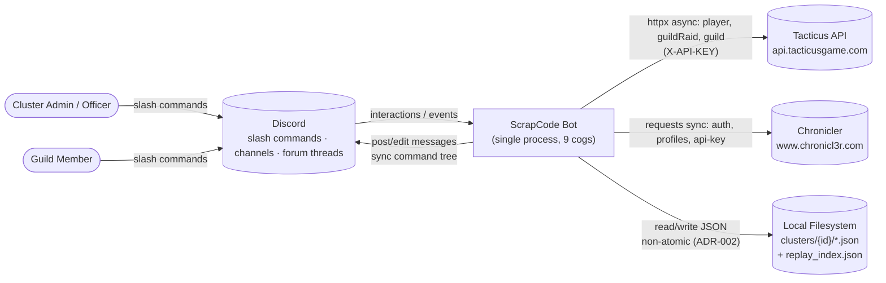
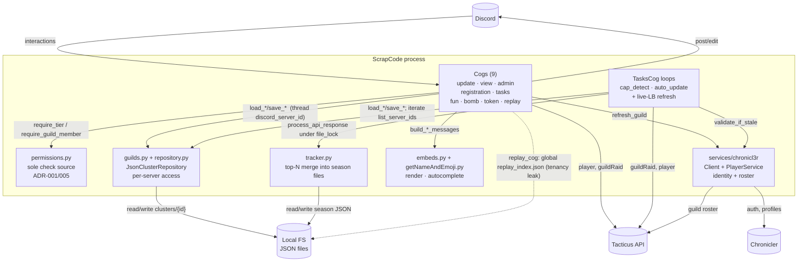
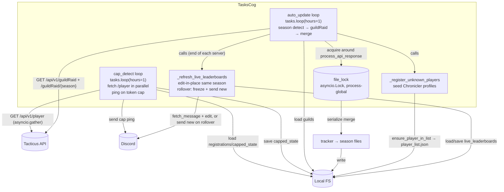
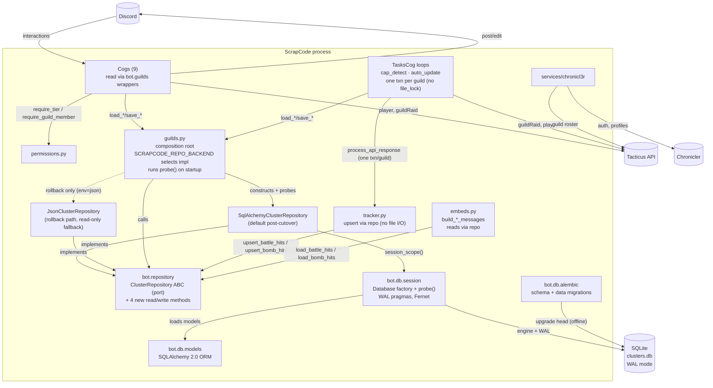
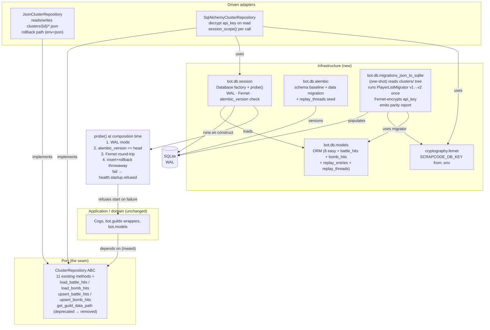

# ScrapCode — Architecture Diagrams (as-built)

> **As-built.** These diagrams describe the system as it exists in code today
> (see [brief.md](brief.md)). They use **standard Mermaid `flowchart`** so they
> render cleanly in VS Code and on GitHub with no C4 plugin. (The filename stays
> `c4-diagrams.md` for link stability; the content is flowcharts, not `C4Context`.)
>
> Doc index: [overview.md](overview.md).

## 1. System Context

## 2. Container (single process)

## 3. TasksCog component (the only multi-loop subsystem)

## Notes

- All three are **as-built**; none describe a target architecture.
- Edge labels carry the interaction and the key library/app construct (e.g.
  `tasks.loop(hours=1)`, `asyncio.gather`, `file_lock`). See the
  [library reference index](overview.md#library-reference-index) for doc links.
- The dotted edge in diagram 2 marks the **multi-tenancy leak**
  (`replay_index.json` is global — see [brief §3.2](brief.md#32-tenancy-leaks-flagged-not-fixed)).

---

# Diagrams — `sqlite-backend` (DESIGN wave, target)

> Target architecture for feature `sqlite-backend`. Decisions in
> [ADR-006](adr-006-sqlite-storage-backend.md) and
> [ADR-007](adr-007-repo-read-methods-get-guild-data-path-deprecation.md).
> The System Context diagram (§1) is unchanged — no new external system is
> introduced. The Container diagram below is the target; the Component
> diagram zooms into the new data layer.

## 4. Container (target, post-cutover)

## 5. Component diagram — data layer (port + 2 impls + migration + probe)

## Notes — `sqlite-backend` diagrams

- Both diagrams are **target** (post-cutover, Slice 04 complete). The
  as-built diagrams in §§1–3 remain the pre-migration reference.
- The repo port (`ClusterRepository`) is the dependency-inversion seam
  (ADR-006 D2). All arrows from cogs/`tracker`/`embeds` point at the ABC,
  never at a concrete adapter or `bot.db.*`.
- The dotted line marks the rollback path: `JsonClusterRepository` is
  constructed only when `SCRAPCODE_REPO_BACKEND=json` (ADR-006 D9).
- The `probe()` call (ADR-006 D8) is the Earned-Trust gate: the adapter
  must demonstrate it can transact before the system depends on it.
- No arrow crosses the process boundary except the unchanged Tacticus /
  Chronicler integrations (§§1–2). SQLite is in-process.