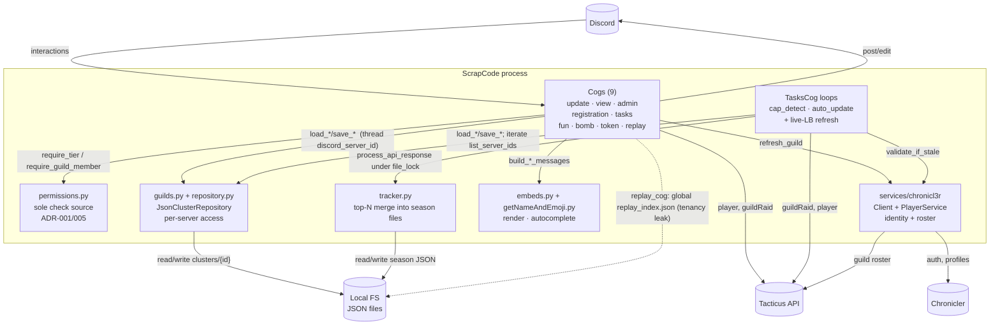
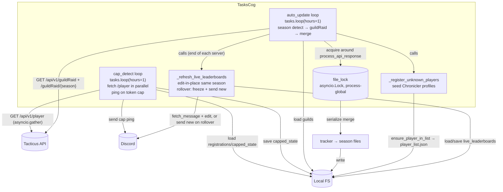

# ScrapCode — Architecture Diagrams (as-built)

> **As-built.** These diagrams describe the system as it exists in code today
> (see [brief.md](brief.md)). They use **standard Mermaid `flowchart`** so they
> render cleanly in VS Code and on GitHub with no C4 plugin. (The filename stays
> `c4-diagrams.md` for link stability; the content is flowcharts, not `C4Context`.)
>
> Doc index: [overview.md](overview.md).

## 1. System Context

## 2. Container (single process)

## 3. TasksCog component (the only multi-loop subsystem)

## Notes

- All three are **as-built**; none describe a target architecture.
- Edge labels carry the interaction and the key library/app construct (e.g.
  `tasks.loop(hours=1)`, `asyncio.gather`, `file_lock`). See the
  [library reference index](overview.md#library-reference-index) for doc links.
- The dotted edge in diagram 2 marks the **multi-tenancy leak**
  (`replay_index.json` is global — see [brief §3.2](brief.md#32-tenancy-leaks-flagged-not-fixed)).