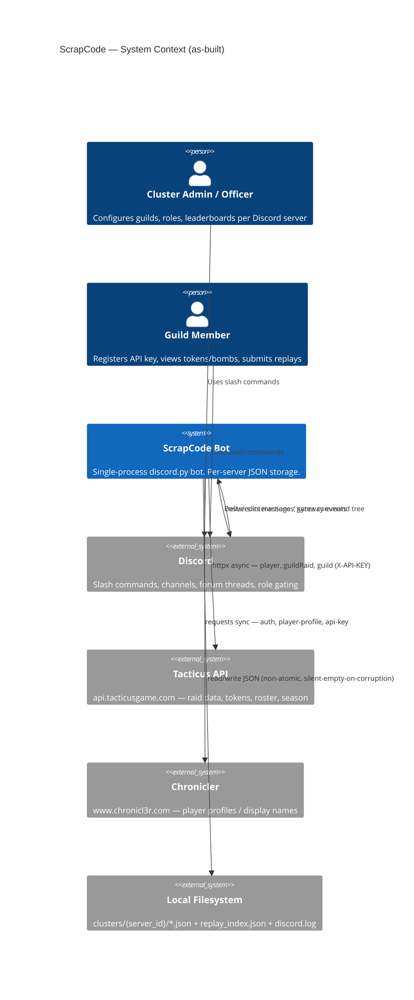
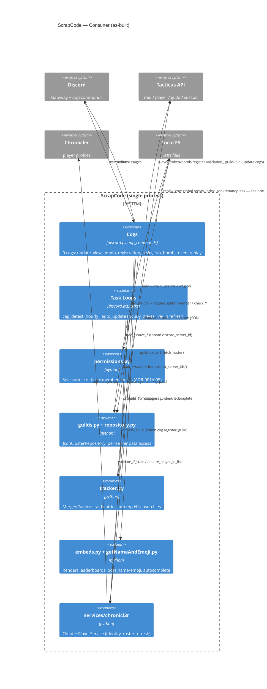
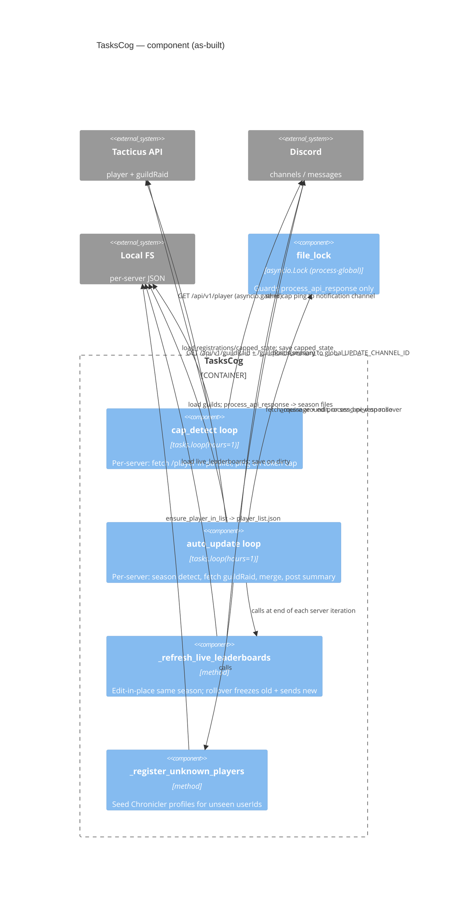

# ScrapCode — C4 Diagrams (as-built)

Mermaid C4 diagrams for the ScrapCode Discord bot baseline. These describe the
system as it exists in code today (see [brief.md](brief.md)). No component here
is a target architecture.

## System Context

## Container

## Component — TasksCog (the only multi-loop subsystem)

