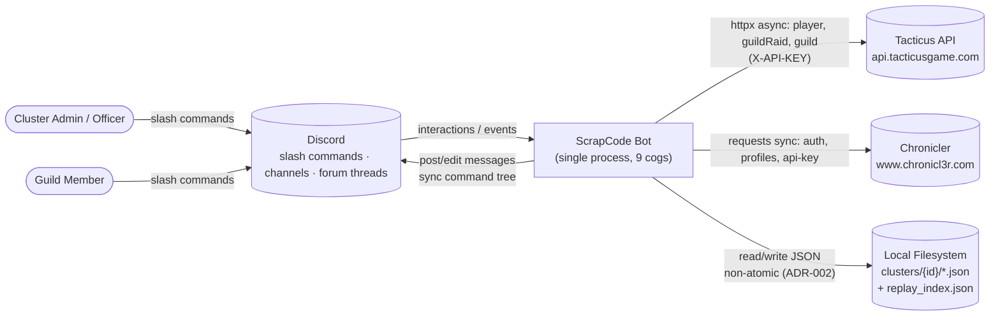
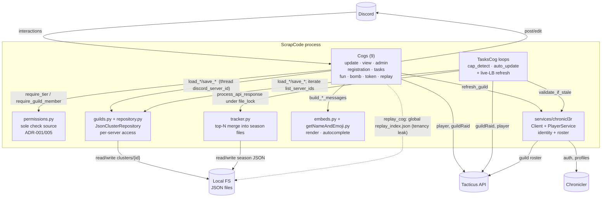
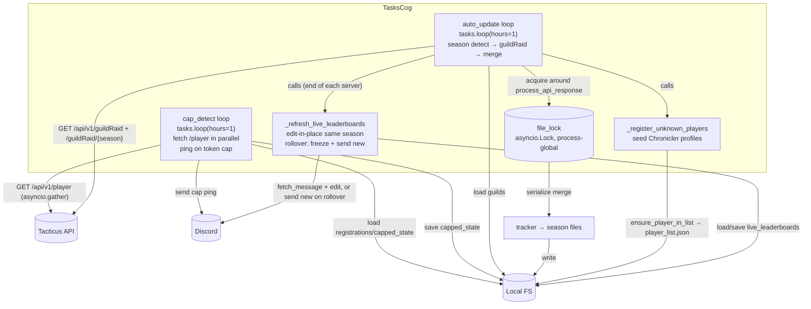
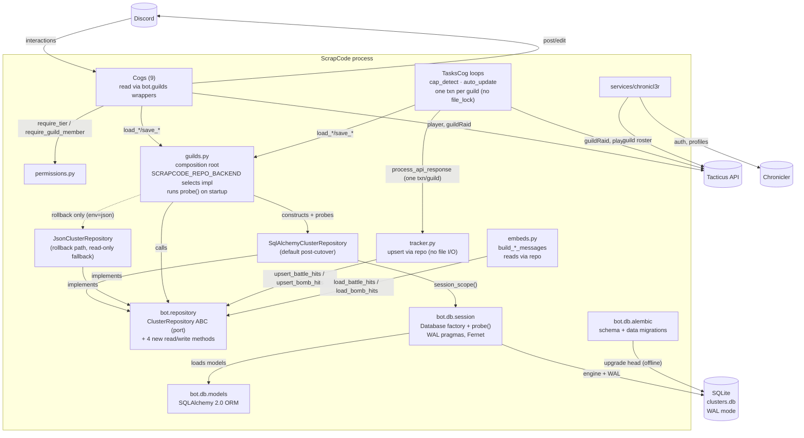
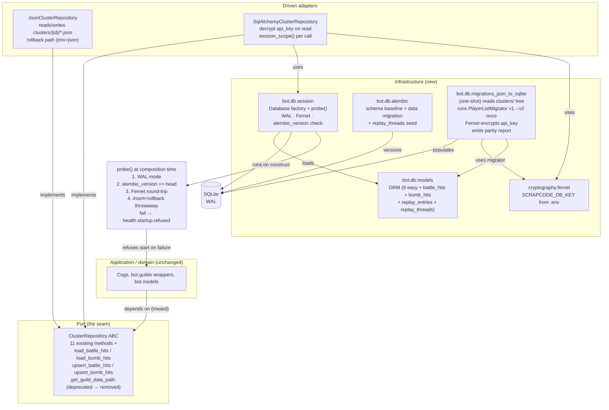
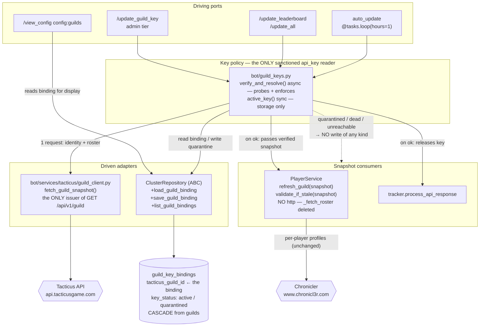
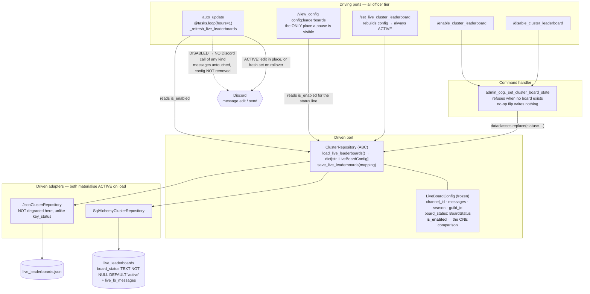

# ScrapCode — Architecture Diagrams (as-built)

> **As-built.** These diagrams describe the system as it exists in code today
> (see [brief.md](brief.md)). They use **standard Mermaid `flowchart`** so they
> render cleanly in VS Code and on GitHub with no C4 plugin. (The filename stays
> `c4-diagrams.md` for link stability; the content is flowcharts, not `C4Context`.)
>
> Doc index: [overview.md](overview.md).

## 1. System Context

```mermaid
flowchart LR
    Admin(["Cluster Admin / Officer"])
    Member(["Guild Member"])
    Discord[("Discord\nslash commands · channels · forum threads")]
    Bot["ScrapCode Bot\n(single process, 9 cogs)"]
    Tacticus[("Tacticus API\napi.tacticusgame.com")]
    Chronicler[("Chronicler\nwww.chronicl3r.com")]
    FS[("Local Filesystem\nclusters/{id}/*.json\n+ replay_index.json")]

    Admin -- "slash commands" --> Discord
    Member -- "slash commands" --> Discord
    Discord -- "interactions / events" --> Bot
    Bot -- "post/edit messages\nsync command tree" --> Discord
    Bot -- "httpx async: player, guildRaid, guild\n(X-API-KEY)" --> Tacticus
    Bot -- "requests sync: auth, profiles, api-key" --> Chronicler
    Bot -- "read/write JSON\nnon-atomic (ADR-002)" --> FS
```

## 2. Container (single process)

```mermaid
flowchart TD
    Discord[("Discord")]
    Tacticus[("Tacticus API")]
    Chronicler[("Chronicler")]
    FS[("Local FS\nJSON files")]

    subgraph Proc["ScrapCode process"]
        direction TB
        Cogs["Cogs (9)<br/>update · view · admin<br/>registration · tasks<br/>fun · bomb · token · replay"]
        Perms["permissions.py<br/>sole check source<br/>ADR-001/005"]
        Guilds["guilds.py + repository.py<br/>JsonClusterRepository<br/>per-server access"]
        Tracker["tracker.py<br/>top-N merge into season files"]
        Embeds["embeds.py + getNameAndEmoji.py<br/>render · autocomplete"]
        Svc["services/chronicl3r<br/>Client + PlayerService<br/>identity + roster"]
        Tasks["TasksCog loops<br/>cap_detect · auto_update<br/>+ live-LB refresh"]
    end

    Discord -- "interactions" --> Cogs
    Cogs -- "post/edit" --> Discord
    Cogs -- "require_tier / require_guild_member" --> Perms
    Cogs -- "load_*/save_*  (thread discord_server_id)" --> Guilds
    Cogs -- "build_*_messages" --> Embeds
    Cogs -- "refresh_guild" --> Svc
    Tasks -- "process_api_response under file_lock" --> Tracker
    Tasks -- "load_*/save_*; iterate list_server_ids" --> Guilds
    Tasks -- "validate_if_stale" --> Svc
    Cogs -- "player, guildRaid" --> Tacticus
    Tasks -- "guildRaid, player" --> Tacticus
    Svc -- "guild roster" --> Tacticus
    Svc -- "auth, profiles" --> Chronicler
    Guilds -- "read/write clusters/{id}" --> FS
    Tracker -- "read/write season JSON" --> FS
    Cogs -. "replay_cog: global replay_index.json (tenancy leak)" .-> FS
```

## 3. TasksCog component (the only multi-loop subsystem)

```mermaid
flowchart TD
    Tacticus[("Tacticus API")]
    Discord[("Discord")]
    FS[("Local FS")]

    subgraph TC["TasksCog"]
        direction TB
        Cap["cap_detect loop<br/>tasks.loop(hours=1)<br/>fetch /player in parallel<br/>ping on token cap"]
        Auto["auto_update loop<br/>tasks.loop(hours=1)<br/>season detect → guildRaid → merge"]
        Refresh["_refresh_live_leaderboards<br/>edit-in-place same season<br/>rollover: freeze + send new"]
        Reg["_register_unknown_players<br/>seed Chronicler profiles"]
        Lock[("file_lock<br/>asyncio.Lock, process-global")]
    end

    Cap -- "GET /api/v1/player (asyncio.gather)" --> Tacticus
    Cap -- "load registrations/capped_state" --> FS
    Cap -- "save capped_state" --> FS
    Cap -- "send cap ping" --> Discord

    Auto -- "GET /api/v1/guildRaid + /guildRaid/{season}" --> Tacticus
    Auto -- "load guilds" --> FS
    Auto -- "acquire around process_api_response" --> Lock
    Lock -- "serialize merge" --> MergeWrite["tracker → season files"]
    MergeWrite -- "write" --> FS
    Auto -- "calls" --> Reg
    Auto -- "calls (end of each server)" --> Refresh
    Reg -- "ensure_player_in_list → player_list.json" --> FS
    Refresh -- "load/save live_leaderboards" --> FS
    Refresh -- "fetch_message + edit, or send new on rollover" --> Discord
```

## Notes

- All three are **as-built**; none describe a target architecture.
- Edge labels carry the interaction and the key library/app construct (e.g.
  `tasks.loop(hours=1)`, `asyncio.gather`, `file_lock`). See the
  [library reference index](overview.md#library-reference-index) for doc links.
- The dotted edge in diagram 2 marks the **multi-tenancy leak**
  (`replay_index.json` is global — see [brief §3.2](brief.md#32-tenancy-leaks-flagged-not-fixed)).

---

# Diagrams — `sqlite-backend` (DESIGN wave, target)

> Target architecture for feature `sqlite-backend`. Decisions in
> [ADR-006](adr-006-sqlite-storage-backend.md) and
> [ADR-007](adr-007-repo-read-methods-get-guild-data-path-deprecation.md).
> The System Context diagram (§1) is unchanged — no new external system is
> introduced. The Container diagram below is the target; the Component
> diagram zooms into the new data layer.

## 4. Container (target, post-cutover)

```mermaid
flowchart TD
    Discord[("Discord")]
    Tacticus[("Tacticus API")]
    Chronicler[("Chronicler")]
    SQLite[("SQLite\nclusters.db\nWAL mode")]

    subgraph Proc["ScrapCode process"]
        direction TB
        Cogs["Cogs (9)<br/>read via bot.guilds wrappers"]
        Perms["permissions.py"]
        Guilds["guilds.py<br/>composition root<br/>SCRAPCODE_REPO_BACKEND selects impl<br/>runs probe() on startup"]
        RepoABC["bot.repository<br/>ClusterRepository ABC (port)<br/>+ 4 new read/write methods"]
        JsonRepo["JsonClusterRepository<br/>(rollback path, read-only fallback)"]
        SqlRepo["SqlAlchemyClusterRepository<br/>(default post-cutover)"]
        Session["bot.db.session<br/>Database factory + probe()<br/>WAL pragmas, Fernet"]
        Models["bot.db.models<br/>SQLAlchemy 2.0 ORM"]
        Alembic["bot.db.alembic<br/>schema + data migrations"]
        Tracker["tracker.py<br/>upsert via repo (no file I/O)"]
        Embeds["embeds.py<br/>build_*_messages<br/>reads via repo"]
        Svc["services/chronicl3r"]
        Tasks["TasksCog loops<br/>cap_detect · auto_update<br/>one txn per guild (no file_lock)"]
    end

    Discord -- "interactions" --> Cogs
    Cogs -- "post/edit" --> Discord
    Cogs -- "require_tier / require_guild_member" --> Perms
    Cogs -- "load_*/save_*" --> Guilds
    Guilds -- "constructs + probes" --> SqlRepo
    Guilds -. "rollback only (env=json)" .-> JsonRepo
    SqlRepo -- "implements" --> RepoABC
    JsonRepo -- "implements" --> RepoABC
    Guilds -- "calls" --> RepoABC
    SqlRepo -- "session_scope()" --> Session
    Session -- "engine + WAL" --> SQLite
    Session -- "loads models" --> Models
    Tracker -- "upsert_battle_hits / upsert_bomb_hits" --> RepoABC
    Embeds -- "load_battle_hits / load_bomb_hits" --> RepoABC
    Tasks -- "process_api_response (one txn/guild)" --> Tracker
    Tasks -- "load_*/save_*" --> Guilds
    Cogs -- "player, guildRaid" --> Tacticus
    Tasks -- "guildRaid, player" --> Tacticus
    Svc -- "guild roster" --> Tacticus
    Svc -- "auth, profiles" --> Chronicler
    Alembic -- "upgrade head (offline)" --> SQLite
```

## 5. Component diagram — data layer (port + 2 impls + migration + probe)

```mermaid
flowchart TD
    subgraph Domain["Application / domain (unchanged)"]
        Cogs["Cogs, bot.guilds wrappers, bot.models"]
    end

    subgraph Port["Port (the seam)"]
        ABC["ClusterRepository ABC<br/>11 existing methods +<br/>load_battle_hits / load_bomb_hits<br/>upsert_battle_hits / upsert_bomb_hits<br/>get_guild_data_path (deprecated → removed)"]
    end

    subgraph Adapters["Driven adapters"]
        Json["JsonClusterRepository<br/>reads/writes clusters/{id}/*.json<br/>rollback path (env=json)"]
        Sql["SqlAlchemyClusterRepository<br/>decrypt api_key on read<br/>session_scope() per call"]
    end

    subgraph Infra["Infrastructure (new)"]
        Session["bot.db.session<br/>Database factory + probe()<br/>WAL · Fernet · alembic_version check"]
        Models["bot.db.models<br/>ORM (8 easy + battle_hits + bomb_hits<br/>+ replay_entries + replay_threads)"]
        Alembic["bot.db.alembic<br/>schema baseline + data migration<br/>+ replay_threads seed"]
        Migration["bot.db.migrations_json_to_sqlite<br/>(one-shot) reads clusters/ tree<br/>runs PlayerListMigrator v1→v2 once<br/>Fernet-encrypts api_key<br/>emits parity report"]
        Fernet["cryptography.fernet<br/>SCRAPCODE_DB_KEY from .env"]
    end

    SQLite[("SQLite\nWAL")]

    Cogs -- "depends on (inward)" --> ABC
    Json -- "implements" --> ABC
    Sql -- "implements" --> ABC
    Sql -- "uses" --> Session
    Sql -- "uses" --> Fernet
    Session -- "loads" --> Models
    Session -- "engine" --> SQLite
    Alembic -- "versions" --> SQLite
    Migration -- "populates" --> SQLite
    Migration -- "reads" --> Fernet
    Migration -- "uses migrator" --> Models

    Probe["probe() at composition time<br/>1. WAL mode<br/>2. alembic_version == head<br/>3. Fernet round-trip<br/>4. insert+rollback throwaway<br/>fail → health.startup.refused"]
    Session -- "runs on construct" --> Probe
    Probe -- "refuses start on failure" --> Cogs
```

## Notes — `sqlite-backend` diagrams

- Both diagrams are **target** (post-cutover, Slice 04 complete). The
  as-built diagrams in §§1–3 remain the pre-migration reference.
- The repo port (`ClusterRepository`) is the dependency-inversion seam
  (ADR-006 D2). All arrows from cogs/`tracker`/`embeds` point at the ABC,
  never at a concrete adapter or `bot.db.*`.
- The dotted line marks the rollback path: `JsonClusterRepository` is
  constructed only when `SCRAPCODE_REPO_BACKEND=json` (ADR-006 D9).
- The `probe()` call (ADR-006 D8) is the Earned-Trust gate: the adapter
  must demonstrate it can transact before the system depends on it.
- No arrow crosses the process boundary except the unchanged Tacticus /
  Chronicler integrations (§§1–2). SQLite is in-process.

---

# Diagrams — `guild-key-integrity` (DESIGN wave, target)

> Appended 2026-07-31. **System Context (§1) and Container (§4) are unchanged**
> — this feature introduces no new external system and no new container. Only a
> Component diagram is warranted. See
> [ADR-008](adr-008-guild-key-identity-binding.md).

## 6. Component diagram — guild key verification path

```mermaid
flowchart TB
    subgraph Driving["Driving ports"]
        Admin["/update_guild_key<br/>admin tier"]
        Upd["/update_leaderboard<br/>/update_all"]
        Auto["auto_update<br/>@tasks.loop(hours=1)"]
        Cfg["/view_config config:guilds"]
    end

    subgraph Policy["Key policy — the ONLY sanctioned api_key reader"]
        GK["bot/guild_keys.py<br/>verify_and_resolve() async — probes + enforces<br/>active_key() sync — storage only"]
    end

    subgraph Adapters["Driven adapters"]
        TC["bot/services/tacticus/guild_client.py<br/>fetch_guild_snapshot()<br/>the ONLY issuer of GET /api/v1/guild"]
        Repo["ClusterRepository (ABC)<br/>+load_guild_binding<br/>+save_guild_binding<br/>+list_guild_bindings"]
    end

    subgraph Consumers["Snapshot consumers"]
        PS["PlayerService<br/>refresh_guild(snapshot)<br/>validate_if_stale(snapshot)<br/>NO http — _fetch_roster deleted"]
        Track["tracker.process_api_response"]
    end

    SQL[("guild_key_bindings<br/>tacticus_guild_id ← the binding<br/>key_status: active / quarantined<br/>CASCADE from guilds")]
    Tact{{"Tacticus API<br/>api.tacticusgame.com"}}
    Chron{{"Chronicler<br/>www.chronicl3r.com"}}

    Admin --> GK
    Upd --> GK
    Auto --> GK
    Cfg -- "reads binding for display" --> Repo

    GK -- "1 request: identity + roster" --> TC
    TC --> Tact
    GK -- "read binding / write quarantine" --> Repo
    Repo --> SQL

    GK -- "on ok: passes verified snapshot" --> PS
    GK -- "on ok: releases key" --> Track
    GK -. "quarantined / dead / unreachable<br/>→ NO write of any kind" .-> Consumers

    PS -- "per-player profiles (unchanged)" --> Chron
```

## Notes — `guild-key-integrity` diagram

- **The probe is not a separate call.** `fetch_guild_snapshot` issues one
  `GET /api/v1/guild` and returns identity *and* members. Probe and roster
  cannot disagree because they are the same response (ADR-008 D2), and the
  hourly Tacticus call count is unchanged rather than doubled.
- **Every arrow into an ingestion path passes through `bot/guild_keys.py`.**
  That is the whole design: the seven pre-existing call sites that each read
  `api_key` independently now have exactly one door. An AST rule forbids
  `bot/cogs/*` and `bot/services/*` from reading `api_key` directly.
- **The dotted arrow is the quarantine path** — it writes nothing. Not the
  roster, not the hits. Blocking hits alone would leave `refresh_guild` free to
  invert the roster, which was 60 of 67 corrupted `players` rows in the incident
  (ADR-008 D5).
- **`PlayerService` no longer speaks to Tacticus.** It keeps its Chronicler
  calls for per-player profiles; the Tacticus-direct call has moved out of the
  Chronicler package entirely, resolving the oddity ADR-003 row #2 flags.

---

# Diagrams — `cluster-board-control` (DESIGN wave, target)

> Appended 2026-09-08. **System Context (§1) and Container (§4) are unchanged**
> — no new external system, no new container, no new dependency. Only a
> Component diagram is warranted. See
> [ADR-009](adr-009-live-board-status-representation.md).

## 7. Component diagram — live board control path

```mermaid
flowchart TB
    subgraph Driving["Driving ports — all officer tier"]
        Dis["/disable_cluster_leaderboard"]
        Ena["/enable_cluster_leaderboard"]
        Setup["/set_live_cluster_leaderboard<br/>rebuilds config → always ACTIVE"]
        Cfg["/view_config config:leaderboards<br/>the ONLY place a pause is visible"]
        Auto["auto_update<br/>@tasks.loop(hours=1)<br/>_refresh_live_leaderboards"]
    end

    subgraph Handler["Command handler"]
        SCB["admin_cog._set_cluster_board_state<br/>refuses when no board exists<br/>no-op flip writes nothing"]
    end

    subgraph Port["Driven port"]
        Repo["ClusterRepository (ABC)<br/>load_live_leaderboards() → dict[str, LiveBoardConfig]<br/>save_live_leaderboards(mapping)"]
        LBC["LiveBoardConfig (frozen)<br/>channel_id · messages · season · guild_id<br/>board_status: BoardStatus<br/><b>is_enabled</b> ← the ONE comparison"]
    end

    subgraph Adapters["Driven adapters — both materialise ACTIVE on load"]
        Json["JsonClusterRepository<br/>NOT degraded here, unlike key_status"]
        Sql["SqlAlchemyClusterRepository"]
    end

    SQLite[("live_leaderboards<br/>board_status TEXT NOT NULL DEFAULT 'active'<br/>+ live_lb_messages")]
    JsonF[("live_leaderboards.json")]
    Discord{{"Discord<br/>message edit / send"}}

    Dis --> SCB
    Ena --> SCB
    SCB -- "dataclasses.replace(status=…)" --> Repo
    Setup --> Repo
    Cfg -- "reads is_enabled for the status line" --> Repo
    Auto -- "reads is_enabled" --> Repo

    Repo --- LBC
    Repo --> Json
    Repo --> Sql
    Json --> JsonF
    Sql --> SQLite

    Auto -- "ACTIVE: edit in place, or fresh set on rollover" --> Discord
    Auto -. "DISABLED → NO Discord call of any kind<br/>messages untouched, config NOT removed" .-> Discord
```

## Notes — `cluster-board-control` diagram

- **The dotted arrow is the whole feature.** A disabled board makes zero
  Discord calls — not an edit, not a re-send — and its config survives. The
  refresh loop already deletes configs whose channel has vanished, so "skip"
  had to be kept out of that branch: a pause is not a teardown.
- **`is_enabled` is a property on the frozen config, not a free function.**
  A predicate that sits *beside* the data can be forgotten by the next call
  site; one that sits *on the type* cannot. This is ADR-009 DDD-7, and it is
  the same discipline as ADR-008's "cogs never compare `key_status`
  themselves".
- **Both adapters materialise the default.** A config with no stored status —
  every board that exists today — comes out of either adapter as `ACTIVE`. No
  reader infers it. This is what makes the JSON/SQLite parity contract hold
  without a conditionally-emitted field, and it mirrors `load_guild_binding`
  returning `GuildBinding()` rather than `None`.
- **The JSON adapter is not degraded here**, unlike `key_status` (ADR-006 D9).
  It stores live-board configs natively, so the status round-trips on the
  rollback path. The asymmetry is deliberate and is recorded so it does not
  read as an oversight.
- **`/view_config` carries load-bearing weight.** Because a pause leaves the
  posted messages untouched (DISCUSS D2), a frozen board and a live one look
  identical in the channel. The status line is the only surface where they
  differ, which is why it renders for *both* states and is never omitted.
- **`active_key` (sync, no probe) exists solely for season discovery**, which
  must skip quarantined guilds and fall through to the next usable key —
  otherwise quarantining one guild halts every guild in the server
  (ADR-008 D7).