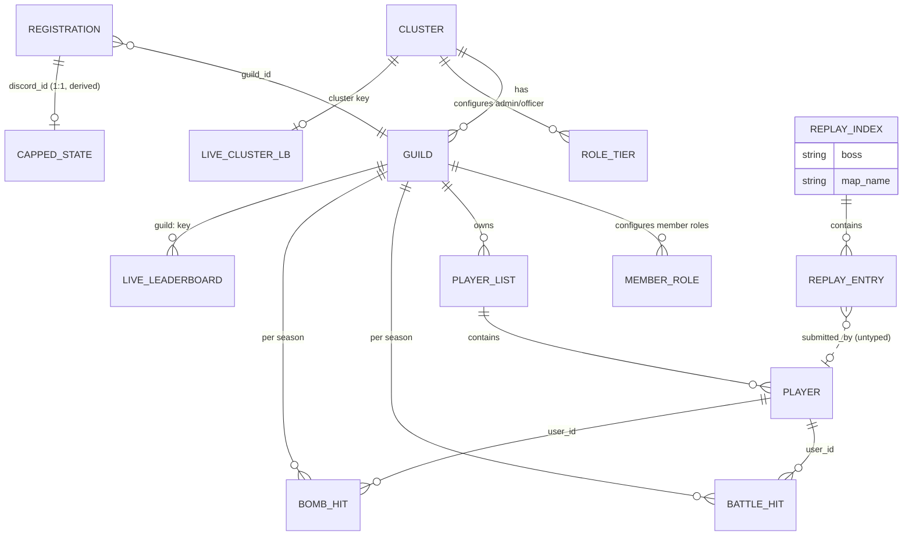

# ScrapCode — Data Dictionary (as-built)

> **Status: AS-BUILT.** This is the authoritative reference for every piece of
> persistent state ScrapCode writes, the field-level schema, and the logical
> relationships between entities. It exists to drive a future migration off flat
> JSON files to a relational backend (SQLite embedded, or Postgres / Supabase
> hosted). It is **backend-agnostic** — it does not pick a target. The current
> successor named in [ADR-002](adr-002-storage-backend-json-legacy.md) is SQLite;
> Postgres/Supabase remain on the table for a later ADR.
>
> The narrative description of storage lives in
> [brief.md §4](brief.md#4-data-layout--storage-_closes-gap-1--decision-form-in-adr-002).
> This file is the reference companion: per-entity field tables, readers/writers,
> and the relationship diagram. Code is the source of truth — verified against
> `bot/repository.py`, `bot/guilds.py`, `bot/tracker.py`, `bot/models.py`,
> `bot/services/chronicl3r/player_service.py`, `bot/cogs/replay_cog.py`, and the
> cogs.

## 1. Storage overview

| Layer | Path | Tenant-scoped? | Gitignored? | Notes |
|-------|------|-----------------|--------------|-------|
| Per-server data | `clusters/{discord_server_id}/...` | ✅ yes (keyed by Discord server) | ✅ `clusters/` + `*.json` | The repository root; `JsonClusterRepository(base_path=Path("clusters"))` in `bot/repository.py` |
| Per-guild data | `clusters/{id}/{guild_id}/...` | ✅ (nested under server) | ✅ | `player_list.json` + `data/` season files |
| Replay index | `replay_index.json` (project root) | ❌ **global — tenancy leak** | ✅ `*.json` | `bot/cogs/replay_cog.py`; see [brief §3.2](brief.md#32-tenancy-leaks-flagged-not-fixed) |
| Log | `discord.log` (project root) | ❌ global | ✅ `*.log` | `main.py` `FileHandler` |
| Secrets/config | `.env` (project root) | ❌ global | ✅ `.env` | `DISCORD_TOKEN`, Chronicler creds, channel IDs |

`JsonClusterRepository` is the only reader/writer of the per-server tree except
`bot/tracker.py`, which reads/writes the season files directly under
`{guild_id}/data/`. `replay_cog.py` is the only reader/writer of `replay_index.json`.

### Atomicity & corruption (known standing trap — documented, not fixed)

Writes are non-atomic (`path.write_text(json.dumps(...))`, no temp+replace). Reads
swallow all exceptions and return an empty dict, so a truncated file is
indistinguishable from a fresh one. Detail in
[brief §4.8](brief.md#48-atomicity--corruption-caveats-_known-standing-data-loss-trap--document-do-not-fix).
A SQL backend resolves both (ADR-002).

## 2. Entity catalog

Each entity below has: file path, JSON schema, a field table (`field | type |
nullable | default | readers | writers | notes`), and migration notes. `readers`
and `writers` are `file:function` traces from the source.

### 2.1 Cluster config — `clusters/{discord_server_id}/guilds.json`

The cluster-level file despite the name: holds the cluster config **and** the guild
registry. Written by `JsonClusterRepository.save` (`bot/repository.py:98`) and the
`save_guilds`/`add_cluster_role`/`add_guild_member_role` wrappers in
`bot/guilds.py`. Read by `JsonClusterRepository.load` (`bot/repository.py:73`) and
indirectly by every permission check via `check_tier`/`check_guild_member`
(`bot/permissions.py`).

```jsonc
{
  "update_channel_id": null,          // ⚠ unused at runtime (see notes)
  "role_tiers": {
    "admin":   [/* role_id, ... */],
    "officer": [/* role_id, ... */]
  },
  "guilds": {
    "<guild_id>": { /* see §2.2 */ }
  }
}
```

| field | type | nullable | default | readers | writers | notes |
|-------|------|----------|---------|---------|---------|-------|
| `update_channel_id` | int \| null | yes | `null` | (none at runtime) | `repository.save`, migration `to_cluster_layout` | **Unused.** The live update channel comes from `config.UPDATE_CHANNEL_ID` (`.env`), not this field. A SQL schema should drop or repurpose it. |
| `role_tiers` | `dict<str, list<int>>` | no | `{}` | `permissions.check_tier`, `permissions.check_guild_member`, `admin._config_roles`, `registration_cog` (admin-impersonation) | `guilds.add_cluster_role` | Keys are `"admin"` and `"officer"` only. Values are Discord role IDs. Officer cascade (admin ⊇ officer) is enforced in `check_tier`, not in storage. |
| `guilds` | `dict<guild_id, Guild-entry>` | no | `{}` | `guilds.load_guilds` (most cogs), `permissions.check_guild_member` | `guilds.save_guilds`, `repository.save` | See §2.2 for the entry shape. |

**Migration:** one `clusters` table (PK `discord_server_id`) + a `role_tiers`
child table `(discord_server_id, tier, role_id)` + a `guilds` table (§2.2).
`role_tiers` becomes a many-to-many with a check constraint on `tier ∈
{admin, officer}`.

### 2.2 Guild registry entry — inside `guilds.json`

One entry per in-game guild. `guild_id` is a short slug produced by
`register_guild` as `guild_id.strip().lower().replace(" ", "_")`.

```jsonc
{
  "name":                    "<display name>",
  "api_key":                 "<tacticus api key>",
  "role_id":                 123456789,
  "notification_channel_id": 987654321,
  "member_role_ids":         [111, 222]
}
```

| field | type | nullable | default | readers | writers | notes |
|-------|------|----------|---------|---------|---------|-------|
| `name` | str | no | — | `guilds.load_guilds` (display), `embeds.guild_autocomplete` | `guilds.save_guilds` (via `register_guild`) | Display name; free text. |
| `api_key` | str | no (may be `""`) | `""` | `tasks_cog.auto_update`, `update_cog`, `admin_cog` (live LB), `PlayerService._fetch_roster` (via caller) | `guilds.save_guilds` (via `register_guild`) | Tacticus guild API key. `""` ⇒ guild skipped on update. Stored in plaintext — a SQL backend should encrypt/secret-manage it. |
| `role_id` | int | no | `0` | `guilds.get_guild_by_role` | `guilds.save_guilds` | The Discord "leader" role for this guild. `register_guild` rejects a role already linked to another guild. |
| `notification_channel_id` | int \| null | yes | `null` | `tasks_cog.cap_detect` (ping target) | `admin_cog.set_ping_channel`, `register_guild` (init `null`), migration `to_cluster_layout` | Channel for token-cap pings. `null`/0 ⇒ player not pinged. |
| `member_role_ids` | `list<int>` | no | `[]` | `permissions.check_guild_member` | `guilds.add_guild_member_role`, migration `seed_roles` | Discord roles that count as "member" of this guild. Per-guild scoping key for member-tier checks. |

**Migration:** `guilds` table, PK `(discord_server_id, guild_id)`, FK
`discord_server_id → clusters`. `member_role_ids` becomes a child table
`(discord_server_id, guild_id, role_id)` (or a `int[]`/JSON column in Postgres).
`api_key` is encrypted at rest (Fernet; key from `SCRAPCODE_DB_KEY` via HKDF — see
ADR-006 D7). Add an `api_key_hmac` column: deterministic HMAC-SHA256 of `api_key`
(key from `SCRAPCODE_DB_KEY`), `UNIQUE NOT NULL`, enforcing the 1:1
guild→api_key binding that Fernet's non-deterministic ciphertext cannot enforce
directly. `guild_id` is the natural key but is a *human-chosen slug* — keep it as a
unique natural key, not a surrogate PK, unless you also want a surrogate.

### 2.3 Player registrations — `clusters/{id}/player_registrations.json`

Maps a Discord user to their Tacticus API key + which game guild they belong to
(for token-cap purposes).

```jsonc
{ "<discord_id_str>": { "api_key": "...", "guild_id": "..." } }
```

| field | type | nullable | default | readers | writers | notes |
|-------|------|----------|---------|---------|---------|-------|
| `<key>` = discord_id | str | no | — | `cap_detect`, `token_cog`, `bomb_cog`, `registration.list` | `registration.register`/`unregister`/`move` | Top-level key is the Discord user ID **as a string**. |
| `api_key` | str | no | — | `cap_detect._fetch`, `token_cog._fetch_token`, `bomb_cog._fetch_bomb` | `registration.register` | Personal Tacticus API key. `register` rejects a key already bound to a different Discord user (1:1). Plaintext — secret-manage in SQL. |
| `guild_id` | str | no | — | `cap_detect` (channel routing), `token_cog`/`bomb_cog` (filter), `registration.list` (grouping) | `registration.register`, `registration.move` | FK → `guilds.guild_id` within the same server. Determines which guild's notification channel pings them. |

**Migration:** `player_registrations` table, PK `discord_id`, FK
`guild_id → guilds(guild_id)` (scoped to the same `discord_server_id` — enforce
with a composite FK `(discord_server_id, guild_id)`). `api_key` is encrypted at
rest (Fernet; key from `SCRAPCODE_DB_KEY` via HKDF — see ADR-006 D7). Add an
`api_key_hmac` column: deterministic HMAC-SHA256 of `api_key`, `UNIQUE NOT NULL`,
enforcing the 1:1 discord-user→api_key binding that Fernet's non-deterministic
ciphertext cannot enforce directly.

### 2.4 Capped state — `clusters/{id}/capped_state.json`

Transient cache of "is this user currently capped" so `cap_detect` only pings on
the rising edge.

```jsonc
{ "<discord_id_str>": true }
```

| field | type | nullable | default | readers | writers | notes |
|-------|------|----------|---------|---------|---------|-------|
| `<key>` = discord_id | str | no | — | `cap_detect` | `cap_detect`, `registration.unregister` (deletes) | Discord ID as string. |
| value | bool | no | `false` (implicit) | `cap_detect` (edge detect) | `cap_detect` (set true on cap, false on spend), `unregister` (delete) | Derived state, fully reconstructable from Tacticus. Safe to drop on migration; a SQL backend may store it as a column on `player_registrations` or a separate cache table. |

**Migration:** can be folded into `player_registrations` as a `is_capped bool`
column (recomputed each tick), or kept as a separate `capped_state` table. It is
not durable history — it is edge-detect scratch.

### 2.5 Live leaderboards — `clusters/{id}/live_leaderboards.json`

Config for pinned leaderboard messages that the bot edits each hour.

```jsonc
{
  "guild:<guild_id>": {
    "channel_id": 123,
    "guild_id":   "<guild_id>",
    "messages":   { "Legendary_0": 456, /* ...one per TIER_CHOICES */ },
    "season":     94        // null = legacy, adopted on next refresh
  },
  "cluster": {
    "channel_id": 123,
    "messages":   { "Legendary_0": 789, /* ... */ },
    "season":     94
  }
}
```

| field | type | nullable | default | readers | writers | notes |
|-------|------|----------|---------|---------|---------|-------|
| `<key>` | str | no | — | `_refresh_live_leaderboards`, `admin._config_leaderboards` | `set_live_leaderboard`, `set_live_cluster_leaderboard` | Either `guild:<guild_id>` (per-guild LB) or literal `cluster` (cluster-wide). |
| `channel_id` | int | no | — | `_refresh_live_leaderboards` | `set_live_leaderboard`/`set_live_cluster_leaderboard` | Discord channel hosting the messages. |
| `guild_id` | str | yes (cluster has none) | — | `_refresh_live_leaderboards` (per-guild branch) | `set_live_leaderboard` | Present only for `guild:` keys. FK → `guilds.guild_id`. |
| `messages` | `dict<tier_value, message_id>` | no | `{}` | `_refresh_live_leaderboards` (fetch+edit) | `set_live_*`, `_refresh_live_leaderboards` (rollover rewrites) | Keys are `TIER_CHOICES` values (`Legendary_0..4`, `Mythic`, `Mythic_1`). Values are Discord message IDs. |
| `season` | int \| null | yes | `null` (legacy) | `_refresh_live_leaderboards` (rollover logic) | `set_live_*`, `_refresh_live_leaderboards` (adopts/rollover) | `null` ⇒ legacy config adopted to current season without spawning new messages. Rollover freezes old messages and writes a fresh set. |

**Migration:** `live_leaderboards` table, PK surrogate, FK `discord_server_id`
(+ `guild_id` for per-guild rows, nullable for cluster rows). `messages` becomes a
child table `(config_id, tier_value, message_id)` or a JSON column. `season` is a
plain int column.

### 2.6 Player list (v2) — `clusters/{id}/{guild_id}/player_list.json`

The Chronicler-backed roster: tacticus user → display name + freshness + former
flag. Versioned via `__meta__.version`; `PlayerListMigrator`
(`bot/migrations/player_list_migrations.py`) auto-migrates v1→v2 on read inside
`load_player_list` and rewrites the file when migrated. `CURRENT_VERSION = 2`.

```jsonc
{
  "__meta__": { "version": 2 },
  "players": {
    "<tacticus_user_id>": {
      "display_name":   "<name>",
      "last_validated":  "2026-07-18T10:00:00Z",
      "is_former":       false
    }
  }
}
```

| field | type | nullable | default | readers | writers | notes |
|-------|------|----------|---------|---------|---------|-------|
| `__meta__.version` | int | no | `1` (migrated to `2`) | `PlayerListMigrator.get_version` | `PlayerListMigrator._migrate_v1_to_v2` | Schema version. v1 was `{display_name: tacticus_id}` (inverted). v2 flips it. |
| `players` | `dict<tacticus_id, Player>` | no | `{}` | `get_player_list`, `PlayerService.*`, `admin._config_guilds`, `_register_unknown_players`, `get_display_name` | `PlayerService.refresh_guild`/`ensure_player_in_list`, `save_player_list` | Key is the Tacticus user ID. |
| `display_name` | str | no | — | `get_player_list`, `get_display_name`, leaderboard rendering | `PlayerService.refresh_guild`/`ensure_player_in_list` | From Chronicler `profile["tacticus_display_nm"]`. |
| `last_validated` | str (ISO8601 UTC) | no | `1970-01-01T00:00:00Z` (post-migration) | `PlayerService.validate_if_stale` (stale check) | `PlayerService.refresh_guild`/`ensure_player_in_list` | `STALE_AFTER_HOURS = 1`. Epoch sentinel forces a real refresh after migration. Store as `TIMESTAMPTZ` in SQL. |
| `is_former` | bool | no | `false` | `get_player_list` (appends "(former)"), `get_display_name`, `admin._config_guilds` (active count) | `PlayerService.refresh_guild` (sets true when absent from roster; rewritten each refresh) | `refresh_guild` rewrites the whole entry each cycle, so a returning player is un-flagged. Not a tombstone. |

**Migration:** `players` table, PK `tacticus_user_id`, FK
`(discord_server_id, guild_id) → guilds`. `last_validated` → `TIMESTAMPTZ`. The
`__meta__` version scheme can be retired (SQL schema versioning instead), but the
v1→v2 data must still be migrated once.

### 2.7 Battle detailed — `clusters/{id}/{guild_id}/data/highest_hits_season_{n}.json`

Top-N Battle hits per boss/encounter/tier, **with hero roster + MoW**, deduped per
player-per-roster. Written by `bot/tracker.py::process_api_response`.

```jsonc
{
  "boss_hits": {
    "<boss_id>": {
      "<encounter_index>": {
        "<tier_key>": [
          {
            "encounterType":   "...",
            "damage":          12345,
            "user_id":         "<tacticus_user_id>",
            "completed_on":    "2026-07-18T10:00:00Z",
            "hero_details":    [{ "unitId": "..." }, ...],
            "machine_of_war":  { "unitId": "..." }   // or null
          }
        ]
      }
    }
  }
}
```

| field | type | nullable | default | readers | writers | notes |
|-------|------|----------|---------|---------|---------|-------|
| `boss_hits` | dict | no | `{}` | `tracker.load_json`, embeds | `tracker.save_json` | Root. |
| `<boss_id>` (key) | str | no | — | leaderboard render (`embeds.build_*`), `_refresh_live_leaderboards` | `process_api_response` | Tacticus boss `unitId`. |
| `<encounter_index>` (key) | str | no | — | render (limit 5 if `"0"` else 1), `LABELS` map | `process_api_response` | `"0"`=Main, `"1"`=Left, `"2"`=Right (config `LABELS`). Determines top-N limit. |
| `<tier_key>` (key) | str | no | — | render (filtered by chosen tier) | `process_api_response` | `Legendary_0..4`, `Mythic`, `Mythic_1` (`get_tier_key`). |
| `damage` | int | no | — | sort key (`-damage`), render | `process_api_response` (from `entry["damageDealt"]`) | Primary sort desc. |
| `user_id` | str | no | — | display lookup via `get_player_list` | `process_api_response` (from `entry["userId"]`) | FK → `players.tacticus_user_id` (logical). |
| `completed_on` | str (ISO8601) | no | — | tiebreak sort (earliest first), render | `process_api_response` (from `entry["completedOn"]`) | Secondary sort asc. Pinned by `test_tracker_tiebreak.py`. |
| `hero_details` | `list<{unitId}>` | no | `[]` | roster display (`_build_hero_display`) | `process_api_response` (from `entry["heroDetails"]`) | Sorted for dedup key (`get_roster_key`). |
| `machine_of_war` | `{unitId}` \| null | yes | `null` | MoW display (`_build_mow_display`), roster key | `process_api_response` (from `entry["machineOfWarDetails"]`) | Part of the per-roster dedup key. |
| `encounterType` | str | yes | — | (stored, not rendered) | `process_api_response` | Informational. |

**Dedup rule:** `try_insert(..., check_roster=True)` — same `(user_id, sorted
hero unitIds, MoW unitId)` ⇒ keep only the higher damage; different roster ⇒
separate entry. Lists truncated to `TOP_N = 5`.

**Migration:** `battle_hits` table, PK surrogate, columns
`(discord_server_id, guild_id, season, boss_id, encounter_index, tier_key,
user_id, damage, completed_on, hero_roster_key, mow_unit_id, encounter_type)`.
Unique constraint on `(server, guild, season, boss, encounter, tier, roster_key,
user_id)` to enforce the dedup; `damage` stored as the best per that key. A
partial unique index or "upsert keep max(damage)" replaces the in-memory
`try_insert` logic. `hero_details`/`machine_of_war` can be JSON columns (Postgres)
or child tables if you want to query by unit.

### 2.8 Battle simple — `clusters/{id}/{guild_id}/data/highest_hits_simple_season_{n}.json`

Same shape as §2.7 but the entry is the *simple* form, no roster dedup:

```jsonc
{
  "boss_hits": {
    "<boss_id>": { "<encounter_index>": { "<tier_key>": [
      { "damage": 12345, "user_id": "...", "completed_on": "...", "encounter_type": "..." }
    ] } }
  }
}
```

| field | type | nullable | notes |
|-------|------|----------|-------|
| `damage` | int | no | Primary sort desc. |
| `user_id` | str | no | FK → `players.tacticus_user_id` (logical). |
| `completed_on` | str | no | Tiebreak asc. |
| `encounter_type` | str | yes | Informational. |

No `hero_details`, no `machine_of_war` ⇒ no roster key ⇒ `try_insert(...,
check_roster=False)` (plain top-N). Writers: `process_api_response`. Readers:
currently only the live-leaderboard/cluster merge in `tasks_cog`/`admin_cog`/`view_cog`
read the **detailed** file, not the simple one — **the simple file is written but
not read by any render path** (worth confirming before migration; it may be
dead data or reserved for future use). Readers in source: none found for the
simple file beyond its own write.

**Migration:** `battle_hits_simple` table mirroring §2.7 minus roster columns,
or drop it if confirmed unused.

### 2.9 Bombs — `clusters/{id}/{guild_id}/data/highest_bombs_season_{n}.json`

```jsonc
{
  "boss_hits": {
    "<boss_id>": { "<encounter_index>": { "<tier_key>": [
      { "encounterType": "...", "damage": 12345, "user_id": "...", "completed_on": "..." }
    ] } }
  }
}
```

| field | type | nullable | notes |
|-------|------|----------|-------|
| `encounterType` | str | yes | Informational. |
| `damage` | int | no | Primary sort desc. |
| `user_id` | str | no | FK → `players.tacticus_user_id` (logical). |
| `completed_on` | str | no | Tiebreak asc. |

No roster dedup (`check_roster=False`), plain top-N to `TOP_N = 5`. Writers:
`process_api_response`. Readers: `embeds.build_bomb_messages`, `view_cog`.

**Migration:** `bomb_hits` table, same pattern as §2.7 (minus roster columns).

### 2.10 Replay index (GLOBAL — tenancy leak) — `replay_index.json`

**Not per-tenant.** `bot/cogs/replay_cog.py` reads/writes this single file at the
project root and never consults `interaction.guild_id`. All Discord servers share
one index. See [brief §3.2](brief.md#32-tenancy-leaks-flagged-not-fixed).

```jsonc
{
  "<boss>": {
    "<map_name>": {
      "index_message_id": 123,        // Discord message id of the index msg in the forum thread
      "entries": [
        {
          "team":         "Neuro",
          "tier":         "Legendary 1",   // TIER_CHOICES.name, not value
          "position":     "LHS",           // "" if none
          "damage":       "1.33M",         // free-text string
          "url":          "https://...",
          "comment":      "",              // "" if none
          "submitted_by": "<discord_id_str>"
        }
      ]
    }
  }
}
```

| field | type | nullable | notes |
|-------|------|----------|-------|
| `<boss>` (key) | str | no | One of `FORUM_CHANNELS` keys (Avatar, Cawl, …). |
| `<map_name>` (key) | str | no | One of `MAP_THREADS[boss]` keys. |
| `index_message_id` | int \| null | yes | Message id of the index post in the forum thread; `null` until first replay creates it. |
| `entries` | list | no | Append-only on upload; removed by URL on delete. |
| `team` | str | no | `TEAM_CHOICES` value. |
| `tier` | str | no | `TIER_CHOICES.name` (display label), **not** the value — diverges from the season files which use `value`. |
| `position` | str | no | `POSITION_CHOICES` value or `""`. |
| `damage` | str | no | **Free-text** (e.g. "1.33M"); not numeric. |
| `url` | str | no | Replay link; uniqueness enforced across the whole index on upload. |
| `comment` | str | no | `""` if none. |
| `submitted_by` | str | no | Discord user ID as string. |

**Migration:** `replay_entries` table PK surrogate, columns
`(discord_server_id, boss, map_name, team, tier, position, damage_text, url,
comment, submitted_by, index_message_id)`. **`discord_server_id` is a new column
that does not exist in the JSON** — the migration must decide per-tenant
partitioning (currently impossible from the data alone). A `replay_threads` table
`(discord_server_id, boss, map_name, forum_channel_id, thread_id,
index_message_id)` replaces the hardcoded `FORUM_CHANNELS`/`MAP_THREADS`. URL
uniqueness should be scoped per `(discord_server_id, boss, map_name)`, not global.

## 3. Relationships (logical)

JSON has no foreign keys; the diagram documents the *intended* keys, which become
FKs/constraints in SQL. `discord_server_id` partitions every relationship.



Notes:
- `REGISTRATION → CAPPED_STATE` is 1:1 by `discord_id` and is **derived** state
  (recomputable from Tacticus).
- `PLAYER → BATTLE_HIT/BOMB_HIT` is by `user_id` = `tacticus_user_id`. Because a
  player can appear in a season file before `PlayerService` registers them
  (`_register_unknown_players` backfills), the FK may be nullable at insert time
  in a SQL schema (or enforced after backfill).
- `REPLAY_INDEX` is drawn **outside** the cluster partition on purpose — it is the
  global tenancy leak. `REPLAY_ENTRY.submitted_by` is a Discord ID with no FK to
  anything (the submitter is not necessarily a registered player).
- `BATTLE_HIT`/`BOMB_HIT` are scoped `(discord_server_id, guild_id, season)` —
  the `season` dimension is in the filename, not the JSON, so it must become a
  column.

## 4. Migration mapping (backend-agnostic)

Candidate backends (this dictionary does not choose — see ADR-002, which names
SQLite as the accepted successor; Postgres/Supabase remain options for a later
ADR):

- **SQLite (embedded):** single file, matches the single-process deployment;
  simplest lift; no network. Good if the bot stays one process on one VM.
- **Postgres (self-hosted or Supabase):** if multi-process horizontal scale or
  richer querying (per-player history, aggregate leaderboards) is wanted later.
  Supabase adds auth/REST on top of Postgres but is not required by the current
  data model.

| JSON entity | File | Proposed SQL table | Natural key | Relationships to preserve |
|-------------|------|---------------------|-------------|---------------------------|
| Cluster config | `guilds.json` (top-level) | `clusters` | `discord_server_id` | → `role_tiers`, `guilds` |
| Role tiers | `guilds.json` → `role_tiers` | `role_tiers(server_id, tier, role_id)` | `(server_id, tier, role_id)` | `tier ∈ {admin, officer}` check |
| Guild entry | `guilds.json` → `guilds[gid]` | `guilds` | `(server_id, guild_id)` | FK `server_id → clusters`; → `member_role_ids`, `player_list`, season hits, live LB |
| Member roles | `guilds.json` → `member_role_ids` | `guild_member_roles(server_id, guild_id, role_id)` | `(server_id, guild_id, role_id)` | FK → `guilds` |
| Registration | `player_registrations.json` | `player_registrations` | `discord_id` | composite FK `(server_id, guild_id) → guilds`; unique `api_key` |
| Capped state | `capped_state.json` | column on `player_registrations` (`is_capped`) or `capped_state` table | `discord_id` | 1:1 with registration; derived |
| Live LB | `live_leaderboards.json` | `live_leaderboards` (+ `live_lb_messages` child) | surrogate; `guild:` rows FK `guild_id` | `messages` → child table `(config_id, tier_value, message_id)` |
| Player list | `player_list.json` | `players` | `tacticus_user_id` | FK `(server_id, guild_id) → guilds`; `last_validated` TIMESTAMPTZ |
| Battle detailed | `highest_hits_season_{n}.json` | `battle_hits` | `(server, guild, season, boss, encounter, tier, roster_key, user_id)` | FK `user_id → players` (nullable until backfilled); upsert keep max(damage) |
| Battle simple | `highest_hits_simple_season_{n}.json` | `battle_hits_simple` (or drop if unused) | as above minus roster | confirm read-path before migrating |
| Bombs | `highest_bombs_season_{n}.json` | `bomb_hits` | `(server, guild, season, boss, encounter, tier, user_id, completed_on)` | FK `user_id → players` |
| Replay index | `replay_index.json` (global) | `replay_threads` + `replay_entries` | `(server_id, boss, map_name)` for threads | **add `server_id` column** (new); `submitted_by` no FK; scope URL-uniqueness per thread |

### Migration notes (carry forward from ADR-002 / brief §4.8)

- The `PlayerListMigrator` v1→v2 inversion must run once as a data migration
  (or the SQL loader handles the inverted v1 shape).
- `update_channel_id` in `guilds.json` is unused — drop it in the SQL schema.
- `api_key` (guild + registration) is plaintext in JSON; move to a secrets store
  (e.g. Supabase Vault, or app-level encrypted column).
- `damage` in replay entries is free-text — keep as text or parse to int in SQL
  (incompatible with the season-file numeric `damage`).
- The non-atomic-write + silent-empty-read trap disappears with transactions; do
  not re-introduce it.
- A `schema_migrations` table replaces the `__meta__.version` per-file scheme.

## 5. Cross-references

- Narrative storage description: [brief.md §4](brief.md#4-data-layout--storage-_closes-gap-1--decision-form-in-adr-002)
- Storage decision: [ADR-002](adr-002-storage-backend-json-legacy.md)
- Multi-tenancy leaks (incl. `replay_index.json`): [brief §3.2](brief.md#32-tenancy-leaks-flagged-not-fixed), [ADR-004](adr-004-multi-tenancy-isolation.md)
- Atomicity/corruption trap: [brief §4.8](brief.md#48-atomicity--corruption-caveats-_known-standing-data-loss-trap--document-do-not-fix)
- Diagrams: [c4-diagrams.md](c4-diagrams.md)
- Doc index / start here: [overview.md](overview.md)